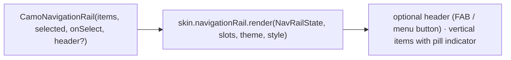
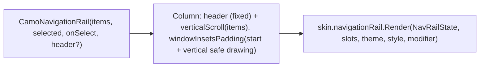
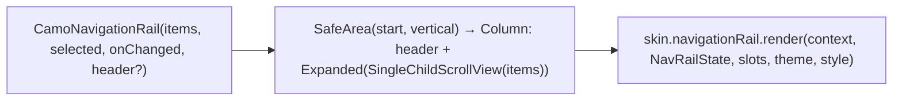

{/* Generated by docs/internal/scripts/sync_vault.py from the Camouflage design notes. Edit the notes and re-run the script; changes made here are overwritten. */}

# CamoNavigationRail

## Concept {#concept}

### 1. Why

On medium windows (tablets, foldables, small desktop windows), the top-level destinations move from a bottom bar to a vertical **rail** on the start edge. It uses the same `CamoNavItem` model as the bar ([CamoNavigationBar](/components/navigation/camo-navigation-bar)), and `CamoAdaptiveNavigation` switches to it automatically.

### 2. Shape



**Material mapping preview:** the M3 navigation rail. 80 wide, `surface`, the same pill indicator as the bar, labels below icons, and the header on top.

### 3. API

#### Contract

```kotlin
fun <T> CamoNavigationRail(
    items: List<CamoNavItem<T>>,           // 3–7
    selected: T,
    onSelect: (T) -> Unit,
    header: Widget? = null,                // e.g. CamoFab or a menu CamoIconButton
)
```

**State → renderer:** `NavRailState(count, selectedIndex, interactions)`. The renderer reads `showLabels` and `alignment` from its style. **Slots:** `header?` and one `NavItemSlot` per item.

#### Tokens used

The same as the navigation bar, with `colors.surface` as the container.

#### Component theme

`theme.components.navigationRail: NavigationRailTheme?`. Every field is nullable in the theme. The skin's `defaults(theme)` fills whatever isn't set (Material defaults shown). See [Theme](/guide/foundations/theme) §3.10.

| Field | Type | Material default | What it's for |
|---|---|---|---|
| `indicator` | NavIndicator (`Pill` \| `Line` \| `Dot` \| `Fill` \| `None`) | `Pill` | the selected item's indicator. `Line` = a line on the start edge (Fluent, Carbon). Minimal: `None`. The size and shape fields apply to the chosen style. |
| `alignment` | RailAlignment (`Top` \| `Center`) | `Top` | where the item group sits (ADR-23: only Material centers it) |
| `showLabels` | LabelVisibility (`Always` \| `Selected` \| `Never`) | `Always` | label visibility, an app-wide choice (ADR-23) |
| `width` | Dp | 80 | rail width |
| `itemSpacing` | Dp | 12 | vertical gap between items |
| `indicatorSize` | Size | 56 × 32 | active pill |
| `labelStyle` / `iconSize` | CamoTextStyle / Dp | `labelMedium` / 24 | item content |
| `colors` | NavRailColors(container, indicator, selectedIcon, selectedLabel, icon, label) | M3 values | every color it uses |

#### Accessibility

- It's the same as the bar: a navigation landmark, items announced as tabs with position, and up/down arrows between items.
- It respects the start inset (a landscape notch).

### 4. Build steps

1. `CamoNavigationRail`, `NavigationRailRenderer`, and the DebugSkin renderer.
2. Tests: selection, arrows, header placement, `alignment` and `showLabels` from the theme, RTL (the rail moves to the right).

**Done when**
- [ ] The adaptive sample shows the rail between 600 and 1200 with the header FAB.

### 5. Edge cases

| Case | Decided behavior |
|---|---|
| More items than fit vertically | The item column scrolls. The header stays fixed. |
| Expanded rail (M3 2025, labels beside icons) | Later. The drawer covers wide windows in v1. |
| RTL | The rail is on the right. |

## Implementation {#implementation}

<KotlinOnly>

### 1. Why {#kotlin-1-why}

The vertical version of the navigation bar for medium windows. It reuses `CamoNavItem` and the item logic; Kotlin adds the start-edge insets (landscape cutouts), the scrolling item column with a fixed header, and vertical arrow keys.

### 2. Shape {#kotlin-2-shape}



### 3. API {#kotlin-3-api}

```kotlin
@Composable
public fun <T> CamoNavigationRail(
    items: List<CamoNavItem<T>>,
    selected: T,
    onSelect: (T) -> Unit,
    modifier: Modifier = Modifier,
    header: (@Composable () -> Unit)? = null,
)
```

- **Insets:** `windowInsetsPadding(WindowInsets.safeDrawing.only(WindowInsetsSides.Start + WindowInsetsSides.Vertical))`; the rail's color runs under the cutout.
- **Alignment and labels:** `style.alignment` (`Top` | `Center`) positions the item group with `Arrangement.Top` / `Arrangement.Center`; `style.showLabels` and `style.indicator` (`Line` = the start edge) as on the bar.
- **Keys:** Up/Down move between items (roving focus), Enter/Space select.
- **Semantics:** the same as the bar: a `selectableGroup()` of `Role.Tab` items.

### 4. Build steps {#kotlin-4-build-steps}

1. `NavigationRailTheme` / `Style`, `CamoNavigationRail`, the DebugSkin renderer.
2. UI tests: selection; arrows; the header stays fixed while items scroll; RTL puts the rail on the right; landscape cutout inset on Android and iOS.

**Done when**
- [ ] The adaptive sample shows the rail between 600 and 1200 dp with a header FAB.

### 5. Edge cases {#kotlin-5-edge-cases}

| Case | Decided behavior |
|---|---|
| More items than fit | The item column scrolls; the header doesn't. |
| Expanded rail (labels beside icons) | Later; the drawer covers wide windows. |

</KotlinOnly>

<DartOnly>

### 1. Why {#dart-1-why}

The vertical navigation for medium windows, reusing `CamoNavItem`. Flutter specifics: the start-side safe-area padding, a fixed header with a scrolling item column, and vertical arrow keys.

### 2. Shape {#dart-2-shape}



### 3. API {#dart-3-api}

```dart
class CamoNavigationRail<T> extends StatelessWidget {
  const CamoNavigationRail({super.key, required this.items, required this.selected, required this.onChanged, this.header});
}
```

- **Padding:** `MediaQuery.paddingOf(context)` start and vertical sides (landscape notches); the rail's color extends under them.
- **Alignment:** `style.alignment` → `MainAxisAlignment.start` or `.center` for the item group; `style.showLabels` and `style.indicator` (`line` = start edge) as on the bar.
- **Keys and semantics:** `CamoRovingFocus` with Up/Down; tab-bar semantics like the bar.

### 4. Build steps {#dart-4-build-steps}

1. Types, the widget, the DebugSkin renderer.
2. Widget tests: selection; arrows; the header stays while items scroll; RTL on the right; notch padding.

**Done when**
- [ ] The adaptive example shows the rail between 600 and 1200 with a header FAB.

### 5. Edge cases {#dart-5-edge-cases}

| Case | Decided behavior |
|---|---|
| Expanded rail | Later. |

</DartOnly>
