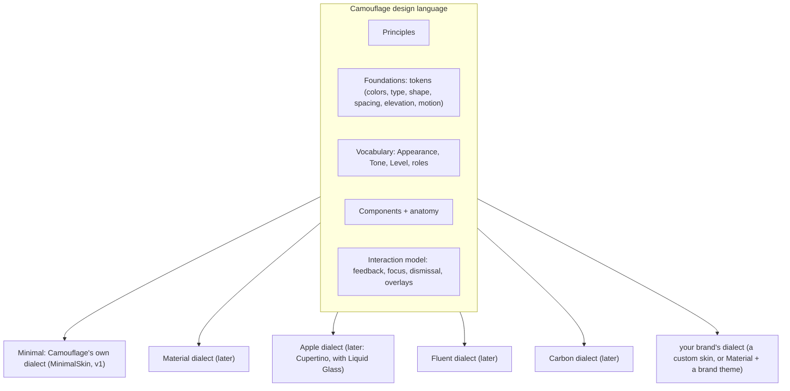

{/* Generated by docs/internal/scripts/sync_vault.py from the Camouflage design notes. Edit the notes and re-run the script; changes made here are overwritten. */}

# Design Language

## 1. Why

Camouflage is **a design system of its own**, not a wrapper around Material. It has its own principles, its own vocabulary, and its own component set. Existing design languages (Material, Apple, Fluent, …) are **dialects**: a skin renders Camouflage's language *in* that dialect's look and feel.

That's what makes the promise work:
- **Designers** design in Camouflage's words (a Camouflage Figma kit).
- **Developers** write the same words in code.
- **Code Connect / AI agents** map one to one.
- **The skin** decides whether the result looks like Material, Apple or your own brand.

Nobody has to translate "Material's tonal" into "Apple's bordered" by hand.

## 2. Shape

| Layer | Where it's defined |
|---|---|
| Foundations | [Theme](/guide/foundations/theme) (with alignment tables to other systems in §3.3) |
| Vocabulary | this note, §3.2 |
| Components | [Components — Overview](/components) |
| Interaction model | [Skin Contract](/guide/architecture/skin-contract) (feedback), [Overlays](/components/overlays/overlays) |
| Dialects | each skin note ([Skins](/guide/skins)), which **must** include an alignment table (§3.4). Camouflage's own dialect is [Minimal Skin](/guide/skins/minimal-skin). |

## 3. API

### 3.1 Principles

1. **Intent over look.** Parameters describe *what* something is (how prominent, what status), never how one design system draws it.
2. **One component, many dialects.** A component is written once. Its look comes from the skin (structure) and the theme (values).
3. **Accessible under every dialect.** Semantics, focus, touch targets and contrast rules belong to Camouflage, not to a skin, so no skin can break them.
4. **Values, not code, for brands.** A brand is a theme: tokens plus component themes. Code changes are only for structural differences (a renderer override or a new skin).
5. **Platform-idiomatic integration.** Camouflage plugs into each platform's framework the way that platform's own design library does (routes in Flutter, Navigation 3 scenes in Compose).

### 3.2 Vocabulary

The four words that appear in every Camouflage API, Figma property and doc:

| Word | Axis | Values | Used by |
|---|---|---|---|
| **Appearance** | visual weight: how much a component stands out | `Solid`, `Soft`, `Raised`, `Outline`, `Ghost`, `Link` | button, icon button, card, chip, badge, banner, tabs, FAB |
| **Tone** | color family: what the component means | `Default`, `Error`, `Success`, `Warning`, `Info` | button, icon button, card, chip, badge, avatar colors, progress, snackbar, banner, menu items, FAB |
| **Level** | separation from the background | `Surface`, `Lowest`, `Low`, `Container`, `High`, `Highest` | surface (and every container, through its skin) |
| **Roles** | named token slots | color roles, type styles, shape roles, spacing, elevation levels, motion | everything |

**Appearance, defined:**

| Appearance | Meaning | Container | Content | Emphasis |
|---|---|---|---|---|
| **Solid** | the strongest: full tone color | the tone's strong color | the tone's on-strong color | highest |
| **Soft** | a tinted, quieter fill | the tone's container color | the tone's on-container color | high |
| **Raised** | lifted by depth, not by color | a surface level + elevation | the tone's strong color | medium |
| **Outline** | a border, no fill | none | the tone's strong color, border in `outline` (or the tone color) | medium |
| **Ghost** | no container, just content | none | the tone's strong color | low |
| **Link** | inline, text-like, underlined | none, no padding beyond the touch target | the tone's strong color, underlined | lowest |

Appearance and Tone are **independent**: any appearance works with any tone (`Outline + Error` is a red outlined button). Components support the subset that makes sense for them (§3.3).

### 3.3 Appearance per component

| Component | Supported | Default | Unsupported values fall back to |
|---|---|---|---|
| `CamoButton` | Solid, Soft, Raised, Outline, Ghost, Link | Solid | – |
| `CamoIconButton` | Solid, Soft, Outline, Ghost | Ghost | Raised → Soft, Link → Ghost |
| `CamoCard` | Solid, Soft, Raised, Outline | Raised | Ghost → Outline, Link → Outline |
| `CamoChip` | Outline, Soft, Solid | Outline | others → Outline |
| `CamoBadge` | Solid, Soft, Outline | Solid | others → Solid |
| `CamoBanner` | Soft, Solid, Outline | Soft | others → Soft |
| `CamoTabs` | Solid (prominent), Ghost (quiet) | Solid | others → Solid |
| `CamoFab` | Soft, Solid, Raised | Soft | others → Soft |

A fallback is applied by core (never an error), and debug builds log it, so a design token or Figma property can never crash an app.

### 3.4 Dialect alignment (required in every skin)

Every skin documents how it renders the vocabulary. Here's how the design systems line up today (→ means "nearest equivalent, used as the fallback"):

**Buttons**

| Appearance | Material 3 | Apple (classic / Liquid Glass) | Fluent 2 | IBM Carbon | Shopify Polaris | Bootstrap |
|---|---|---|---|---|---|---|
| Solid | Filled | `.borderedProminent` / `.glassProminent` | Primary | primary | primary | `btn-primary` |
| Soft | Filled tonal | `.bordered` (tinted) / `.glass` | Secondary | secondary | secondary | `btn-secondary` |
| Raised | Elevated | → Soft | → Soft | → Soft | → Soft | → Soft |
| Outline | Outlined | → `.bordered` | Outline | tertiary | → secondary | `btn-outline-*` |
| Ghost | Text | `.borderless` | Subtle / Transparent | ghost | tertiary / plain | → `btn-link` |
| Link | → Text | `.plain` | → Link style | → Link | plain | `btn-link` |

Rank names differ between systems: Carbon's "tertiary" is outlined, while Polaris's "tertiary" is text-like. That's why Camouflage names *appearance*, not rank.

**Tone**

| Tone | Material 3 | Apple | Fluent 2 | Carbon |
|---|---|---|---|---|
| Default | primary | tint / accent | brand | interactive |
| Error | error | `role: .destructive`, systemRed | danger | danger / support-error |
| Success | – (Camouflage addition) | systemGreen | success | support-success |
| Warning | – | systemOrange / systemYellow | warning | support-warning |
| Info | – | systemBlue | – (brand) | support-info |

**Level**

The level alignment is in [Theme](/guide/foundations/theme) §3.3 (Material surface containers, Apple grouped backgrounds, Fluent neutral backgrounds 1–6, Carbon layers).

### 3.5 In Figma

The Camouflage Figma kit uses the same words as component properties: `appearance = solid | soft | raised | outline | ghost | link`, `tone = default | error | success | warning | info`. Code Connect maps them one to one ([Figma and AI](/guide/integrations/figma-and-ai)).

## 4. Build steps

1. Keep this note the single source of the vocabulary. Every component note links here instead of redefining words.
2. `Appearance`, `Tone`, `SurfaceLevel` enums in core, with the per-component fallback function (`Appearance.supportedBy(component)`).
3. Each skin's note gets its alignment table (v1: [Minimal Skin](/guide/skins/minimal-skin) §3.3; the Later skins have theirs too).
4. The sample app gets a "Language" screen: every appearance × tone for buttons and cards, switchable between skins. It's the visual proof of this note, and a strong episode.

**Done when**
- [ ] Every component with variants uses `appearance` + `tone` from this vocabulary.
- [ ] The Minimal skin's alignment table covers every appearance, tone and level.
- [ ] The Language screen renders identically-structured grids under DebugSkin and MinimalSkin.

## 5. Edge cases

| Case | Decided behavior |
|---|---|
| A design system has an appearance Camouflage lacks (e.g. Polaris "monochrome plain") | The skin maps it to the nearest Camouflage appearance, and the brand uses a component theme to fine-tune colors. The vocabulary grows only when two real designs need the same new appearance (an ADR). |
| A designer asks for "Primary button" | That's rank, not appearance. Guidance in the Figma kit: "primary action = Solid" (most dialects), "secondary action = Soft or Outline", "tertiary action = Ghost". |
| Appearance unsupported by a component (a `Link` card) | Falls back per §3.3, and debug builds log it. |
| New components (chips, badges, banners) | Reuse Appearance and Tone. Don't invent component-specific variant names. |
