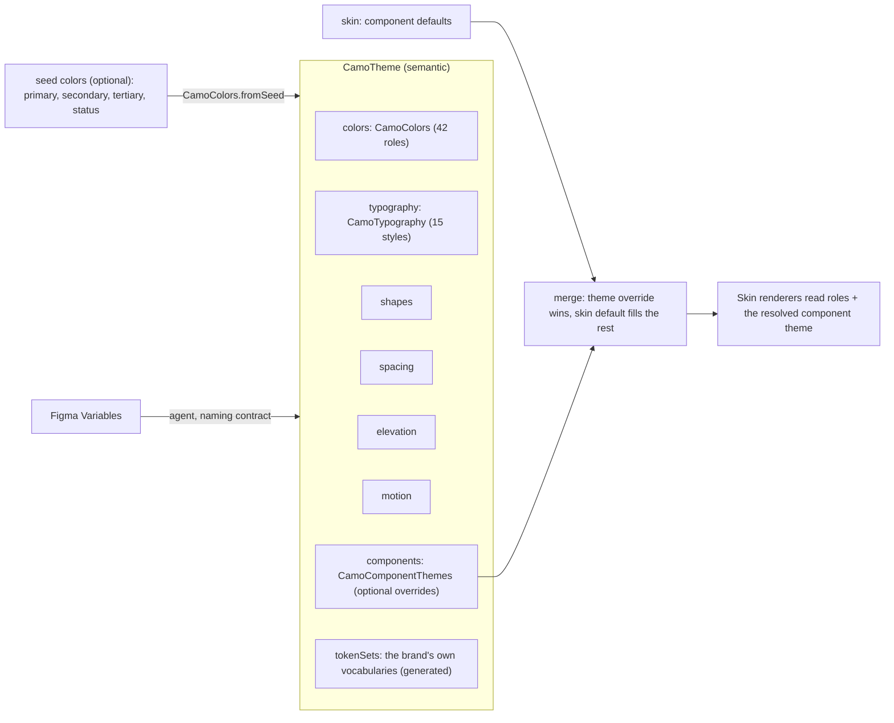
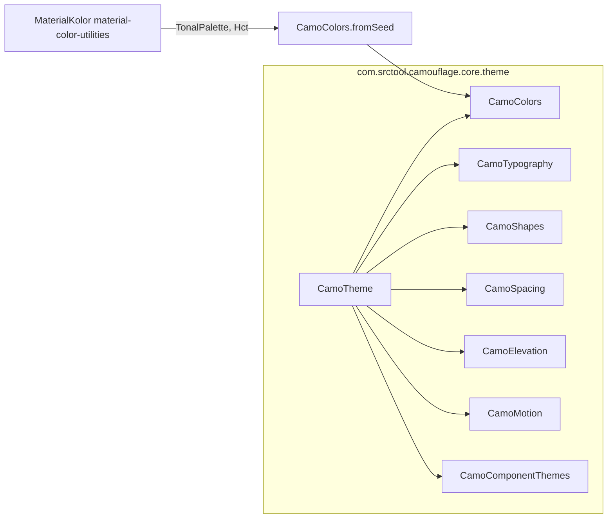
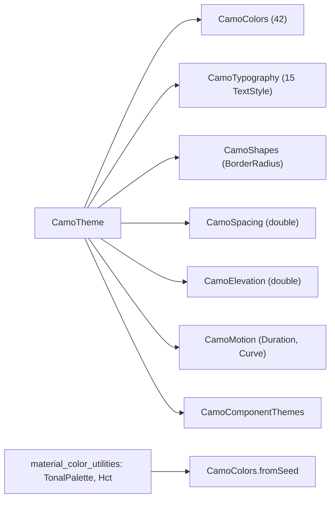

{/* Generated by docs/internal/scripts/sync_vault.py from the Camouflage design notes. Edit the notes and re-run the script; changes made here are overwritten. */}

# Theme

## Concept {#concept}

### 1. Why

A `CamoTheme` is **all the design values for one brand in one mode**, and nothing else: no behavior, no layout, no knowledge of which skin draws it. Because it is plain immutable data, a Theme can be written by hand, generated from a few seed colors, generated from Figma Variables by an AI agent ([Figma and AI](/guide/integrations/figma-and-ai)), or switched at runtime. This note fixes every token group, every role name, how the roles line up with other design systems, and the naming contract that maps Figma variables onto them one to one.

### 2. Shape



**Tier rule.** Camouflage defines only the **semantic** tier (roles). Primitives (a raw palette like `blue600`) are the app's own business. It may keep them in a `BrandPalette` object and reference them when building a theme, but no renderer ever sees a primitive. The **component tier** is optional and lives in `theme.components`. Every field there is nullable. The **skin** supplies a complete set of component defaults (Material: "buttons are 40 tall, full radius, icons 18"), and the theme overrides only what the brand's Figma file changes ("our buttons are 48 tall with radius 12"). This keeps a brand theme portable: on another skin, every field the theme didn't set falls back to *that* skin's defaults. See §3.10.

**Responsibilities**
- It holds values. It is immutable, and any change creates a new instance (`copy`).
- It validates itself (`validate()`) so broken generated themes fail early.
- It depends on nothing. It doesn't know about skins, providers or components.

**Group defaults.** Groups that define **brand identity** (colors, typography) are **required**. Groups that define **rhythm** (shapes, spacing, elevation, motion) have neutral defaults. Skin modules ship a ready-made starter theme (v1: `minimalTheme()` in [Minimal Skin](/guide/skins/minimal-skin)).

### 3. API

#### 3.1 `CamoTheme`

```kotlin
data class CamoTheme(
    val colors: CamoColors,                 // required
    val typography: CamoTypography,         // required; CamoTypography.system() is Camouflage's default scale
    val shapes: CamoShapes = CamoShapes(),
    val spacing: CamoSpacing = CamoSpacing(),
    val elevation: CamoElevation = CamoElevation(),
    val motion: CamoMotion = CamoMotion(),
    val components: CamoComponentThemes = CamoComponentThemes(),   // all null = use skin defaults
    val tokenSets: List<CamoTokenSet<*>> = emptyList(),   // the brand's own token vocabularies (§3.14), usually generated
) {
    fun copy(...): CamoTheme                // change one group, keep the rest
    fun validate(): List<ThemeIssue>        // empty list = valid
    fun <T : CamoTokenSet<T>> tokens(type): T?   // typed read of a token set (app code uses Camouflage.tokens<T>())
}
```

| Member | What it's for |
|---|---|
| `colors` … `motion` | the six token groups below |
| `components` | per-component overrides (button height, text-field shape…), merged over the skin's defaults (§3.10) |
| `tokenSets` | the brand's own tokens in its own naming (`brand[600]`, `radiusCard`, a gradient): typed classes, generated from the tokens JSON (§3.14). Roles and component themes can refer to them. |
| `copy` | derive dark from light, a seasonal variant from the base, and so on |
| `validate()` | returns issues: missing roles in generated themes, contrast failures, negative sizes |
| `tokens(type)` | the token set of that type, or null |

#### 3.2 `CamoColors`: 42 roles in 7 groups

Pairs `x` / `onX`: `onX` is the color of content (text, icons) drawn **on** `x`.

| Group | Roles | Used for |
|---|---|---|
| **Brand** | `primary`, `onPrimary`, `primaryContainer`, `onPrimaryContainer` | main actions (Solid button fill), selected and highlighted areas |
| | `secondary`, `onSecondary`, `secondaryContainer`, `onSecondaryContainer` | supporting actions (Soft button fill), filter chips, toggled icon backgrounds |
| | `tertiary`, `onTertiary`, `tertiaryContainer`, `onTertiaryContainer` | a third accent for contrast (a highlight badge, a chart series). Skins may ignore it. |
| **Surfaces** | `surface` | the default background of screens |
| | `surfaceContainerLowest`, `surfaceContainerLow`, `surfaceContainer`, `surfaceContainerHigh`, `surfaceContainerHighest` | layered containers, from least to most separated from the background (cards, sheets, dialogs, input fills) |
| **Content** | `onSurface` | primary text and icons on any surface |
| | `onSurfaceVariant` | secondary text, placeholders, unselected icons |
| **Lines** | `outline` | borders that must be seen (text-field outline, unchecked checkbox) |
| | `outlineVariant` | decorative dividers, subtle card borders |
| **Status** | `error`, `onError`, `errorContainer`, `onErrorContainer` | errors and destructive actions (`Tone.Error`) |
| | `success`, `onSuccess`, `successContainer`, `onSuccessContainer` | confirmations ("Payment sent") (`Tone.Success`) |
| | `warning`, `onWarning`, `warningContainer`, `onWarningContainer` | cautions ("Low balance") (`Tone.Warning`) |
| | `info`, `onInfo`, `infoContainer`, `onInfoContainer` | neutral information (`Tone.Info`) |
| **Inverse** | `inverseSurface`, `inverseOnSurface`, `inversePrimary` | elements that sit on the opposite scheme: snackbars, tooltips (`inversePrimary` is the action color on them) |
| **Utility** | `scrim` | the dim layer behind dialogs and bottom sheets (skins apply their own alpha) |

**Disabled content** has no role. Renderers derive it as `onSurface` at 38% alpha and containers as `onSurface` at 12%. The alpha values belong to the skin, because different design languages dim differently.

**`Tone` → color family.** Every component that takes a `tone` reads one family mechanically:

| `Tone` | Strong | On strong | Container | On container |
|---|---|---|---|---|
| `Default` | `primary` | `onPrimary` | `secondaryContainer` | `onSecondaryContainer` |
| `Error` | `error` | `onError` | `errorContainer` | `onErrorContainer` |
| `Success` | `success` | `onSuccess` | `successContainer` | `onSuccessContainer` |
| `Warning` | `warning` | `onWarning` | `warningContainer` | `onWarningContainer` |
| `Info` | `info` | `onInfo` | `infoContainer` | `onInfoContainer` |

(`Default` pairs `primary` with `secondaryContainer`, because in Material a Soft (tonal) button uses it. Each skin documents its own `Default` mapping; the status tones are fixed.)

#### 3.3 How the roles line up with other design systems

This table is what makes future skins and Figma imports work. Every major system's colors land on a Camouflage role.

| Camouflage | Material 3 | Apple HIG | Fluent 2 | IBM Carbon |
|---|---|---|---|---|
| `primary` | primary | tint / accent color | brandBackground | interactive / button-primary |
| `secondary`, `tertiary` | secondary, tertiary | – (skin ignores) | – | – |
| `surface` | surface | systemBackground | neutralBackground1 | background |
| `surfaceContainerLow` … `Highest` | surfaceContainer* | secondary/tertiarySystemBackground, grouped backgrounds | neutralBackground2–6 | layer-01 … layer-03 |
| `onSurface` | onSurface | label | neutralForeground1 | text-primary |
| `onSurfaceVariant` | onSurfaceVariant | secondaryLabel | neutralForeground2–3 | text-secondary, text-placeholder |
| `outline` / `outlineVariant` | outline / outlineVariant | opaqueSeparator / separator | neutralStroke1 / neutralStroke2 | border-strong / border-subtle |
| `error` family | error | systemRed | statusDanger | support-error |
| `success` family | – (Camouflage addition) | systemGreen | statusSuccess | support-success |
| `warning` family | – (Camouflage addition) | systemOrange / systemYellow | statusWarning | support-warning |
| `info` family | – (Camouflage addition) | systemBlue | – (brand) | support-info |
| `inverseSurface` family | inverseSurface | – | neutralBackgroundInverted | background-inverse |
| `scrim` | scrim | – (system dimming) | backgroundOverlay | overlay |

Where a system has more text levels than two (Apple's `tertiaryLabel`, `quaternaryLabel`), its skin derives them from `onSurfaceVariant` with alpha. Where it has fewer surface levels, its skin uses a subset.

#### 3.4 Building colors: explicit or from seeds

```kotlin
// explicit: what Figma / an AI agent generates, every role given
val brandLightColors = CamoColors(primary = …, onPrimary = …, /* all 42 */)

// generated: a few brand colors in, all 42 roles out
val brandLightColors = CamoColors.fromSeed(
    primary = Color(0xFF0B57D0),
    secondary = null, tertiary = null,          // null → derived from primary's hue
    error = null, success = null, warning = null, info = null,   // null → Camouflage default seeds
    neutral = null,                            // seed for surfaces/text; null → true grays (Camouflage default); pass primary for brand-tinted surfaces
    dark = false,
)
```

`fromSeed` uses the Material tonal-palette algorithm (HCT color space). Each seed becomes a palette of tones from 0 to 100, and the roles take fixed tones:

| Role | Light tone | Dark tone |
|---|---|---|
| `x` | 40 | 80 |
| `onX` | 100 | 20 |
| `xContainer` | 90 | 30 |
| `onXContainer` | 10 | 90 |

The same rule applies to primary, secondary, tertiary and every status family.

Surfaces and lines come from the **neutral palette**: a zero-chroma gray by default (true grays, Camouflage's own look, ADR-24), or the `neutral` seed when given (pass `neutral = primary` for brand-tinted surfaces in the Material style). The neutral roles take Camouflage's tones:

| Roles | Light | Dark |
|---|---|---|
| `surface`, `surfaceContainerLowest` | 100, 100 | 6, 4 |
| `surfaceContainerLow / Container / High / Highest` | 98 / 96 / 94 / 92 | 10 / 12 / 17 / 22 |
| `onSurface` / `onSurfaceVariant` | 10 / 35 | 92 / 75 |
| `outline` / `outlineVariant` | 50 / 90 | 60 / 25 |
| `inverseSurface` / `inverseOnSurface` | 20 / 95 | 90 / 20 |

The tonal palettes (HCT) come from Google's `material_color_utilities` package in Flutter, and its KMP port (MaterialKolor) in Kotlin. The platform notes pin the versions.

Default status seeds: `error` `#B3261E`, `success` `#2E7D32`, `warning` `#F9A825`, `info` `#0288D1` (settled 2026-09-27). Only the hue and chroma of a seed matter: the shades come from the tone table. At tone 40 the amber reads as a dark mustard, which is legible on light surfaces; a brand that wants a bright warning passes its own seed.

#### 3.5 `CamoTypography`: 15 styles

Five roles × three sizes. Each is a complete `CamoTextStyle(fontFamily, fontWeight, fontSize, lineHeight, letterSpacing)`, **including its weight**, so a component reads one constant and needs nothing else. For a one-off change, use `copy`:

```kotlin
CamoText("Total", style = Camouflage.typography.titleMedium.copy(fontWeight = Bold))
```

| Role | Large / Medium / Small used for |
|---|---|
| `display` | hero numbers, splash text |
| `headline` | screen titles in content, dialog title (`headlineSmall`) |
| `title` | top bar title (`titleLarge`), card titles (`titleMedium`) |
| `body` | paragraphs (`bodyLarge`), default text (`bodyMedium`), captions (`bodySmall`) |
| `label` | button text (`labelLarge`), chips and small tags (`labelMedium`/`labelSmall`) |

Property names: `displayLarge`, `displayMedium`, … `labelSmall`. Sizes are in **scalable units** (sp / logical px scaled by the text scaler), so user font scaling always applies.

**`CamoTypography.system()`** is Camouflage's default scale (the same values the Minimal skin uses), in the platform system font (SF Pro on Apple platforms, Roboto on Android, Segoe UI on Windows, the system UI font on Linux and web):

| Role | Size / line height | Weight |
|---|---|---|
| display L / M / S | 48/56 · 40/48 · 32/40 | 600 |
| headline L / M / S | 28/36 · 24/32 · 20/28 | 600 |
| title L / M / S | 18/26 · 16/24 · 14/20 | 600 |
| body L / M / S | 16/24 · 14/20 · 12/16 | 400 |
| label L / M / S | 14/20 · 12/16 · 11/16 | 500 |

`CamoTypography.system(fontFamily = BrandFont)` keeps the scale with a brand font.

#### 3.6 `CamoShapes`: corner radii

| Role | Default | Typical use |
|---|---|---|
| `none` | 0 | full-bleed surfaces |
| `extraSmall` | 4 | checkbox, small tag |
| `small` | 6 | chip, snackbar, menu |
| `medium` | 8 | button, text field, card |
| `large` | 12 | large card, dialog |
| `extraLarge` | 16 | sheet |
| `full` | 50% of the shorter side (pill/circle) | button, switch track, icon button |

These are Camouflage's defaults (ADR-24). Other dialects set their own (Material: 4 / 8 / 12 / 16 / 28; Carbon: all 0). These are radii only. The kind of corner (round vs a continuous "squircle") is a skin decision.

#### 3.7 `CamoSpacing`

| Role | Default | Role | Default |
|---|---|---|---|
| `none` | 0 | `l` | 16 |
| `xxs` | 2 | `xl` | 24 |
| `xs` | 4 | `xxl` | 32 |
| `s` | 8 | | |
| `m` | 12 | | |

In dp / logical pixels, on a 4-point grid. `none` gives component themes a named zero (`contentPadding = none`) and maps to a Figma `spacing/none` variable. Renderers use spacing roles for padding and gaps, never raw numbers.

#### 3.8 `CamoElevation`

| Role | Default (dp) | Meaning |
|---|---|---|
| `level0` | 0 | flat |
| `level1` | 1 | card resting |
| `level2` | 3 | top bar when scrolled |
| `level3` | 6 | raised card |
| `level4` | 8 | hovered raised elements |
| `level5` | 12 | dialog |

Elevation is a **semantic depth**, not a shadow. Each skin's `SurfaceTreatment` decides how depth looks: Paper uses a shadow, Glass uses blur strength, Acrylic uses frost amount.

#### 3.9 `CamoMotion`

| Role | Default | Used for |
|---|---|---|
| `durationShort` | 120 ms | press feedback, checkbox tick, switch thumb |
| `durationMedium` | 200 ms | expand/collapse, dialog enter |
| `durationLong` | 300 ms | large transitions |
| `easingStandard` | cubic-bezier(0.2, 0, 0, 1) | most transitions |
| `easingEmphasized` | cubic-bezier(0.05, 0.7, 0.1, 1) | entering elements, attention (Camouflage's own dialect doesn't use it; Material does) |

Durations are Camouflage's calm defaults (ADR-24). Material's are 150 / 300 / 500.

#### 3.10 Component themes

The per-component tier, the same idea as Flutter's `FilledButtonThemeData` / `InputDecorationTheme`: how **one kind of component** looks across the whole app.

```kotlin
data class CamoComponentThemes(
    val icon: IconTheme? = null,
    val surface: SurfaceTheme? = null,
    val button: ButtonTheme? = null,
    val iconButton: IconButtonTheme? = null,
    val textField: TextFieldTheme? = null,
    val card: CardTheme? = null,
    val checkbox: CheckboxTheme? = null,
    val switch: SwitchTheme? = null,
    val topBar: TopBarTheme? = null,
    val dialog: DialogTheme? = null,
    val bottomSheet: BottomSheetTheme? = null,
    val divider: DividerTheme? = null, val radio: RadioTheme? = null,
    val segmentedControl: SegmentedControlTheme? = null, val slider: SliderTheme? = null,
    val searchField: SearchFieldTheme? = null, val listItem: ListItemTheme? = null,
    val menu: MenuTheme? = null, val select: SelectTheme? = null, val tooltip: TooltipTheme? = null,
    val chip: ChipTheme? = null, val badge: BadgeTheme? = null, val avatar: AvatarTheme? = null,
    val progress: ProgressTheme? = null, val snackbar: SnackbarTheme? = null, val banner: BannerTheme? = null,
    val tabs: TabsTheme? = null, val navigationBar: NavigationBarTheme? = null,
    val navigationRail: NavigationRailTheme? = null, val navigationDrawer: NavigationDrawerTheme? = null,
    val fab: FabTheme? = null,
)
```

**The fields** of each `XTheme` are listed in its component note, under *Component theme*. They are values (sizes, corner radii, paddings, text styles, colors), never structure. All of them are **nullable**.

**Resolution (merge).** Before calling a renderer, core computes the effective component theme field by field:

```
resolved.button = skin.button.defaults(theme)     // complete, owned by the skin, may reference global tokens
                  .merge(theme.components.button)   // non-null theme fields win
```

The renderer receives `resolved` with **no nulls**. It never has to handle a missing value.

| Layer | Owns | Example |
|---|---|---|
| Global tokens | brand values used everywhere | `colors.primary`, `typography.labelLarge` |
| Component theme (theme, optional) | brand values for one component | `button.height = 48`, `button.shape = 12` |
| Skin defaults | the design language's proportions for every field the theme didn't set | Material: `button.height = 40` |
| Renderer override | only when the **structure** differs | a gradient pill button |

**Colors in component themes.**
- Component defaults normally *reference* global roles. A skin's default for a Solid button container is `colors.primary`, so changing `primary` still recolors buttons.
- A component-theme color override is a fixed value for that component only ("our secondary buttons are grey no matter what"). Use it sparingly.
- Status tones (`Error`, `Success`…) always come from the global status families, so a destructive button stays red.

**Scoped overrides** go through the provider, like any theme change:
```kotlin
CamouflageProvider(theme = Camouflage.theme.copy(
    components = Camouflage.theme.components.copy(button = ButtonTheme(height = 56)))) {
    CheckoutFooter()          // only buttons in here are 56 tall
}
```

#### 3.11 Light and dark

Light and dark are **two `CamoTheme` instances**. There is no `isDark` flag inside the theme:

```kotlin
val brandLight = CamoTheme(colors = CamoColors.fromSeed(primary = BrandBlue, dark = false), typography = CamoTypography.system(fontFamily = BrandFont))
val brandDark  = brandLight.copy(colors = CamoColors.fromSeed(primary = BrandBlue, dark = true))
CamouflageProvider(skin = MinimalSkin, theme = if (systemIsDark) brandDark else brandLight) { … }
```

If a skin needs to know whether the theme is dark (a glass tint, for example), it computes the luminance of `colors.surface`.

#### 3.12 Figma naming contract

Figma Variables use `/`-separated paths. Each path maps **one to one** onto a role. Lowercase kebab-case in Figma becomes camelCase in code.

| Figma variable path | Theme property |
|---|---|
| `color/primary` | `colors.primary` |
| `color/on-primary-container` | `colors.onPrimaryContainer` |
| `color/surface-container-high` | `colors.surfaceContainerHigh` |
| `color/success`, `color/on-warning`, `color/info-container` | `colors.success`, `colors.onWarning`, `colors.infoContainer` |
| `type/body/medium` | `typography.bodyMedium` (a text style, not a variable) |
| `shape/medium` | `shapes.medium` |
| `spacing/l` | `spacing.l` |
| `elevation/level2` | `elevation.level2` |
| `motion/duration-short` | `motion.durationShort` |
| `component/button/height`, `component/button/radius`, `component/text-field/icon-size` | `components.button.height`, `components.button.shape`, `components.textField.iconSize` |
| `custom/<set>/<name>` (any extra collection, any naming) | a field of the generated token set `<Set>Tokens` (§3.14) |

Figma **modes** (Light, Dark, Brand A, Brand B) become separate `CamoTheme` instances. Typography comes from Figma **text styles**, because Figma Variables can't hold a full text style.

#### 3.13 Validation rules (`validate()`)

| Check | Issue |
|---|---|
| a color role missing (generated themes) | `MissingRole("colors.onSuccess")` |
| contrast of each `onX` on `x` below **4.5:1** (WCAG 2.2 AA, normal text), for all 13 pairs | `LowContrast("onWarning/warning", 3.1)` |
| `onSurface` and `onSurfaceVariant` on `surface` and every surface container below 4.5:1 | `LowContrast(...)` |
| `outline` on `surface` below **3:1** (WCAG 1.4.11 non-text contrast) | `LowContrast("outline/surface", 2.4)` |
| a negative radius, spacing or duration | `InvalidValue("spacing.m", -4)` |
| two token sets of the same type, or a role referencing a token set the theme doesn't include | `DuplicateTokenSet(BrandTokens)` / `MissingTokenSet(BrandTokens)` |
| a component-theme size below the 48 touch target where the component needs one (e.g. `iconButton.containerSize = 32`) | `SmallTarget("components.iconButton", 32)`. It's allowed visually; core still keeps a 48 touch area around it. |

 `validate()` **reports**, it doesn't throw (see §5).

#### 3.14 Custom token sets (ADR-32)

Brands have their own vocabulary: Tailwind-style scales (`brand-50` … `brand-950`), Mantine-style indexed shades (`brand[6]`), named sizes (`radius-card`). On the web these can be plain CSS variables, used anywhere. In Kotlin and Dart they must be **typed and mapped** to Camouflage, which is a job for the **generator**: from the tokens JSON's `custom` groups, `camo` writes one class per set.

```kotlin
// generated from "custom": { "brand": { "50": …, "600": …, "950": … }, "radius": { "card": "20px" } }
@Immutable data class BrandTokens(
    val brand: CamoColorScale,         // brand[600]; numeric names are kept
    val radiusCard: Dp,
) : CamoTokenSet<BrandTokens> {
    override fun lerp(to: BrandTokens, t: Float): BrandTokens = /* generated */
    companion object { val Light = BrandTokens(…); val Dark = BrandTokens(…) }
}

// roles and component themes refer to it (the tokens JSON says "primary": "{custom.brand.600}")
val brandLight = CamoTheme(
    colors = CamoColors(primary = BrandTokens.Light.brand[600], /* … */),
    components = CamoComponentThemes(card = CardTheme(shape = RoundedCornerShape(BrandTokens.Light.radiusCard))),
    tokenSets = listOf(BrandTokens.Light),
)

// app code: typed, scoped by providers, blended by animated theme switches
val brand = Camouflage.tokens<BrandTokens>()      // Flutter: CamoTokens.of<BrandTokens>(context)
```

| | Flutter `ThemeExtension` | Camouflage token sets |
|---|---|---|
| naming | Dart fields | any convention, including numeric scales |
| boilerplate | hand-written `copyWith` + `lerp` | generated (hand-writing a `CamoTokenSet` still works) |
| used by roles and component themes | no | yes, by reference |
| platforms | Flutter | Kotlin, Dart, and CSS variables on the web |

### 4. Build steps

1. Create `CamoTextStyle` (with `copy`), then `CamoColors` (42 fields, no defaults) and `CamoTypography` (15 fields).
2. Create `CamoShapes`, `CamoSpacing`, `CamoElevation`, `CamoMotion` with the defaults from the tables.
3. Create `CamoTheme` with `components` (all-null `CamoComponentThemes`), `tokenSets`, `copy` and `tokens(type)`, plus `CamoTokenSet<T>` (with `lerp`) and `CamoColorScale` / `CamoDimensionScale`. Each `XTheme` class is created with its component (M3–M6), and each gets a `merge(other)` that keeps non-null fields of `other`.
4. Implement `CamoColors.fromSeed` on top of the platform's tonal-palette library (the tone table in §3.4).
5. Write `validate()` with a WCAG contrast function (relative luminance, then `(L1 + 0.05) / (L2 + 0.05)`).
6. Build a sample `brandLight` / `brandDark` in the `sample` module from one seed color.
7. Unit tests:
   - `copy` keeps untouched groups;
   - `fromSeed` produces 42 roles, and the light theme passes `validate()`;
   - a planted 3:1 pair is reported with its ratio;
   - black on white gives 21;
   - an unknown extension key returns null.

**Done when**
- [ ] A full theme can be built from one seed color plus typography.
- [ ] `validate()` returns no issues for the sample light and dark themes, and reports a planted low-contrast pair.
- [ ] The theme compiles with zero dependencies on skins, providers or components.

### 5. Edge cases

| Case | Decided behavior |
|---|---|
| **Text scaling to 200%** | Typography sizes are scalable units, so they grow. Renderers must let text wrap and containers grow. The theme never caps scaling. |
| **An extra Figma variable** (`color/brand-accent`, no role) | The agent puts it in a custom token set (`custom/…`) and reports it. It never silently drops it. |
| **A missing Figma variable** (no `color/on-success`) | A generated theme fails validation with `MissingRole`. The agent asks, or fills it with `fromSeed` from the related strong color **and reports that it did**. |
| **A design system without status colors** (plain Material files) | `fromSeed` fills success, warning and info from the default seeds. The report says which ones were defaulted. |
| **A brand whose warning color (yellow) fails contrast with white** | The tone rule avoids it: `warning` is tone 40 (a dark amber), and `onWarning` is tone 100. A hand-picked bright yellow is reported by `validate()`. |
| **Low contrast in a real brand** | `validate()` reports it. Apps choose to fail in a debug assert, or accept and log it. The library never auto-corrects brand colors. |
| **Dynamic color** (Android 12+ wallpaper colors) | Another theme *source*. The Kotlin note provides `dynamicCamoColors()`, which fills the brand and surface roles from the platform scheme, and the status roles from default seeds. |
| **Reduced motion** | The provider passes `theme.copy(motion = motion.reduced())`, which zeroes durations except the meaningful ones. See [Provider and Scoping](/guide/architecture/provider-and-scoping). |
| **Theme sets a component value the current skin doesn't use** (e.g. `switch.thumbSizeOn` on a skin whose switch has no size change) | Ignored by that skin, and documented in the skin's note. |
| **Brand theme moved to another skin** | Global tokens and any component values it set carry over. Everything unset uses the new skin's defaults. |
| **Animated theme switch** | Themes support `lerp(a, b, t)` per token (colors blend, sizes interpolate, fonts switch at t = 0.5). |

## Implementation {#implementation}

<KotlinOnly>

### 1. Why {#kotlin-1-why}

This note turns the token model from Theme into Kotlin data classes that Compose can use efficiently. That means immutable, `@Immutable`-annotated, and built on Compose's own value types (`Color`, `TextStyle`, `Dp`, `Shape`), so renderers need no conversion. It also implements `CamoColors.fromSeed` on MaterialKolor, and `validate()`.

### 2. Shape {#kotlin-2-shape}



**Base → Kotlin type mapping**

| Base | Kotlin | Why |
|---|---|---|
| `CamoTextStyle` | `androidx.compose.ui.text.TextStyle` | it already has every field plus `copy()` and `lerp`, so a wrapper would add nothing |
| color | `androidx.compose.ui.graphics.Color` | – |
| sizes (spacing, elevation, radii) | `Dp` | – |
| shape roles | `CornerBasedShape` (`RoundedCornerShape`) | renderers pass them straight to `Modifier.clip` / `background` |
| durations | `Int` milliseconds | matches `tween(durationMillis = …)` |
| easings | `androidx.compose.animation.core.Easing` (`CubicBezierEasing`) | – |

### 3. API {#kotlin-3-api}

#### 3.1 `CamoTheme` {#kotlin-31-camotheme}

```kotlin
@Immutable
public data class CamoTheme(
    val colors: CamoColors,
    val typography: CamoTypography,
    val components: CamoComponentThemes = CamoComponentThemes(),
    val shapes: CamoShapes = CamoShapes(),
    val spacing: CamoSpacing = CamoSpacing(),
    val elevation: CamoElevation = CamoElevation(),
    val motion: CamoMotion = CamoMotion(),
    val tokenSets: List<CamoTokenSet<*>> = emptyList(),
) {
    public inline fun <reified T : CamoTokenSet<T>> tokens(): T? = tokenSets.firstOrNull { it is T } as T?
    public fun validate(): List<ThemeIssue> = ThemeValidator.validate(this)
}
```

`copy()` comes free with `data class`. Token sets are `@Immutable` data classes (generated), and `Camouflage.tokens<T>()` reads them from the current theme.

#### 3.2 `CamoColors` {#kotlin-32-camocolors}

```kotlin
@Immutable
public data class CamoColors(
    // brand
    val primary: Color, val onPrimary: Color, val primaryContainer: Color, val onPrimaryContainer: Color,
    val secondary: Color, val onSecondary: Color, val secondaryContainer: Color, val onSecondaryContainer: Color,
    val tertiary: Color, val onTertiary: Color, val tertiaryContainer: Color, val onTertiaryContainer: Color,
    // surfaces + content + lines
    val surface: Color,
    val surfaceContainerLowest: Color, val surfaceContainerLow: Color, val surfaceContainer: Color,
    val surfaceContainerHigh: Color, val surfaceContainerHighest: Color,
    val onSurface: Color, val onSurfaceVariant: Color,
    val outline: Color, val outlineVariant: Color,
    // status
    val error: Color, val onError: Color, val errorContainer: Color, val onErrorContainer: Color,
    val success: Color, val onSuccess: Color, val successContainer: Color, val onSuccessContainer: Color,
    val warning: Color, val onWarning: Color, val warningContainer: Color, val onWarningContainer: Color,
    val info: Color, val onInfo: Color, val infoContainer: Color, val onInfoContainer: Color,
    // inverse + utility
    val inverseSurface: Color, val inverseOnSurface: Color, val inversePrimary: Color,
    val scrim: Color,
) {
    public companion object {
        public fun fromSeed(
            primary: Color,
            secondary: Color? = null, tertiary: Color? = null,
            error: Color? = null, success: Color? = null, warning: Color? = null, info: Color? = null,
            neutral: Color? = null,          // null → true grays (ADR-24); pass primary for tinted surfaces
            dark: Boolean = false,
        ): CamoColors = SeedScheme.build(/* … */)
    }
}

// the Tone → family lookup every tone-aware renderer uses
@Immutable public data class ToneColors(val strong: Color, val onStrong: Color, val container: Color, val onContainer: Color)
public fun CamoColors.family(tone: Tone): ToneColors
```

**`fromSeed` implementation (internal `SeedScheme`)**, using MaterialKolor's `material-color-utilities` port:

```kotlin
internal object SeedScheme {
    private val Light = Tones(strong = 40, onStrong = 100, container = 90, onContainer = 10)
    private val Dark  = Tones(strong = 80, onStrong = 20, container = 30, onContainer = 90)

    fun family(seed: Color, dark: Boolean): ToneColors {
        val palette = TonalPalette.fromInt(seed.toArgb())            // HCT-based palette, tones 0..100
        val t = if (dark) Dark else Light
        return ToneColors(Color(palette.tone(t.strong)), Color(palette.tone(t.onStrong)),
                          Color(palette.tone(t.container)), Color(palette.tone(t.onContainer)))
    }
    // neutral palette: TonalPalette.fromHueAndChroma(0.0, 0.0) (true grays), or from the `neutral` seed.
    // Roles take the base tone table (§3.4): surface 100 / 6, containers 98..92 / 10..22,
    // onSurface 10 / 92, onSurfaceVariant 35 / 75, outline 50 / 60, outlineVariant 90 / 25 …
}
```

- `secondary` and `tertiary` default to palettes derived from `primary`'s hue (the Material "tonal spot" approach).
- Status seeds default to `#B3261E`, `#2E7D32`, `#F9A825` and `#0288D1`.
- The neutral tones are Camouflage's table in `SeedScheme` (ADR-24), pinned by a snapshot test. MaterialKolor only supplies the palettes.

**Dynamic color (Android only, an addition, not core API):**

```kotlin
// androidMain
public fun dynamicCamoColors(context: Context, dark: Boolean): CamoColors?   // null below Android 12
```

It reads the system's dynamic scheme, maps it role by role, and fills the status families from the default seeds.

#### 3.3 `CamoTypography`, `CamoShapes`, `CamoSpacing`, `CamoElevation`, `CamoMotion` {#kotlin-33-camotypography-camoshapes-camospacing-camoelevation-camomotion}

```kotlin
// CamoTypography.system(fontFamily = FontFamily.Default): Camouflage's default scale (base §3.5), sizes in sp
@Immutable public data class CamoTypography(
    val displayLarge: TextStyle, val displayMedium: TextStyle, val displaySmall: TextStyle,
    val headlineLarge: TextStyle, val headlineMedium: TextStyle, val headlineSmall: TextStyle,
    val titleLarge: TextStyle, val titleMedium: TextStyle, val titleSmall: TextStyle,
    val bodyLarge: TextStyle, val bodyMedium: TextStyle, val bodySmall: TextStyle,
    val labelLarge: TextStyle, val labelMedium: TextStyle, val labelSmall: TextStyle,
) {
    public companion object {
        public fun system(fontFamily: FontFamily = FontFamily.Default): CamoTypography   // 600 / 500 / 400 weights
    }
}

@Immutable public data class CamoShapes(
    val none: CornerBasedShape = RoundedCornerShape(0.dp),
    val extraSmall: CornerBasedShape = RoundedCornerShape(4.dp),
    val small: CornerBasedShape = RoundedCornerShape(6.dp),
    val medium: CornerBasedShape = RoundedCornerShape(8.dp),
    val large: CornerBasedShape = RoundedCornerShape(12.dp),
    val extraLarge: CornerBasedShape = RoundedCornerShape(16.dp),
    val full: CornerBasedShape = RoundedCornerShape(percent = 50),
)
public fun CamoShapes.of(role: ShapeRole): CornerBasedShape

@Immutable public data class CamoSpacing(
    val none: Dp = 0.dp, val xxs: Dp = 2.dp, val xs: Dp = 4.dp, val s: Dp = 8.dp, val m: Dp = 12.dp,
    val l: Dp = 16.dp, val xl: Dp = 24.dp, val xxl: Dp = 32.dp,
)

@Immutable public data class CamoElevation(
    val level0: Dp = 0.dp, val level1: Dp = 1.dp, val level2: Dp = 3.dp,
    val level3: Dp = 6.dp, val level4: Dp = 8.dp, val level5: Dp = 12.dp,
)
public fun CamoElevation.of(level: ElevationLevel): Dp

@Immutable public data class CamoMotion(
    val durationShort: Int = 120, val durationMedium: Int = 200, val durationLong: Int = 300,
    val easingStandard: Easing = CubicBezierEasing(0.2f, 0f, 0f, 1f),
    val easingEmphasized: Easing = CubicBezierEasing(0.05f, 0.7f, 0.1f, 1f),
) {
    public fun reduced(): CamoMotion = copy(durationShort = 0, durationMedium = 0, durationLong = 0)
}
```

Font sizes in `TextStyle` use `sp`, so the system font scale applies automatically.

#### 3.4 Component themes: overrides (`XTheme`) and resolved styles (`XStyle`) {#kotlin-34-component-themes-overrides-xtheme-and-resolved-styles-xstyle}

Kotlin's null-safety makes the base "all nullable in the theme, no nulls in the renderer" rule explicit with **two classes per component**:

```kotlin
@Immutable public data class ButtonTheme(          // in CamoTheme.components: every field nullable
    val height: Dp? = null, val minWidth: Dp? = null, val shape: Shape? = null,
    val padding: PaddingValues? = null, val paddingWithIcon: PaddingValues? = null,
    val textStyle: TextStyle? = null, val iconSize: Dp? = null, val iconGap: Dp? = null,
    val borderWidth: Dp? = null, val raisedElevation: ElevationLevel? = null,
    val solidColors: ButtonColors? = null, val softColors: ButtonColors? = null, val raisedColors: ButtonColors? = null,
    val outlineColors: ButtonColors? = null, val ghostColors: ButtonColors? = null, val linkColors: ButtonColors? = null,
    val disabledContainerAlpha: Float? = null, val disabledContentAlpha: Float? = null,
)

@Immutable public data class ButtonStyle(          // what a renderer receives: nothing nullable
    val height: Dp, val minWidth: Dp, val shape: Shape,
    val padding: PaddingValues, val paddingWithIcon: PaddingValues,
    val textStyle: TextStyle, val iconSize: Dp, val iconGap: Dp,
    val borderWidth: Dp, val raisedElevation: ElevationLevel,
    val solidColors: ButtonColors, val softColors: ButtonColors, val raisedColors: ButtonColors,
    val outlineColors: ButtonColors, val ghostColors: ButtonColors, val linkColors: ButtonColors,
    val disabledContainerAlpha: Float, val disabledContentAlpha: Float,
) {
    public fun merge(overrides: ButtonTheme?): ButtonStyle = if (overrides == null) this else ButtonStyle(
        height = overrides.height ?: height, minWidth = overrides.minWidth ?: minWidth, /* …every field… */
    )
}

@Immutable public data class CamoComponentThemes(
    val icon: IconTheme? = null, val surface: SurfaceTheme? = null, val button: ButtonTheme? = null, val iconButton: IconButtonTheme? = null,
    val textField: TextFieldTheme? = null, val card: CardTheme? = null, val checkbox: CheckboxTheme? = null,
    val switch: SwitchTheme? = null, val topBar: TopBarTheme? = null, val dialog: DialogTheme? = null,
    val bottomSheet: BottomSheetTheme? = null,
    val divider: DividerTheme? = null, val fab: FabTheme? = null, val radio: RadioTheme? = null,
    val segmentedControl: SegmentedControlTheme? = null, val slider: SliderTheme? = null, val searchField: SearchFieldTheme? = null,
    val select: SelectTheme? = null, val datePicker: DatePickerTheme? = null, val timePicker: TimePickerTheme? = null,
    val stepper: StepperTheme? = null, val accordion: AccordionTheme? = null, val listItem: ListItemTheme? = null, val pagedList: PagedListTheme? = null,
    val chip: ChipTheme? = null, val badge: BadgeTheme? = null, val avatar: AvatarTheme? = null,
    val progress: ProgressTheme? = null, val snackbar: SnackbarTheme? = null, val banner: BannerTheme? = null,
    val skeleton: SkeletonTheme? = null, val menu: MenuTheme? = null, val tooltip: TooltipTheme? = null,
    val tabs: TabsTheme? = null, val navigationBar: NavigationBarTheme? = null, val navigationRail: NavigationRailTheme? = null,
    val navigationDrawer: NavigationDrawerTheme? = null,
)
```

The field lists are exactly the *Component theme* tables in each base component note, including the layout choices added in review (ADR-28/30: `labelPlacement`, `labelPosition`, `titleAlign`, `actionsLayout`, `indicator`, `placement`, `defaultAppearance`, …).

**Custom token sets (ADR-32):**

```kotlin
public interface CamoTokenSet<T : CamoTokenSet<T>> {
    public fun lerp(to: T, fraction: Float): T                     // for animateCamoTheme
}

@Immutable public class CamoColorScale(private val steps: Map<Int, Color>) {
    public operator fun get(step: Int): Color = steps[step] ?: error("No step $step in this scale")
    public fun lerp(to: CamoColorScale, t: Float): CamoColorScale
}
@Immutable public class CamoDimensionScale(private val steps: Map<String, Dp>) { public operator fun get(name: String): Dp }
```

Token-set classes are normally **generated** by `camo theme import` (one `@Immutable data class` per `custom` group, with `lerp` and `Light`/`Dark` instances). `animateCamoTheme` blends each set with the matching set of the target theme (matched by class). Each `XTheme`/`XStyle` pair lives in the component's own file (`button/ButtonTheme.kt`), next to the component.

#### 3.5 Validation {#kotlin-35-validation}

```kotlin
public sealed interface ThemeIssue {
    public data class LowContrast(val pair: String, val ratio: Double, val required: Double) : ThemeIssue
    public data class InvalidValue(val token: String, val value: Any) : ThemeIssue
    public data class ShadowedRole(val key: String) : ThemeIssue
    public data class SmallTarget(val component: String, val size: Dp) : ThemeIssue
}

internal fun contrastRatio(a: Color, b: Color): Double {
    val l1 = a.luminance() + 0.05; val l2 = b.luminance() + 0.05       // Compose's luminance() = WCAG relative luminance
    return maxOf(l1, l2) / minOf(l1, l2)
}
```

`MissingRole` from the base note doesn't exist in Kotlin: the constructor requires all 42 colors, so a missing role is a compile error. It only exists in generated JSON → theme parsing (Camouflage Blueprint, Later).

#### 3.6 Animated theme switch {#kotlin-36-animated-theme-switch}

```kotlin
public fun lerp(a: CamoTheme, b: CamoTheme, t: Float): CamoTheme    // colors lerp, Dp lerp, TextStyle lerp
@Composable public fun animateCamoTheme(target: CamoTheme, durationMillis: Int = 300): CamoTheme
```

`animateCamoTheme` is public API in core: it animates a `0 → 1` float and returns `lerp(previous, target, t)`. It's used by the M4 theme-swap demo.

### 4. Build steps {#kotlin-4-build-steps}

1. `ThemeRoles.kt`: the shared enums (`ShapeRole`, `ElevationLevel`, `Tone`, `SurfaceLevel`) and `ToneColors` + `family()`.
2. `CamoColors`, `CamoTypography`, `CamoShapes`, `CamoSpacing`, `CamoElevation`, `CamoMotion`, all `@Immutable data class`es.
3. `CamoTheme` + `CamoComponentThemes` (empty `XTheme` classes for now, filled per component in M3–M6).
4. `SeedScheme` + `CamoColors.fromSeed` on MaterialKolor.
5. `ThemeValidator` + `contrastRatio`.
6. `lerp` + `animateCamoTheme`.
7. `commonTest`:
   - `contrastRatio(Black, White) == 21.0`;
   - `fromSeed(Color(0xFF6750A4))` gives `primary` equal to MaterialKolor's tone 40;
   - light and dark `fromSeed` themes validate cleanly;
   - a planted `onWarning` = `warning` is reported;
   - `ButtonStyle.merge` keeps defaults for null fields.
8. `androidMain`: `dynamicCamoColors`.

**Done when**
- [ ] All `commonTest` tests pass on jvm, iOS simulator and wasmJs.
- [ ] `sample` shows a color-role swatch grid for a seed theme in light and dark.
- [ ] The ABI dump lists only the intended public types.

### 5. Edge cases {#kotlin-5-edge-cases}

| Case | Decided behavior |
|---|---|
| **Base `CamoTextStyle` vs Compose `TextStyle`** | Kotlin uses `TextStyle` directly (platform mapping, not a contract change). `copy(fontWeight = …)` works as the base note describes. |
| **Base `XTheme` resolved "with no nulls"** | Kotlin splits it into `XTheme` (nullable overrides) + `XStyle` (resolved). The names differ only on the resolved side. The renderer signature takes `XStyle`. |
| 42-parameter constructor | Verbose but explicit. Most apps use `fromSeed` (or a skin's starter theme, e.g. `minimalTheme`), then `copy` a few roles. |
| Token set lookup cost | A linear scan of a short list, once per read; the generated `Camouflage.tokens<T>()` is `@ReadOnlyComposable`. |
| Font loading on web | Custom fonts must be loaded as Compose resources, because the browser has no system Roboto. `minimalLight` falls back to the platform default family. |
| MaterialKolor version bump changes generated tones | Baseline status colors are pinned in code (see [Material Skin](/guide/skins/material-skin#implementation)). `fromSeed` output is covered by snapshot tests, so changes are visible in review. |

</KotlinOnly>

<DartOnly>

### 1. Why {#dart-1-why}

This note turns the token model into immutable Dart classes with `copyWith` and `lerp`, the Flutter idiom that `ThemeData` and `ThemeExtension` use too. They're built on Flutter's value types (`Color`, `TextStyle`, `BorderRadius`, `Duration`, `Curve`). Camouflage **doesn't** use `ThemeData`: that class lives in `material_ui` now, and core must not depend on it.

### 2. Shape {#dart-2-shape}



**Base → Dart type mapping**

| Base | Dart | Note |
|---|---|---|
| `CamoTextStyle` | `TextStyle` (`dart:ui`/widgets) | has `copyWith`, `lerp`, `merge` |
| color | `Color` | – |
| sizes | `double` (logical pixels) | the Flutter convention; no `Dp` type |
| shape roles | `BorderRadius` | renderers wrap it in `RoundedRectangleBorder`/`ClipRRect`. `full` is a large radius (`BorderRadius.circular(1000)`), clamped by the box. |
| durations / easings | `Duration` / `Curve` (`Cubic`) | – |

### 3. API {#dart-3-api}

#### 3.1 `CamoTheme` {#dart-31-camotheme}

```dart
@immutable
class CamoTheme {
  const CamoTheme({
    required this.colors,
    required this.typography,
    this.components = const CamoComponentThemes(),
    this.shapes = const CamoShapes(),
    this.spacing = const CamoSpacing(),
    this.elevation = const CamoElevation(),
    this.motion = const CamoMotion(),
    this.tokenSets = const [],
  });

  final CamoColors colors;
  final CamoTypography typography;
  final CamoComponentThemes components;
  final CamoShapes shapes;
  final CamoSpacing spacing;
  final CamoElevation elevation;
  final CamoMotion motion;
  final List<CamoTokenSet> tokenSets;   // generated brand vocabularies (ADR-32)

  CamoTheme copyWith({/* every field, nullable */});
  T? tokens<T extends CamoTokenSet<T>>() => tokenSets.whereType<T>().firstOrNull;   // app code: CamoTokens.of<T>(context)
  List<ThemeIssue> validate() => ThemeValidator.validate(this);
  static CamoTheme lerp(CamoTheme a, CamoTheme b, double t);
}
```

#### 3.2 `CamoColors` {#dart-32-camocolors}

```dart
@immutable
class CamoColors {
  const CamoColors({
    required this.primary, required this.onPrimary, required this.primaryContainer, required this.onPrimaryContainer,
    // … all 42 roles, required, grouped as in the base note
    required this.scrim,
  });
  // fields …

  factory CamoColors.fromSeed({
    required Color primary,
    Color? secondary, Color? tertiary,
    Color? error, Color? success, Color? warning, Color? info,
    Color? neutral,                    // null → true grays (ADR-24); pass primary for tinted surfaces
    Brightness brightness = Brightness.light,
  }) => SeedScheme.build(/* … */);

  CamoColors copyWith({/* … */});
  static CamoColors lerp(CamoColors a, CamoColors b, double t);   // Color.lerp per role
  ToneColors family(Tone tone);
}

@immutable class ToneColors { const ToneColors(this.strong, this.onStrong, this.container, this.onContainer); /* … */ }
```

**`fromSeed`** uses `material_color_utilities` directly: `TonalPalette.of(hct.hue, hct.chroma).get(tone)` with the same tone table as the base note (light 40/100/90/10, dark 80/20/30/90). Neutrals come from `TonalPalette.of(0, 0)` (true grays) unless `neutral` is given, with the base neutral tone table (ADR-24). The same default status seeds apply. A unit test checks that `primary` for seed `#6750A4` matches tone 40.

Dynamic color (Android 12+) isn't in core. An app can use `dynamic_color` (pub) and map its `CorePalette` into `CamoColors`. The example shows how.

#### 3.3 The other groups {#dart-33-the-other-groups}

```dart
@immutable class CamoTypography {
  const CamoTypography({required this.displayLarge, /* … 15 TextStyle */}); /* copyWith, lerp */
  factory CamoTypography.system({String? fontFamily});   // Camouflage's default scale (base §3.5); null → platform system font
}

@immutable class CamoShapes {
  const CamoShapes({
    this.none = BorderRadius.zero,
    this.extraSmall = const BorderRadius.all(Radius.circular(4)),
    this.small = const BorderRadius.all(Radius.circular(6)),
    this.medium = const BorderRadius.all(Radius.circular(8)),
    this.large = const BorderRadius.all(Radius.circular(12)),
    this.extraLarge = const BorderRadius.all(Radius.circular(16)),
    this.full = const BorderRadius.all(Radius.circular(1000)),
  });
  BorderRadius of(ShapeRole role);
}

@immutable class CamoSpacing { const CamoSpacing({this.none = 0, this.xxs = 2, this.xs = 4, this.s = 8, this.m = 12, this.l = 16, this.xl = 24, this.xxl = 32}); }
@immutable class CamoElevation { const CamoElevation({this.level0 = 0, this.level1 = 1, this.level2 = 3, this.level3 = 6, this.level4 = 8, this.level5 = 12}); double of(ElevationLevel l); }
@immutable class CamoMotion {
  const CamoMotion({
    this.durationShort = const Duration(milliseconds: 120),
    this.durationMedium = const Duration(milliseconds: 200),
    this.durationLong = const Duration(milliseconds: 300),
    this.easingStandard = const Cubic(0.2, 0, 0, 1),
    this.easingEmphasized = const Cubic(0.05, 0.7, 0.1, 1),
  });
  CamoMotion reduced() => copyWith(durationShort: Duration.zero, durationMedium: Duration.zero, durationLong: Duration.zero);
}
```

Font sizes are logical pixels, scaled by `MediaQuery.textScalerOf(context)` automatically in `Text`/`RichText`.

#### 3.4 Component themes: `CamoXTheme` (overrides) and `CamoXStyle` (resolved) {#dart-34-component-themes-camoxtheme-overrides-and-camoxstyle-resolved}

The same split as Kotlin (nullable overrides, and a resolved class with no nulls), with the `Camo` prefix to avoid clashing with `IconTheme` (widgets) and `ButtonTheme`/`CardTheme`/`DialogTheme`/… (`material_ui`):

```dart
@immutable class CamoButtonTheme {                 // in CamoTheme.components; every field nullable
  const CamoButtonTheme({this.height, this.minWidth, this.shape, this.padding, this.paddingWithIcon,
      this.textStyle, this.iconSize, this.iconGap, this.borderWidth, this.raisedElevation,
      this.solidColors, this.softColors, this.raisedColors, this.outlineColors, this.ghostColors, this.linkColors,
      this.disabledContainerAlpha, this.disabledContentAlpha});
  final double? height; /* … */
}

@immutable class CamoButtonStyle {                 // resolved; what renderers receive
  const CamoButtonStyle({required this.height, /* … all required */});
  CamoButtonStyle merge(CamoButtonTheme? o) => o == null ? this : CamoButtonStyle(height: o.height ?? height, /* … */);
  static CamoButtonStyle lerp(CamoButtonStyle a, CamoButtonStyle b, double t);
}

@immutable class CamoComponentThemes {
  const CamoComponentThemes({this.icon, this.surface, this.button, this.iconButton, this.textField, this.card,
      this.checkbox, this.switchTheme, this.topBar, this.dialog, this.bottomSheet,
      this.divider, this.fab, this.radio, this.segmentedControl, this.slider, this.searchField, this.select, this.datePicker, this.timePicker, this.stepper, this.accordion,
      this.listItem, this.pagedList, this.chip, this.badge, this.avatar, this.progress, this.snackbar,
      this.banner, this.skeleton, this.menu, this.tooltip, this.tabs, this.navigationBar,
      this.navigationRail, this.navigationDrawer});
}
```

`switch` is a Dart keyword, so the field is `switchTheme`. The renderer field on `CamoSkin` is `switchRenderer` for the same reason.

#### 3.5 Validation {#dart-35-validation}

The same checks as the base note. `computeLuminance()` on `Color` gives WCAG relative luminance:

```dart
double contrastRatio(Color a, Color b) {
  final l1 = a.computeLuminance() + 0.05, l2 = b.computeLuminance() + 0.05;
  return math.max(l1, l2) / math.min(l1, l2);
}
```

#### 3.6 Animated theme switch {#dart-36-animated-theme-switch}

`CamoAnimatedTheme` (an `ImplicitlyAnimatedWidget`) tweens between themes with `CamoTheme.lerp`, the same approach as Material's `AnimatedTheme`, used by the M4 demo.

**Custom token sets (ADR-32):**

```dart
abstract class CamoTokenSet<T extends CamoTokenSet<T>> {
  const CamoTokenSet();
  T lerp(T other, double t);                    // for CamoAnimatedTheme
}
@immutable class CamoColorScale {
  const CamoColorScale(this._steps);
  final Map<int, Color> _steps;
  Color operator [](int step);                  // brand[600]
  static CamoColorScale lerp(CamoColorScale a, CamoColorScale b, double t);
}
class CamoTokens { static T of<T extends CamoTokenSet<T>>(BuildContext context); }   // fails fast naming the missing set
```

Token-set classes are normally generated by `camo theme import` (with `lerp`, `==`, and `light`/`dark` instances), which removes the `ThemeExtension` boilerplate. `CamoAnimatedTheme` blends sets matched by type.

### 4. Build steps {#dart-4-build-steps}

1. Enums (`Tone`, `SurfaceLevel`, `ShapeRole`, `ElevationLevel`) + `ToneColors`.
2. The group classes with `const` defaults, `copyWith`, `lerp`, `==`/`hashCode`.
3. `CamoTheme`, `CamoComponentThemes`.
4. `SeedScheme` + `CamoColors.fromSeed`.
5. `ThemeValidator`, `contrastRatio`, `CamoAnimatedTheme`.
6. Tests (`flutter_test`):
   - contrast black/white is 21;
   - `fromSeed` tone 40;
   - light and dark seed themes validate;
   - a planted issue is reported;
   - `merge` keeps defaults;
   - `lerp` at t = 0/1 returns the endpoints.

**Done when**
- [ ] All theme tests pass. The example shows a swatch grid for a seed theme in light and dark.

### 5. Edge cases {#dart-5-edge-cases}

| Case | Decided behavior |
|---|---|
| **`Camo` prefix (Flutter only)** | Needed because of `IconTheme` in widgets and Material's theme classes. Kotlin keeps `ButtonTheme`. Recorded as a platform difference. |
| `switch` keyword | `switchTheme` / `switchRenderer` fields. The component is still `CamoSwitch`. |
| `==` on 42 fields | Written by hand, or via `Object.hashAll`. It matters for `updateShouldNotify` in the provider. |
| Roboto on web and desktop | Not bundled. The platform default font is used unless the app adds font assets. |
| Relationship to `ThemeData` | None. Camouflage doesn't bridge to Material: a component an app would borrow from Material (a date picker, …) is built as a Camouflage component instead. |

</DartOnly>
