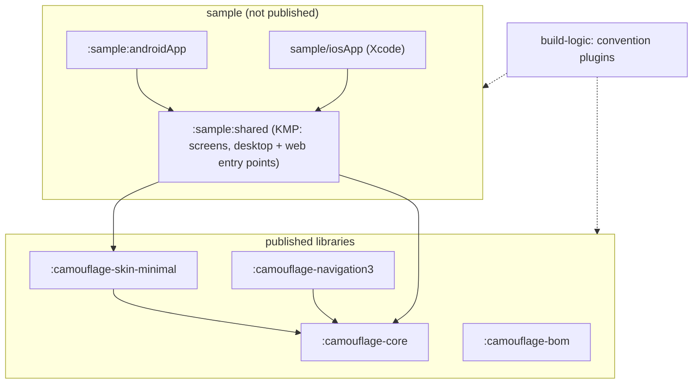
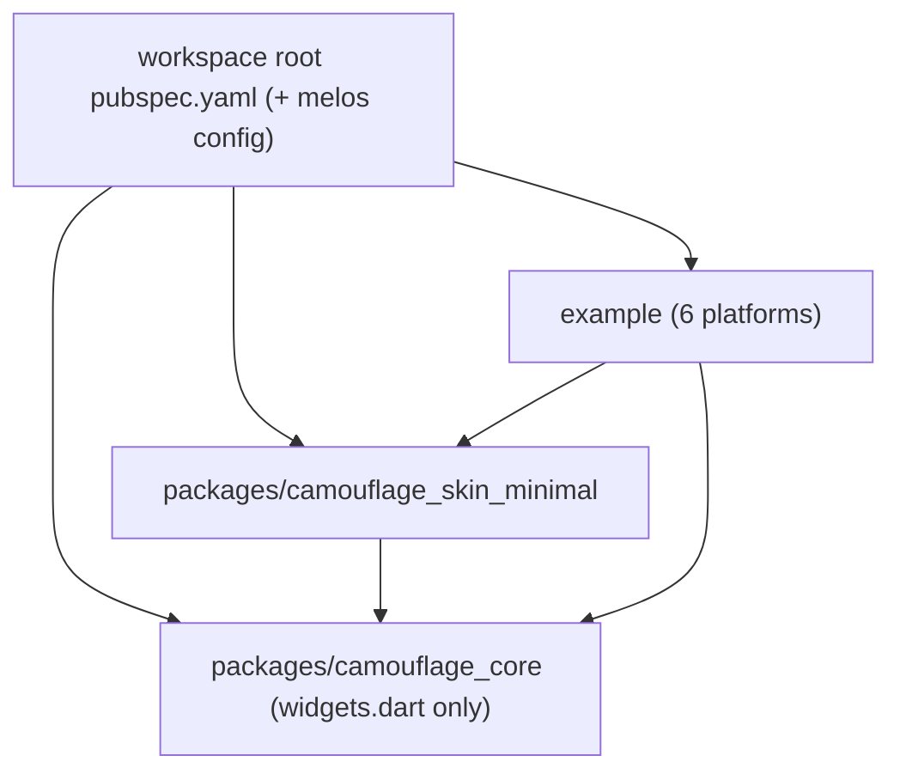

{/* Generated by docs/internal/scripts/sync_vault.py from the Camouflage design notes. Edit the notes and re-run the script; changes made here are overwritten. */}

# Project Setup

<KotlinOnly>

## 1. Why {#kotlin-1-why}

M0 is about proving the skeleton before any component exists:
- two library modules plus a sample app;
- **four platforms** (Android, iOS, desktop, web, per ADR-18);
- CI that builds all of them.

Getting the Gradle structure right now saves fighting it for every later milestone. This note implements the module and platform parts of [Architecture](/guide/architecture/architecture).

## 2. Shape {#kotlin-2-shape}



**Targets per module**

| Module | android | iosArm64 + iosSimulatorArm64 | jvm (desktop) | wasmJs (web) |
|---|---|---|---|---|
| `:camouflage-core` | library | library | library | library |
| `:camouflage-skin-minimal` | library | library | library | library |
| `:camouflage-navigation3` | library | library | library | library |
| `:sample:shared` | library (consumed by `:sample:androidApp`) | framework `SampleShared` | `application` (desktop window) | `binaries.executable()` (browser) |

`iosX64` (Intel simulators) is left out, because Compose Multiplatform supports only 64-bit **arm64** Macs for new work. Add it only if a contributor still uses an Intel Mac.

## 3. API {#kotlin-3-api}

This is the Gradle surface: what each file contains and why.

### 3.1 `settings.gradle.kts` {#kotlin-31-settingsgradlekts}

```kotlin
rootProject.name = "camouflage-kotlin"
enableFeaturePreview("TYPESAFE_PROJECT_ACCESSORS")     // projects.camouflageCore instead of ":camouflage-core"

pluginManagement {
    includeBuild("build-logic")
    repositories { google(); mavenCentral(); gradlePluginPortal() }
}
dependencyResolutionManagement {
    repositories { google(); mavenCentral() }
    versionCatalogs {                                     // split catalogs, one per concern
        create("kotlinLibs") { from(files("gradle/kotlin.versions.toml")) }
        create("composeLibs") { from(files("gradle/compose.versions.toml")) }
        create("androidLibs") { from(files("gradle/android.versions.toml")) }
        create("toolLibs") { from(files("gradle/tools.versions.toml")) }
    }
}
include(":camouflage-core", ":camouflage-skin-minimal", ":camouflage-navigation3", ":camouflage-skin-testing", ":camouflage-bom",
        ":sample:shared", ":sample:androidApp")
```

### 3.2 Version catalogs (`gradle/*.versions.toml`) {#kotlin-32-version-catalogs-gradleversionstoml}

| Catalog | Entries |
|---|---|
| `kotlin.versions.toml` | `kotlin = "2.4.20"`; plugins `kotlin-multiplatform`, `kotlin-compose` (Compose compiler, same version) |
| `compose.versions.toml` | `compose-multiplatform = "1.12.1"`; libraries `runtime`, `ui`, `foundation`, `ui-test` (plus `material-ripple` later, for the Material skin only); plugins `compose-multiplatform`, `compose-hot-reload` |
| `android.versions.toml` | `agp = "9.4.0"`, `compileSdk = "37"`, `minSdk = "24"`; plugins `android-application`, `android-kmp-library` (`com.android.kotlin.multiplatform.library`) |
| `tools.versions.toml` | `kotlinx-datetime` (core's date types for the pickers, ADR-35), `materialkolor = "5.0.1"` (`com.materialkolor:material-color-utilities`), `roborazzi`, `vanniktech-publish`, `dokka`, `detekt`, `kover` |

Compose libraries use explicit coordinates (`org.jetbrains.compose.foundation:foundation`, …) from the catalog, not the `compose.*` shortcuts, so versions are visible and catalog-driven.

### 3.3 Convention plugins (`build-logic/`) {#kotlin-33-convention-plugins-build-logic}

**Designed to be extracted.** This `build-logic` is the seed of a standalone, published convention-plugin project (e.g. `srctool/gradle-conventions`), built properly while doing Camouflage and extracted after M7. So:
- plugin IDs are **generic** (`com.srctool.*`), and nothing inside mentions Camouflage;
- project-specific values come from a small extension:

```kotlin
srctool {
    namespacePrefix = "com.srctool.camouflage"      // android namespace = prefix + module suffix
    targets = setOf(Android, Ios, Jvm, WasmJs)
    publishing { groupId = "com.srctool.camouflage"; repoUrl = "https://github.com/srctool/camouflage-kotlin" }
}
```

| Plugin id | Applies | Used by |
|---|---|---|
| `com.srctool.kmp.library` | Kotlin Multiplatform, the Android-KMP library plugin, all four targets, `explicitApi()`, `abiValidation`, Detekt, Kover | core, skin-material |
| `com.srctool.compose` | the Compose Multiplatform + Compose compiler plugins, and the base Compose dependencies | core, skin-material, sample:shared |
| `com.srctool.publish` | vanniktech publish + Dokka + signing (see [Publishing](/guide/delivery/publishing)) | core, skin-material, bom |

Each is split into small `configureXxx()` functions that read SDK versions from the catalog (your convention-plugin style). The plugins get their own tests (Gradle TestKit functional tests on a tiny fixture project), so they're ready to publish when extracted.

**`com.srctool.kmp.library`, the important part** (values shown resolved from the `srctool {}` extension):

```kotlin
kotlin {
    explicitApi()

    android {                                            // Android-KMP library plugin DSL (AGP 9)
        namespace = srctool.namespacePrefix.get() + "." + project.name.removePrefix("camouflage-").replace('-', '.')
        compileSdk = androidLibs.versions.compileSdk.get().toInt()
        minSdk = androidLibs.versions.minSdk.get().toInt()
        withHostTestBuilder {}                           // unit tests on the JVM (Robolectric screenshots)
    }
    iosArm64(); iosSimulatorArm64()
    jvm()
    @OptIn(ExperimentalWasmDsl::class)
    wasmJs { browser() }

    @OptIn(ExperimentalAbiValidation::class)
    abiValidation()                                      // checkKotlinAbi runs on `check`

    compilerOptions { freeCompilerArgs.add("-Xexpect-actual-classes") }
}
```

### 3.4 Library dependencies {#kotlin-34-library-dependencies}

| Module | `commonMain` | `commonTest` |
|---|---|---|
| `:camouflage-core` | `runtime`, `ui`, `foundation`, `material-color-utilities` (for `fromSeed`) | `kotlin("test")`, `ui-test` (the common `runComposeUiTest`) |
| `:camouflage-skin-minimal` | `projects.camouflageCore` (as `api`) only. No Material artifacts. |
| `:camouflage-navigation3` | `projects.camouflageCore` (as `api`), JetBrains' multiplatform Navigation 3 (`navigation3-ui`) + `lifecycle-viewmodel-navigation3` | the same as core | the same, plus Roborazzi in `androidHostTest` and `jvmTest` |

There is deliberately **no Material dependency in v1** (`material3`, `material-ripple`): core must stay visually neutral, and the Minimal skin draws everything itself. A Later Material skin adds only `material-ripple` (see [Material Skin](/guide/skins/material-skin#implementation)).

### 3.5 Sample app entry points {#kotlin-35-sample-app-entry-points}

| Platform | Where | Entry |
|---|---|---|
| Android | `:sample:androidApp` | `MainActivity` → `setContent { SampleApp() }` |
| iOS | `sample/iosApp` + `iosMain` of `:sample:shared` | `fun MainViewController() = ComposeUIViewController { SampleApp() }`, shown from SwiftUI |
| Desktop | `jvmMain` of `:sample:shared` | `fun main() = application { Window(::exitApplication, title = "Camouflage") { SampleApp() } }` |
| Web | `wasmJsMain` of `:sample:shared` | `fun main() = ComposeViewport(document.body!!) { SampleApp() }` |

`SampleApp()` lives in `commonMain`. Add **Compose Hot Reload** to the desktop run: it's the fastest loop for live coding on camera.

### 3.6 CI (GitHub Actions) {#kotlin-36-ci-github-actions}

| Job | Runner | Runs |
|---|---|---|
| `jvm-and-android` | ubuntu | `./gradlew check` for android + jvm (tests, ABI check, Detekt, Kover) |
| `web` | ubuntu | `./gradlew wasmJsTest wasmJsBrowserDistribution` (**allowed to fail** while Compose web is Beta, per ADR-18) |
| `ios` | macos | `./gradlew iosSimulatorArm64Test` plus an `xcodebuild` build of `iosApp` |

Use the Gradle build cache and configuration cache in every job.

## 4. Build steps {#kotlin-4-build-steps}

1. Create the repo layout from the Overview, then `settings.gradle.kts` and the four catalogs.
2. Write the three convention plugins in `build-logic` with generic `com.srctool.*` IDs, the `srctool {}` extension, and TestKit tests.
3. Create `:camouflage-core` with one public type (`public data class CamoTheme(val placeholder: Int)`) and `:camouflage-skin-minimal` using it, plus empty `:camouflage-navigation3` and `:camouflage-skin-testing` modules (they fill in at M6 and M3).
4. Create `:sample:shared` with `SampleApp()` showing a text, plus the four entry points. Run it on an Android emulator, an iOS simulator, a desktop window, and in the browser.
5. Run `./gradlew updateKotlinAbi` to create the first ABI dumps, and commit them.
6. Add the three CI jobs, including the **dependency-layer check** (ADR-27): a Gradle task that fails if a module depends on its own layer or a higher one.
7. Add Detekt with a baseline, Kover with a threshold (start at 0, raise to 75% for core logic from M2), and Dokka.

**Done when**
- [ ] `./gradlew check` passes locally, and all three CI jobs are green (web may be yellow).
- [ ] The sample opens on Android, iOS, desktop and web.
- [ ] Changing a public signature in core fails `checkKotlinAbi` until `updateKotlinAbi` is run.
- [ ] `:camouflage-core` has no dependency on `:camouflage-skin-minimal`, and neither module depends on any Material artifact (check with `./gradlew :camouflage-core:dependencies`).

## 5. Edge cases {#kotlin-5-edge-cases}

| Case | Decided behavior |
|---|---|
| Family packages (ADR-26) | Blueprint, Storybook, `camouflage-generator` (a Gradle plugin, in its own included build next to `build-logic`), templates (`camouflage-camera`) and `camouflage-filesystem` join later as modules in this repo, depending on `project(":camouflage-core")`. They have their own versions, and the BOM pins them at versions tested together with core (ADR-27). |
| AGP 9 forbids KMP + `com.android.application` in one module | That's why the Android app is `:sample:androidApp`, separate from `:sample:shared`. |
| A dependency lacks one of the four targets | Don't add it to core or the skin. Find a multiplatform alternative, or put the feature behind `expect`/`actual`. It's checked at M0 for MaterialKolor (supported). |
| The web build breaks because of a Compose web (Beta) change | The `web` job is allowed to fail. Fix it in a follow-up. It never blocks a release of the stable targets (ADR-18). |
| Building iOS locally without a Mac | Not possible. CI's macOS job covers it. The other three targets build anywhere. |
| ABI validation is experimental | It's opted in with `@OptIn(ExperimentalAbiValidation::class)`. If the DSL changes in a Kotlin update, fix the convention plugin in one place. |
| An Intel Mac contributor | Add `iosX64()` locally, and don't commit it unless needed. |

</KotlinOnly>

<DartOnly>

## 1. Why {#dart-1-why}

This is the Flutter half of M0: two library packages and an example app, building for **all six Flutter platforms** (Android, iOS, web, macOS, Windows, Linux; ADR-18), with CI. It uses **pub workspaces + Melos**, the current Flutter monorepo standard. Workspaces make the packages resolve against each other locally, and Melos runs scripts and versioning.

## 2. Shape {#dart-2-shape}



## 3. API {#dart-3-api}

### 3.1 Root `pubspec.yaml` (workspace + Melos) {#dart-31-root-pubspecyaml-workspace-melos}

```yaml
name: camouflage_workspace
publish_to: none
environment:
  sdk: ^3.13.0
workspace:
  - packages/camouflage_core
  - packages/camouflage_skin_minimal
  - packages/camouflage_skin_testing
  - example
dev_dependencies:
  melos: ^7.0.0
melos:
  scripts:
    analyze: dart analyze --fatal-infos
    format: dart format --set-exit-if-changed .
    test: melos exec --dir-exists=test -- flutter test
    test:goldens:ci: melos exec --dir-exists=test -- flutter test --tags golden
    api:check: melos exec --no-private -- dart run dart_apitool:main diff --old pub://$MELOS_PACKAGE_NAME --new .   # check the exact CLI at M0
```

Each member `pubspec.yaml` declares `resolution: workspace`.

### 3.2 Package manifests {#dart-32-package-manifests}

| Package | `dependencies` | `dev_dependencies` |
|---|---|---|
| `camouflage_core` | `flutter` (SDK), `material_color_utilities`, `intl` (date and time names and formats for the pickers, ADR-35) | `flutter_test`, `alchemist` |
| `camouflage_skin_minimal` | `camouflage_core` only | `flutter_test`, `alchemist` |
| `example` | both, plus whatever the sample uses | – |

Constraints: `environment: { sdk: ^3.13.0, flutter: ">=3.47.0" }`. Neither `camouflage_core` nor `camouflage_skin_minimal` has a `material_ui` / `cupertino_ui` dependency (v1 is Material-free).

### 3.3 `analysis_options.yaml` (root, shared) {#dart-33-analysis_optionsyaml-root-shared}

```yaml
include: package:flutter_lints/flutter.yaml
analyzer:
  language: { strict-casts: true, strict-raw-types: true }
linter:
  rules:
    - prefer_const_constructors
    - prefer_final_fields
    - avoid_print
    - prefer_relative_imports
    - use_key_in_widget_constructors
    - sized_box_for_whitespace
    - public_member_api_docs          # a published library: every public member documented
```

A CI check fails if `packages/camouflage_core/lib` contains `package:flutter/material.dart`, `package:flutter/cupertino.dart` or `package:material_ui/`.

### 3.4 Example app {#dart-34-example-app}

- Create it with `flutter create --platforms=android,ios,web,macos,windows,linux example`.
- `lib/main.dart` → `CamouflageExampleApp` built on `WidgetsApp` (not `MaterialApp`, so the example proves core works without Material), with `CamouflageProvider` above the navigator.
- Screens are the same set as the Kotlin sample, for side-by-side episodes.
- **Widget Previewer** (stable in 3.47): add `@Preview` functions next to each component's example, wrapped in `MinimalPreview` (or core's `CamouflagePreview(skin:, theme:)`) (see [Provider and Scoping](/guide/architecture/provider-and-scoping#implementation)). This is the Flutter counterpart to Compose previews, and useful when recording.

### 3.5 Public API tracking {#dart-35-public-api-tracking}

Dart has no built-in ABI dump. Use **`dart_apitool`** (it compares the public API against the last published version and says whether a change needs a major, minor or patch bump) in the `api:check` script. It runs in CI from the first published version.

### 3.6 CI (GitHub Actions) {#dart-36-ci-github-actions}

| Job | Runner | Runs |
|---|---|---|
| `analyze-test` | ubuntu | `melos run analyze`, `format`, `test`, CI goldens, the no-Material-import check |
| `web` | ubuntu | `flutter build web --wasm` for `example` |
| `linux` | ubuntu | `flutter build linux` |
| `apple` | macos | `flutter build ios --no-codesign`, `flutter build macos` |
| `windows` | windows | `flutter build windows` |
| `android` | ubuntu | `flutter build apk --debug` |

## 4. Build steps {#dart-4-build-steps}

1. Create the root workspace `pubspec.yaml`, the packages (`camouflage_core`, `camouflage_skin_minimal`, an empty `camouflage_skin_testing`; `flutter create --template=package`), and the example (6 platforms).
2. Shared `analysis_options.yaml` + the no-Material check script.
3. A placeholder public class in core (`CamoTheme`), used by the skin and the example.
4. Run the example on an Android emulator, an iOS simulator, Chrome (`--wasm`), and the desktop of your machine.
5. The CI jobs, including the **dependency-layer check** (ADR-27): a script over `melos list --graph` that also checks `dev_dependencies`.

**Done when**
- [ ] `melos run analyze` and `melos run test` pass. All six platform builds are green in CI.
- [ ] `flutter pub deps` for `camouflage_core` and `camouflage_skin_minimal` shows no `material_ui`.
- [ ] The example opens on at least Android, iOS, web and one desktop OS.

## 5. Edge cases {#dart-5-edge-cases}

| Case | Decided behavior |
|---|---|
| Family packages (ADR-26) | Blueprint, Storybook, `camouflage_generator` (a `build_runner` builder), templates (`camouflage_camera`) and `camouflage_filesystem` join later as `packages/*` in this workspace, versioned independently by Melos. |
| **Flutter vs Kotlin: platform count** | Flutter builds 6 platforms (desktop is per-OS). Kotlin builds 4 targets (desktop is one JVM target). The same components, the same contract. |
| Building iOS/macOS without a Mac | Not possible. The CI `apple` job covers it. |
| Windows build flakiness | It runs in its own job, so a Windows-only failure is visible without blocking the others. |
| `material_ui` versions move faster than Flutter now | Only relevant to a Later Material skin: pin a compatible range there. v1 doesn't depend on it. |
| Web renderer | Wasm (`--wasm`, the default direction for Flutter web). The JS fallback works automatically for browsers without WasmGC. |

</DartOnly>
