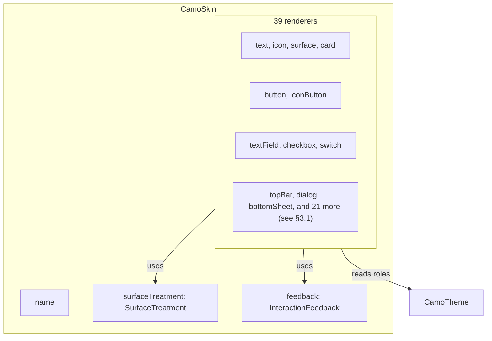
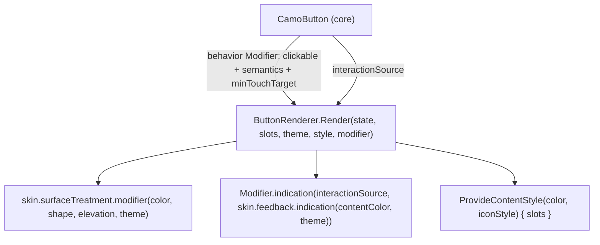
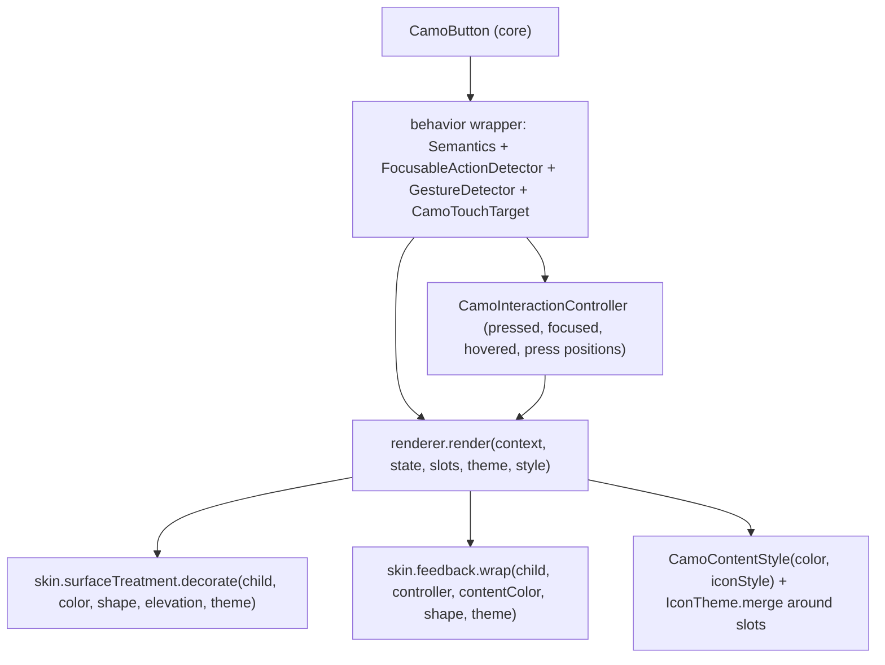

{/* Generated by docs/internal/scripts/sync_vault.py from the Camouflage design notes. Edit the notes and re-run the script; changes made here are overwritten. */}

# Skin Contract

## Concept {#concept}

### 1. Why

A **Skin** is the design language: how each component is built, how it reacts to touch, and what its surfaces are made of. Core defines the **contract** a skin must fulfil: one renderer interface per component, plus two reusable parts (surface treatment and interaction feedback). A skin that implements the whole contract can draw every `Camo*` component, so an app changes design language by changing one value. This note is also the spec an AI agent follows to generate a new skin, so it must be precise.

### 2. Shape



**Responsibilities of a skin**
- Draw every component from `(state, slots, theme)`.
- Map **semantic** inputs (`Appearance`, `Tone`, `SurfaceLevel`, `ElevationLevel`, `ShapeRole`: Camouflage's vocabulary, see [Design Language](/guide/foundations/design-language)) to its own visual language.
- Choose structure: where slots go, what shape a dialog has, whether a switch shows icons.
- Provide one surface treatment and one feedback style, which all its renderers share for consistency.

**Not the skin's job** (the component owns these, see [Architecture](/guide/architecture/architecture)):
- callbacks;
- semantics role and label;
- the enabled gate;
- the minimum touch target;
- focus traversal order;
- holding state.

#### 2.1 State vs Slots

Every renderer receives two separate objects:

| | State | Slots |
|---|---|---|
| **Is** | plain data, including text values (`text`, `label`, `title`) | widgets the caller provides: icon widgets, nested components (dialog buttons), layout content (card body) |
| **Example (button)** | `text = "Save"`, `enabled = true`, `appearance = Solid`, `interaction = Pressed` | `prefixIcon = AppIcon.save()`, `suffixIcon = null` |
| **Renderer may** | branch on it (`when (appearance)`), draw text values in its own styles | place it, wrap it, give it a content color and icon style, or not show it |
| **Renderer may not** | mutate it | inspect what's inside it |

Keeping them apart means a renderer can't depend on *what* the caller put in a slot. It only decides *where* the slot goes, and *what content color and icon style* it gets.

**The API rule behind this split:** text is a value, icons and nested components are widgets, and layout content is a slot. See ADR-12 in [Decisions](/guide/project/decisions).

**Content color and icon style.** Before invoking a slot, the renderer sets the **local content color** and the **ambient icon style** (`IconStyle(size, color)`) (e.g. `onPrimary` inside a Solid button). `CamoText` and `CamoIcon` read that color by default, so a caller's `CamoText("Save")` automatically gets the right color on every skin.

### 3. API

#### 3.1 `CamoSkin`

```kotlin
data class CamoSkin(
    val name: String,                           // "minimal", for debugging and tests
    val surfaceTreatment: SurfaceTreatment,
    val feedback: InteractionFeedback,
    val text: TextRenderer,
    val icon: IconRenderer,
    val surface: SurfaceRenderer,
    val card: CardRenderer,
    val button: ButtonRenderer,
    val iconButton: IconButtonRenderer,
    val textField: TextFieldRenderer,
    val checkbox: CheckboxRenderer,
    val switch: SwitchRenderer,
    val topBar: TopBarRenderer,
    val dialog: DialogRenderer,
    val bottomSheet: BottomSheetRenderer,
    // added with the full v1 set (ADR-21)
    val divider: DividerRenderer,
    val radio: RadioRenderer,
    val segmentedControl: SegmentedControlRenderer,
    val slider: SliderRenderer,
    val searchField: SearchFieldRenderer,
    val listItem: ListItemRenderer,
    val listSection: ListSectionRenderer,
    val pagedList: PagedListRenderer,
    val datePicker: DatePickerRenderer, val timePicker: TimePickerRenderer,
    val stepper: StepperRenderer, val accordion: AccordionRenderer,
    val skeleton: SkeletonRenderer,
    val menu: MenuRenderer,
    val tooltip: TooltipRenderer,
    val chip: ChipRenderer,
    val badge: BadgeRenderer,
    val avatar: AvatarRenderer,
    val progressBar: ProgressBarRenderer,
    val progressCircle: ProgressCircleRenderer,
    val snackbar: SnackbarRenderer,
    val banner: BannerRenderer,
    val tabs: TabsRenderer,
    val navigationBar: NavigationBarRenderer,
    val navigationRail: NavigationRailRenderer,
    val navigationDrawer: NavigationDrawerRenderer,
    val fab: FabRenderer,
) {
    fun copy(...): CamoSkin    // replace any subset, keep the rest
}
```

All fields are **required, with no defaults**. A skin that forgets a renderer is a **compile error**.

**Component defaults travel with the renderer.** Each renderer declares `defaults(theme)`, which returns a complete `XTheme` (every field set). It's a function because defaults usually *reference* global tokens (`container = theme.colors.primary`, `shape = theme.shapes.full`), so changing `primary` still recolors buttons. Before calling `render`, core resolves `style = renderer.defaults(theme).merge(theme.components.x)`, so the renderer draws from `style` (component values) and `theme` (global tokens), never from nulls. Because defaults belong to the renderer, `MaterialSkin.copy(button = X)` brings X's own proportions with it. Components with no component theme (`text`, `surface`) take `style = Unit`. See [Theme](/guide/foundations/theme) §3.10.

#### 3.2 Renderer interfaces

Every renderer has the same shape:

```kotlin
interface XRenderer {
    fun defaults(theme: CamoTheme): XTheme                 // complete component theme; may reference global tokens
    fun render(state: XState, slots: XSlots, theme: CamoTheme, style: XTheme)   // style = resolved, no nulls
}
```

| Renderer | State (data) | Slots (content) |
|---|---|---|
| `TextRenderer` | `content: String or List<CamoSpan>`, `style: CamoTextStyle`, resolved `color`, `maxLines`, `overflow`, `textAlign` | none |
| `IconRenderer` | `source: IconSource`, resolved `size`, resolved `color`, `contentDescription?` | none |
| `SurfaceRenderer` | `level: SurfaceLevel`, `shape: ShapeRole`, `elevation: ElevationLevel`, `border: Boolean` | `content` |
| `CardRenderer` | `appearance: Appearance`, `tone: Tone`, `clickable`, `enabled`, `selected?`, `interaction` | `content` |
| `ButtonRenderer` | `text`, `enabled`, `loading`, `appearance: Appearance`, `tone: Tone`, `interaction` | `prefixIcon?`, `suffixIcon?` |
| `IconButtonRenderer` | `enabled`, `checked?`, `loading`, `appearance: Appearance`, `tone: Tone`, `interaction` | `icon` |
| `TextFieldRenderer` | `value`, `label?`, `placeholder?`, `supportingText?`, `error?`, `prefixText?`, `suffixText?`, `enabled`, `focused`, `singleLine`, `secure`, `isEmpty` | `prefixIcon?`, `suffixIcon?`, `input` (the editable text itself, provided by core) |
| `CheckboxRenderer` | `checked`, `label?` (String or spans), `description?`, `error?`, `enabled`, `interaction` | none |
| `SwitchRenderer` | `checked`, `label?` (String or spans), `description?`, `error?`, `enabled`, `interaction` | none |
| `TopBarRenderer` | `title`, `scrollOffset: Dp` | `navigation?`, `actions`, `titleContent?` |
| `DialogRenderer` | `title?`, `message`, `dismissible`, `onDismissRequest` (opening and closing belong to the navigator and the dialog frame) | `confirm`, `dismiss?`, `content?` |
| `BottomSheetRenderer` | `title?`, `dragProgress`, `dismissible`, `onDismissRequest` | `content` |
| the 27 added renderers (incl. `PagedListRenderer`, `SkeletonRenderer`, `DatePickerRenderer`, `TimePickerRenderer`, `StepperRenderer`, `AccordionRenderer`) | see each component note (§3, **State → renderer**) | see each component note |

**Overlay dismissal in state.** `dismissible` and `onDismissRequest` come from the overlay frame (passed down the tree), not from the app. A skin that draws a close affordance (`DialogTheme.showCloseButton` / `BottomSheetTheme.showCloseButton`, or a Cupertino "Done") shows it only when `dismissible` is true, and calls `onDismissRequest`, which goes through the same path as back/Esc, so vetoes (`PopScope` / `OnDismissRequest`) still apply. Skins without a close affordance ignore both.

`CamoSelect` has **no renderer of its own**: it reuses the text-field, menu, bottom-sheet and list-item renderers.

Shared types (in core):

```kotlin
data class InteractionState(val pressed: Boolean, val focused: Boolean, val hovered: Boolean, val dragged: Boolean)   // dragged: slider handle, switch thumb
enum class Appearance { Solid, Soft, Raised, Outline, Ghost, Link }   // visual weight; per-component subsets + fallbacks (Design Language §3.3)
enum class Tone { Default, Error, Success, Warning, Info }  // color family; see Theme §3.2
enum class SurfaceLevel { Surface, Lowest, Low, Container, High, Highest }   // → surface, surfaceContainer*
enum class ElevationLevel { Level0, Level1, Level2, Level3, Level4, Level5 }
enum class ShapeRole { None, ExtraSmall, Small, Medium, Large, ExtraLarge, Full }
data class CamoSpan(text, style?, fontWeight?, italic?, color?, underline?, link?)   // rich text, see CamoText
```

Exact fields for each component are in its note under [Components — Overview](/components).

#### 3.3 `SurfaceTreatment`

```kotlin
interface SurfaceTreatment {
    // decorates a region: background, shadow/blur, clip to shape
    fun paint(color: Color, shape: ShapeRole, elevation: ElevationLevel, theme: CamoTheme)
}
```

| Implementation | Where | How it expresses elevation |
|---|---|---|
| `Flat` | Minimal skin (**v1**) | no shadow: a hairline border from `Level1`, and a one-step surface-level shift from `Level3` |
| `Paper` | Material skin (Later) | shadow + tonal tint of `primary` blended into the surface |
| `Glass` | Later | background blur + refraction, stronger with level |
| `Acrylic` | Later | frosted blur + noise, stronger with level |

Every renderer that draws a container (surface, card, button, dialog, top bar) calls `theme`-aware `surfaceTreatment.paint(...)` instead of painting a background itself. That is what lets Fluent reuse Material renderers with a different surface.

#### 3.4 `InteractionFeedback`

```kotlin
interface InteractionFeedback {
    // draws the visual response to press / hover / focus on top of a region
    fun indicate(interaction: InteractionState, contentColor: Color, theme: CamoTheme)
}
```

| Implementation | Look |
|---|---|
| `Fade` (**v1**, Minimal) | content-color overlay 4% hover, 8% pressed, no ripple, no scale |
| `Ripple` (Material, Later) | Material ink ripple from the touch point, plus a state layer (8% hover, 10% focus, 10% press) |
| `Opacity` | content fades to about 40% while pressed (iOS style) |
| `Scale` | shrinks to about 96% while pressed |

The **focus indicator** (keyboard focus ring) is also drawn by `indicate` when `focused`. A skin must always make keyboard focus visible (WCAG 2.4.7).

#### 3.5 Partial override

```kotlin
val brandSkin = MinimalSkin.copy(button = PillGradientButtonRenderer)
```

This replaces one renderer and keeps everything else. It's the common case for "our Figma button is special, everything else is Minimal".

**Borrowing a renderer from another skin** (ADR-28). Product feedback is often "make the tabs behave like Apple's" or "like that app's": the brand look stays, but one component takes another dialect's structure and behavior.

```kotlin
val brandSkin = MinimalSkin.copy(tabs = CupertinoSkin.tabs, switch = CupertinoSkin.switch)
// only one screen: CamouflageProvider(skin = Camouflage.skin.copy(tabs = CupertinoSkin.tabs)) { … }
```

| Rule | Why |
|---|---|
| The borrowed renderer keeps its **structure, behavior and `defaults(theme)`** (a segmented control for tabs, the iOS switch proportions). | That's what was asked for. |
| It reads the **host skin's** `surfaceTreatment` and `feedback` (always `Camouflage.skin.…`, never its own skin object). | The component still feels part of the app (flat surfaces, fade feedback under Minimal). To borrow the feel too, copy those as well: `.copy(feedback = CupertinoSkin.feedback)` on a nested provider. |
| It reads the **app's theme** (colors, typography, component-theme overrides). | The brand's colors and fonts stay. |
| Every skin module exposes its renderers individually (`CupertinoSkin.tabs`), not only the whole skin. | Borrowing needs no fork. It works once that skin module exists (the Later skins). |

#### 3.6 Rules every renderer follows

1. **Pure.** Its output depends only on `(state, slots, theme)`, plus internal animation state (e.g. the ripple position). No network, no global singletons, no reading other providers.
2. **Tokens only.** It reads colors, sizes and durations **only** from `style` (the resolved component theme) and `theme` roles. Every size a designer might change (height, radius, padding, icon size) must come from `style`, and never be a literal in the renderer. No hard-coded colors, not even for "Material's default grey". Fixed alphas for states (hover 8%) are allowed; they are part of the skin's language.
3. **Sets content color and icon style** before invoking a slot (§2.1), and draws text values with theme typography.
4. **Respects layout direction.** It uses start/end, never left/right, so RTL mirrors automatically.
5. **Never shrinks the touch area** below what the component set (48dp minimum).
6. **Honors reduced motion** implicitly, by using `theme.motion` durations (see [Theme](/guide/foundations/theme) §5).

#### 3.7 Checklist: writing a new skin (for you or an AI agent)

1. Pick the design language and write down its **surface metaphor** and **press feedback**.
2. Implement `SurfaceTreatment` and `InteractionFeedback` first. Test them on a bare box.
3. Write the skin's **dialect alignment table**: how it renders every Appearance, Tone and Level ([Design Language](/guide/foundations/design-language) §3.4). Then, for each renderer, write its complete `defaults` component theme (this dialect's proportions and color references). Put the tables in the skin's own doc.
4. Implement the renderers in this order: `text` → `icon` → `surface` → `button` → `iconButton` → `card` → `checkbox` → `switch` → `textField` → `topBar` → `dialog` → `bottomSheet`, then the rest in milestone order (M3 divider; M5 radio, segmentedControl, slider, searchField; M6 listItem, listSection, menu, tooltip; M7 chip, badge, avatar, progress, snackbar, banner; M8 tabs, navigation bar/rail/drawer, fab). The simplest come first, and later ones reuse the earlier ones.
5. Check each renderer against the rules in §3.6.
6. Run the shared screenshot matrix (skin × light/dark × font scale 100/200% × LTR/RTL). See the platform Testing notes ([Testing](/guide/delivery/testing), [Testing](/guide/delivery/testing)).
7. Package it as its own module, `camouflage-skin-<name>`, depending only on `camouflage-core`.

### 4. Build steps

1. Add the shared enums and `InteractionState` to core.
2. Add the 39 `XState` / `XSlots` data classes, the `XRenderer` interfaces with `defaults(theme)` (fields from §3.2), and the merge step in core that resolves `style`.
3. Add `SurfaceTreatment` and `InteractionFeedback` interfaces.
4. Add `CamoSkin` with all 36 fields and `copy`.
5. In `sample`, make a `DebugSkin` whose renderers draw a labelled grey box (`"Button: High"`) and whose surface and feedback are no-ops. This proves the contract end to end before any real skin exists, and is useful for tests.
6. Write tests: `DebugSkin.copy(button = X)` changes only `button`; a skin that leaves out a field doesn't compile (a comment in the test file documents this, since compile errors can't be asserted at runtime).

**Done when**
- [ ] Core compiles with every renderer interface.
- [ ] `DebugSkin` implements all of them with no warnings.
- [ ] `copy` replaces one renderer and keeps the other 37 fields identical (`===`).

### 5. Edge cases

| Case | Decided behavior |
|---|---|
| **Overriding one renderer** (`MinimalSkin.copy(button = X)`) | Only `button` changes. Other renderers that *use* a button internally (the dialog's confirm action) get the **caller's widget**. When the caller passes a `CamoButton` (the recommended way), it uses X, so the override applies consistently inside dialogs too. |
| **A renderer ignores a token** (hard-codes a color) | A contract violation. The screenshot matrix catches it: the rendering doesn't change between two themes. The skin checklist item 5 is the manual gate. |
| **A skin needs an extra parameter** (a look only this dialect draws, like Material's wavy progress) | Put it in the skin's own constructor or options object (`MaterialSkin(expressiveProgress = true)`). Values the skin reads from the brand go in a custom token set (ADR-32). If a brand could want it on any skin (switch thumb icons), it's a component-theme field instead (ADR-28). **Never** add it to a core component's API, because the core API stays skin-neutral. |
| **A skin wants to restructure a component** (an iOS alert stacks buttons vertically) | Allowed. That's what a renderer is for. Values and slots stay the same; only placement changes. |
| **A renderer needs state the contract lacks** (e.g. a switch that shows its thumb *while dragging*) | Add the field to `XState` in core (a core minor version plus an ADR). Other skins may ignore it. |
| **Two skins in one screen** | Supported through nested providers; see [Provider and Scoping](/guide/architecture/provider-and-scoping). Each renderer reads only the skin it was invoked from. |

## Implementation {#implementation}

<KotlinOnly>

### 1. Why {#kotlin-1-why}

This note turns the skin contract into Compose interfaces: one renderer per component, plus surface treatment and interaction feedback, bundled in a `CamoSkin` data class. The Compose-specific questions it settles:
- how the component's behavior modifiers (click, semantics, touch target) reach the renderer's root;
- how press feedback plugs into Compose's `Indication` system;
- how a renderer sets the content color and icon style for its slots.

### 2. Shape {#kotlin-2-shape}



**The one rule that makes the split work in Compose:** the component builds a **behavior `Modifier`** (click handling, semantics, min touch target, focus), and passes it to `Render`. The renderer must apply it to its **outermost** layout node, **before** its own visual modifiers. Then the whole visual box is clickable and focusable, and the ripple bounds match the shape.

### 3. API {#kotlin-3-api}

#### 3.1 Renderer interfaces {#kotlin-31-renderer-interfaces}

```kotlin
@Stable
public interface ButtonRenderer {
    public fun defaults(theme: CamoTheme): ButtonStyle
    @Composable
    public fun Render(state: ButtonState, slots: ButtonSlots, theme: CamoTheme, style: ButtonStyle, modifier: Modifier)
}
```

Every renderer follows this shape (`XRenderer`, `XState`, `XSlots`, `XStyle`). Renderers without a component theme (`TextRenderer`, `SurfaceRenderer`) drop `defaults` and `style`.

**States and slots (Kotlin additions in bold):**

| Class | Fields |
|---|---|
| `ButtonState` | `text`, `enabled`, `appearance`, `tone`, `interaction: InteractionState`, **`interactionSource: InteractionSource`** |
| `ButtonSlots` | `prefixIcon: (@Composable () -> Unit)?`, `suffixIcon: (@Composable () -> Unit)?` |
| `IconButtonState` / `Slots` | `enabled`, `appearance`, `tone`, `interaction`, **`interactionSource`** / `icon: @Composable () -> Unit` |
| `TextFieldState` | the base fields, plus **`interactionSource`** |
| `TextFieldSlots` | `prefixIcon?`, `suffixIcon?`, `input: @Composable () -> Unit` (the `BasicTextField` from core) |
| `CardState` / `CheckboxState` / `SwitchState` | the base fields, plus **`interactionSource`** |
| `TopBarSlots` | `navigation?`, `actions: @Composable RowScope.() -> Unit`, `titleContent: (@Composable () -> Unit)?` |
| `DialogState` | the base fields, including `dismissible` and `onDismissRequest: () -> Unit` (read from the frame's `LocalCamoOverlayFrame`) |
| `DialogSlots` | `confirm`, `dismiss?`, `content?` |
| `BottomSheetState` / `Slots` | `title?`, `dragProgress`, `dismissible`, `onDismissRequest` / `content: @Composable ColumnScope.() -> Unit` |
| `SurfaceSlots` / `CardSlots` | `content: @Composable () -> Unit` |
| the 23 renderers added after the first twelve | the base fields from each component note, plus `interactionSource` wherever the base state has `interaction`; slot lambdas use Compose receivers where natural (`RowScope` for actions, `LazyItemScope` for list items) |

`InteractionState` stays the base's four booleans (the component derives them with `collectIsPressedAsState()`, `collectIsHoveredAsState()`, `collectIsFocusedAsState()` and `collectIsDraggedAsState()`). `interactionSource` is added because Compose's `Indication` (ripple) needs the source itself, not just booleans.

```kotlin
@Immutable public data class InteractionState(val pressed: Boolean, val focused: Boolean, val hovered: Boolean, val dragged: Boolean = false)
```

The name clash with Compose's own `TextFieldState` is resolved by packaging: Camouflage's is `com.srctool.camouflage.core.textfield.TextFieldState`. Inside core, Compose's is imported under an alias (`import androidx.compose.foundation.text.input.TextFieldState as InputBuffer`).

#### 3.2 `SurfaceTreatment` and `InteractionFeedback` {#kotlin-32-surfacetreatment-and-interactionfeedback}

```kotlin
@Stable
public interface SurfaceTreatment {
    /** Background, depth and clip for a container. Applied after the behavior modifier. */
    public fun modifier(color: Color, shape: Shape, elevation: Dp, theme: CamoTheme): Modifier
}

@Stable
public interface InteractionFeedback {
    /** Compose Indication drawing press / hover / focus feedback in the given content color. */
    public fun indication(contentColor: Color, theme: CamoTheme): Indication
}
```

- **Flat** (skin-minimal, **v1**): `Modifier.background(color, shape).clip(shape)`, plus `Modifier.border(1.dp, outlineVariant, shape)` from `Level1`. No shadow.
- **Fade** (skin-minimal, **v1**): an `IndicationNodeFactory` that draws a content-color overlay (4% hover, 8% pressed) and a 2 dp focus ring. No `material-ripple` needed.
- **Paper** (skin-material, Later): `Modifier.shadow(elevation, shape, clip = false).background(color, shape).clip(shape)`.
- **Ripple** (skin-material, Later): an `IndicationNodeFactory` built on `material-ripple`'s `createRippleModifierNode` (the public low-level API), plus a state-layer node for hover and focus and a focus ring. Details are in [Material Skin](/guide/skins/material-skin#implementation).
- **Opacity** / **Scale** (future skins): custom `IndicationNodeFactory`s that animate alpha or scale from the `InteractionSource`.

#### 3.3 `CamoSkin` {#kotlin-33-camoskin}

```kotlin
@Immutable
public data class CamoSkin(
    val name: String,
    val surfaceTreatment: SurfaceTreatment,
    val feedback: InteractionFeedback,
    // 39 renderers, grouped as in base
    val text: TextRenderer, val icon: IconRenderer, val surface: SurfaceRenderer, val divider: DividerRenderer,
    val button: ButtonRenderer, val iconButton: IconButtonRenderer, val fab: FabRenderer,
    val textField: TextFieldRenderer, val checkbox: CheckboxRenderer, val switch: SwitchRenderer, val radio: RadioRenderer,
    val segmentedControl: SegmentedControlRenderer, val slider: SliderRenderer, val searchField: SearchFieldRenderer,
    val datePicker: DatePickerRenderer, val timePicker: TimePickerRenderer, val stepper: StepperRenderer,
    val card: CardRenderer, val listItem: ListItemRenderer, val listSection: ListSectionRenderer, val pagedList: PagedListRenderer, val accordion: AccordionRenderer,
    val chip: ChipRenderer, val badge: BadgeRenderer, val avatar: AvatarRenderer,
    val progressBar: ProgressBarRenderer, val progressCircle: ProgressCircleRenderer, val snackbar: SnackbarRenderer,
    val banner: BannerRenderer, val skeleton: SkeletonRenderer,
    val dialog: DialogRenderer, val bottomSheet: BottomSheetRenderer, val menu: MenuRenderer, val tooltip: TooltipRenderer,
    val topBar: TopBarRenderer, val tabs: TabsRenderer, val navigationBar: NavigationBarRenderer,
    val navigationRail: NavigationRailRenderer, val navigationDrawer: NavigationDrawerRenderer,
)
```

It has no default values. `copy(button = BrandButtonRenderer)` is the partial override.

#### 3.4 Helpers for skin authors (public, in core) {#kotlin-34-helpers-for-skin-authors-public-in-core}

```kotlin
/** Sets the content color + icon style for slots drawn inside a renderer. */
@Composable public fun ProvideContentStyle(color: Color, iconStyle: IconStyle, content: @Composable () -> Unit)

/** The current skin's feedback as an Indication, for use with Modifier.indication. */
@Composable public fun rememberSkinIndication(contentColor: Color): Indication

/** Applies the disabled alphas uniformly. */
public fun Color.disabled(alpha: Float): Color
```

A renderer reads `Camouflage.skin.surfaceTreatment` and `.feedback` at render time, **not** fixed references to `Paper`/`Ripple`. That way `MinimalSkin.copy(feedback = Opacity)` changes the feedback of every Material renderer.

#### 3.5 Reference: a complete renderer (DebugSkin button) {#kotlin-35-reference-a-complete-renderer-debugskin-button}

```kotlin
internal object DebugButtonRenderer : ButtonRenderer {
    override fun defaults(theme: CamoTheme) = ButtonStyle(
        height = 40.dp, minWidth = 64.dp, shape = theme.shapes.small,
        padding = PaddingValues(horizontal = theme.spacing.l), paddingWithIcon = PaddingValues(horizontal = theme.spacing.m),
        textStyle = theme.typography.labelLarge, iconSize = 18.dp, iconGap = theme.spacing.s,
        borderWidth = 1.dp, raisedElevation = ElevationLevel.Level1,
        solidColors = ButtonColors(Color.LightGray, Color.Black), /* soft, raised, outline, ghost, link … */
        disabledContainerAlpha = 0.12f, disabledContentAlpha = 0.38f,
    )

    @Composable
    override fun Render(state: ButtonState, slots: ButtonSlots, theme: CamoTheme, style: ButtonStyle, modifier: Modifier) {
        val colors = style.colorsFor(state.appearance, state.tone, theme)
        Row(
            modifier = modifier                                           // 1. behavior first
                .then(Camouflage.skin.surfaceTreatment.modifier(colors.container, style.shape, 0.dp, theme))
                .indication(state.interactionSource, rememberSkinIndication(colors.content))
                .border(if (state.interaction.focused) 2.dp else 0.dp, Color.Magenta, style.shape)
                .heightIn(min = style.height).widthIn(min = style.minWidth)
                .padding(if (slots.prefixIcon != null || slots.suffixIcon != null) style.paddingWithIcon else style.padding),
            horizontalArrangement = Arrangement.spacedBy(style.iconGap),
            verticalAlignment = Alignment.CenterVertically,
        ) {
            ProvideContentStyle(colors.content, IconStyle(style.iconSize, colors.content)) {
                slots.prefixIcon?.invoke()
                BasicText("[${state.appearance}] ${state.text}", style = style.textStyle.copy(color = colors.content))
                slots.suffixIcon?.invoke()
            }
        }
    }
}
```

### 4. Build steps {#kotlin-4-build-steps}

1. `InteractionState`, the shared enums, and the 39 `XState` / `XSlots` classes (each one arrives with its component, M3–M8) (`@Immutable`; slots `@Stable`).
2. The 39 renderer interfaces, plus `SurfaceTreatment` and `InteractionFeedback`.
3. `CamoSkin`.
4. `ProvideContentStyle`, `rememberSkinIndication`, `Color.disabled`.
5. `DebugSkin` in `:sample:shared`, with every renderer drawing a labelled box (like §3.5), `NoTreatment` and `NoFeedback`.
6. `commonTest`:
   - `copy(button = X)` keeps the other 14 fields referentially equal;
   - a renderer applying `modifier` makes the whole box clickable (`runComposeUiTest`: a click on the box's corner fires `onClick`).

**Done when**
- [ ] `DebugSkin` compiles for all targets, with every renderer implemented.
- [ ] A click anywhere on a DebugSkin button fires, and the focus border appears with keyboard Tab (desktop).

### 5. Edge cases {#kotlin-5-edge-cases}

| Case | Decided behavior |
|---|---|
| **A renderer forgets to apply `modifier`** | Clicks and semantics silently vanish, which is the worst kind of bug. Guard: `assertRendererAppliesBehavior(renderer)` from the published test-only artifact **`camouflage-skin-testing`**, which every skin's test suite (Camouflage's own, brands', generated ones) runs for each clickable renderer. |
| A renderer applies `modifier` *after* padding | The touch area shrinks to the inner box. The rule is "outermost". The same test utility checks a click at the corner. |
| `interactionSource` added to states (not in base) | A platform addition, needed by Compose's `Indication`. The base booleans are still present for renderers that only branch on state. |
| Name clash with Compose `TextFieldState` | Solved by package plus an import alias inside core. Apps rarely import both. |
| Skin-specific options | Constructor parameters of the skin's factory function, only for looks tied to that dialect (`materialSkin(expressiveProgress = true)`), never core parameters. Anything a brand could want on any skin is a component-theme field (ADR-28), e.g. `SwitchStyle.showThumbIcons`. |
| Performance: renderers are interfaces called every recomposition | Renderers are `object`s or stable instances inside an `@Immutable` skin, so Compose can skip them when inputs don't change. Avoid allocating lambdas in `Render` without `remember`. |

</KotlinOnly>

<DartOnly>

### 1. Why {#dart-1-why}

This note turns the skin contract into Dart abstract interfaces. The Flutter-specific questions:
- how the component's behavior (gestures, focus, semantics) wraps the renderer's output;
- how press feedback gets **tap positions** (a ripple starts where you touched);
- how the renderer sets the content color and icon style (including Flutter's own `IconTheme`) for its slots.

### 2. Shape {#dart-2-shape}



**The difference from Kotlin:** in Compose the component *passes a Modifier into* the renderer. In Flutter the component **wraps the renderer's returned widget** with the behavior widgets. It's the same split with a different mechanism. The renderer doesn't need to cooperate for clicks and semantics to work, so there's no "renderer forgot the modifier" failure mode in Flutter.

### 3. API {#dart-3-api}

#### 3.1 Renderer interfaces {#dart-31-renderer-interfaces}

```dart
abstract interface class CamoButtonRenderer {
  CamoButtonStyle defaults(CamoTheme theme);
  Widget render(BuildContext context, ButtonState state, ButtonSlots slots, CamoTheme theme, CamoButtonStyle style);
}
```

Every renderer follows this shape. Renderers without a component theme (`CamoTextRenderer`, `CamoSurfaceRenderer`) drop `defaults` and `style`. Renderer interfaces get the `Camo` prefix too, for consistency with the theme classes.

**States and slots:**

| Class | Fields (Flutter additions in bold) |
|---|---|
| `ButtonState` | `text`, `enabled`, `appearance`, `tone`, `interaction` (`InteractionState`), **`controller`** (`CamoInteractionController`) |
| `ButtonSlots` | `prefixIcon: Widget?`, `suffixIcon: Widget?` |
| `TextFieldSlots` | `prefixIcon`, `suffixIcon`, `input: Widget` (the `EditableText` from core) |
| `TopBarSlots` | `navigation: Widget?`, `actions: List<Widget>`, `titleContent: Widget?` |
| `DialogState` | the base fields, including `dismissible` and `onDismissRequest` (`VoidCallback`, from the frame's `InheritedWidget`; it calls `Navigator.maybePop`, so `PopScope` can veto) |
| `DialogSlots` | `confirm`, `dismiss?`, `content?` |
| `BottomSheetState` / `BottomSheetSlots` | `title?`, `dragProgress`, `dismissible`, `onDismissRequest` / `child: Widget` |

```dart
@immutable class InteractionState { const InteractionState({this.pressed = false, this.focused = false, this.hovered = false, this.dragged = false}); /* … */ }

/// Owned by the component's State; renderers listen to it for feedback animations.
class CamoInteractionController extends ChangeNotifier implements ValueListenable<InteractionState> {
  Stream<Offset> get pressDowns;          // local positions, so a ripple starts at the finger
  Stream<void> get pressEnds;             // release or cancel
  bool get focusedByKeyboard;             // for focus rings
}
```

#### 3.2 `SurfaceTreatment` and `InteractionFeedback` {#dart-32-surfacetreatment-and-interactionfeedback}

```dart
abstract interface class SurfaceTreatment {
  Widget decorate({required Widget child, required Color color, required BorderRadius shape,
                   required double elevation, required CamoTheme theme});
}

abstract interface class InteractionFeedback {
  Widget wrap({required Widget child, required CamoInteractionController controller,
               required Color contentColor, required BorderRadius shape, required CamoTheme theme});
}
```

- **Flat** (Minimal, **v1**): `DecoratedBox` with the fill and, from `Level1`, a 1 px `outlineVariant` border. No shadow.
- **Fade** (Minimal, **v1**): an overlay `ColoredBox` animated from the controller (4% hover, 8% pressed) and a 2 px focus ring. No `material_ui`.
- **Paper** (Material, Later): `PhysicalShape` (shadow from the elevation) + `ClipRRect` + `ColoredBox`, or a `DecoratedBox` with `BoxShadow`s approximating Material's elevation shadows.
- **Ripple** (skin-material, Later): `Material(type: MaterialType.transparency)` + `InkRipple` created from `controller.pressDowns`, plus a state layer and a focus ring. Details are in [Material Skin](/guide/skins/material-skin#implementation).
- **Opacity / Scale**: `AnimatedOpacity` / `AnimatedScale` driven by `controller`.

#### 3.3 `CamoSkin` {#dart-33-camoskin}

```dart
@immutable
class CamoSkin {
  const CamoSkin({
    required this.name, required this.surfaceTreatment, required this.feedback,
    // 39 renderers, grouped as in base
    required this.text, required this.icon, required this.surface, required this.divider,
    required this.button, required this.iconButton, required this.fab,
    required this.textField, required this.checkbox, required this.switchRenderer, required this.radio,
    required this.segmentedControl, required this.slider, required this.searchField,
    required this.datePicker, required this.timePicker, required this.stepper,
    required this.card, required this.listItem, required this.listSection, required this.pagedList, required this.accordion,
    required this.chip, required this.badge, required this.avatar,
    required this.progressBar, required this.progressCircle, required this.snackbar, required this.banner, required this.skeleton,
    required this.dialog, required this.bottomSheet, required this.menu, required this.tooltip,
    required this.topBar, required this.tabs, required this.navigationBar, required this.navigationRail, required this.navigationDrawer,
  });
  CamoSkin copyWith({/* every field */});
}
```

#### 3.4 Helpers for skin authors {#dart-34-helpers-for-skin-authors}

```dart
/// Sets Camouflage's content color + icon style, AND Flutter's IconTheme/DefaultTextStyle color,
/// so both CamoIcon and plain Icon widgets follow.
class CamoContentStyle extends StatelessWidget {
  const CamoContentStyle({super.key, required this.color, required this.iconStyle, required this.child});
}
Color disabled(Color c, double alpha);
```

A renderer reads `CamouflageScope.skinOf(context).surfaceTreatment` / `.feedback` at build time, never fixed references, so `copyWith(feedback: …)` works across all of a skin's renderers.

#### 3.5 Reference: the DebugSkin button renderer {#dart-35-reference-the-debugskin-button-renderer}

```dart
class DebugButtonRenderer implements CamoButtonRenderer {
  const DebugButtonRenderer();

  @override
  CamoButtonStyle defaults(CamoTheme t) => CamoButtonStyle(
      height: 40, minWidth: 64, shape: t.shapes.small, padding: EdgeInsets.symmetric(horizontal: t.spacing.l),
      paddingWithIcon: EdgeInsets.symmetric(horizontal: t.spacing.m), textStyle: t.typography.labelLarge,
      iconSize: 18, iconGap: t.spacing.s, /* colors … */ disabledContainerAlpha: 0.12, disabledContentAlpha: 0.38);

  @override
  Widget render(BuildContext context, ButtonState s, ButtonSlots slots, CamoTheme t, CamoButtonStyle style) {
    final skin = CamouflageScope.skinOf(context);
    final colors = style.colorsFor(s.appearance, s.tone, t);
    final hasIcon = slots.prefixIcon != null || slots.suffixIcon != null;
    return skin.feedback.wrap(
      controller: s.controller, contentColor: colors.content, shape: style.shape, theme: t,
      child: skin.surfaceTreatment.decorate(
        color: colors.container, shape: style.shape, elevation: 0, theme: t,
        child: ConstrainedBox(
          constraints: BoxConstraints(minHeight: style.height, minWidth: style.minWidth),
          child: Padding(
            padding: hasIcon ? style.paddingWithIcon : style.padding,
            child: CamoContentStyle(
              color: colors.content, iconStyle: CamoIconStyle(size: style.iconSize, color: colors.content),
              child: Row(mainAxisSize: MainAxisSize.min, spacing: style.iconGap, children: [
                if (slots.prefixIcon != null) slots.prefixIcon!,
                Flexible(child: Text('[${s.appearance.name}] ${s.text}', maxLines: 2, overflow: TextOverflow.ellipsis,
                    style: style.textStyle.copyWith(color: colors.content))),
                if (slots.suffixIcon != null) slots.suffixIcon!,
              ]),
            ),
          ),
        ),
      ),
    );
  }
}
```

### 4. Build steps {#dart-4-build-steps}

1. `InteractionState`, `CamoInteractionController`, the enums, and the 39 state/slot classes (each with its component, M3–M8).
2. The 39 renderer interfaces, plus `SurfaceTreatment` and `InteractionFeedback`.
3. `CamoSkin` + `copyWith`.
4. `CamoContentStyle`.
5. `DebugSkin` in the example.
6. Widget tests: `copyWith(button: X)` keeps the other renderers `identical`; tapping anywhere inside a DebugSkin button fires `onPressed` (the wrapper owns the gestures).

**Done when**
- [ ] `DebugSkin` renders every placeholder component. Keyboard Tab shows the focus border on desktop and web.

### 5. Edge cases {#dart-5-edge-cases}

| Case | Decided behavior |
|---|---|
| **Wrap vs Modifier (Flutter vs Kotlin)** | Flutter wraps the renderer output, so behavior can't be lost by a renderer. Kotlin passes a modifier the renderer must apply. The contract meaning is identical. |
| Ripple needs the tap position | `CamoInteractionController.pressDowns` carries local positions. Kotlin gets them from `InteractionSource`. |
| Renderer names clash with the `switch` keyword | `switchRenderer` field. |
| Plain `Icon` in a slot | Follows too, because `CamoContentStyle` also sets `IconTheme`. (Kotlin can't do that without Material; see [CamoIcon](/components/primitives/camo-icon#implementation).) |
| **Testing third-party skins** | `camouflage_skin_testing` (a test-only package) runs the "no literals" check (every component-theme field changes the output) and a semantics/hit-test check on any skin, including brand renderers and generated ones. |

</DartOnly>
