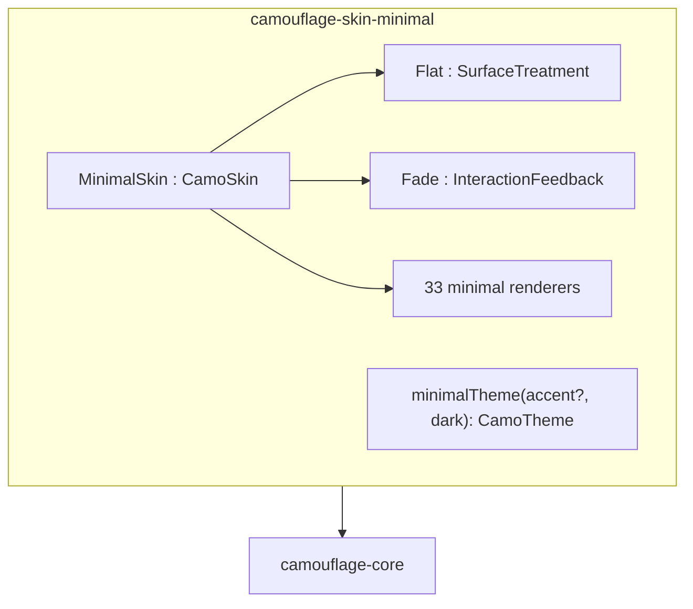
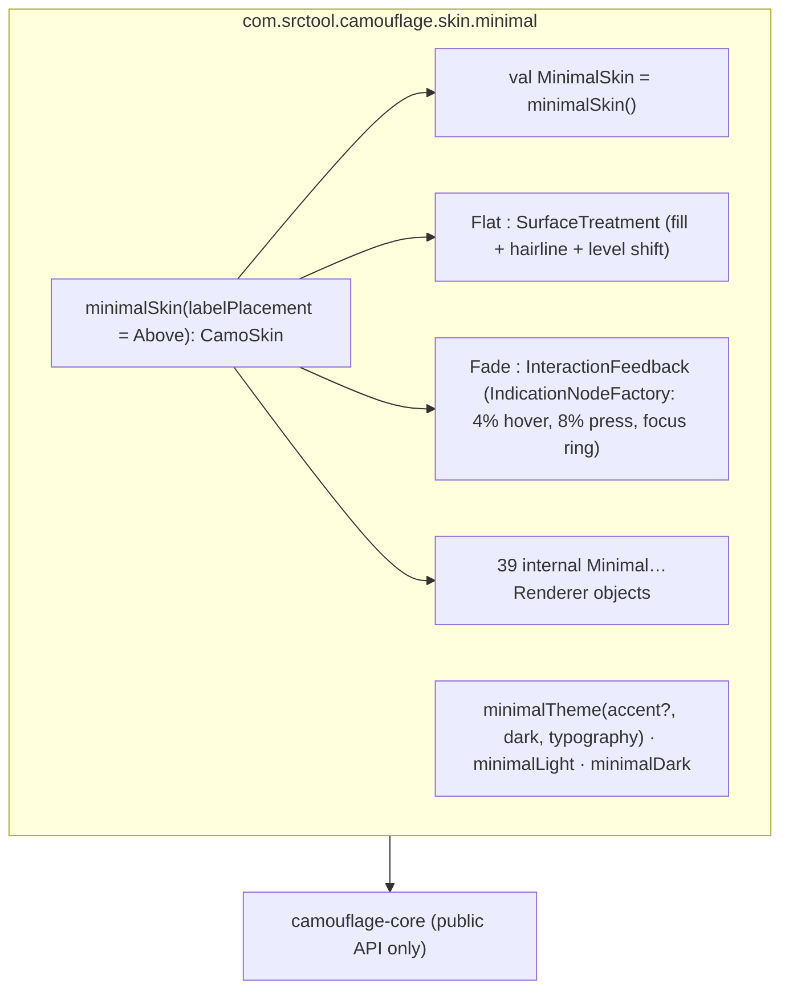
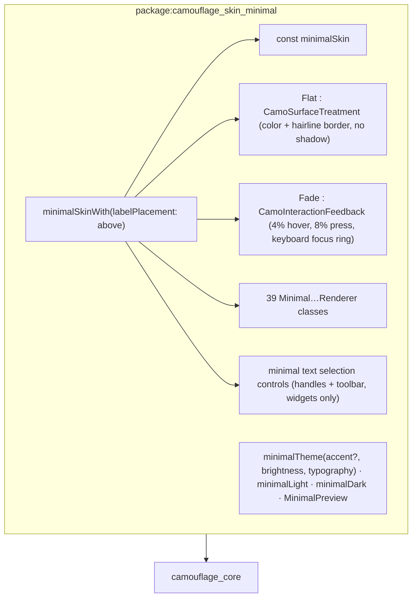

{/* Generated by docs/internal/scripts/sync_vault.py from the Camouflage design notes. Edit the notes and re-run the script; changes made here are overwritten. */}

# Minimal Skin

## Concept {#concept}

### 1. Why

`MinimalSkin` is **Camouflage's own dialect** and the **v1 skin** (ADR-22). It follows a minimalist design concept: content first, few surfaces, flat depth, restrained color, and typography carrying the hierarchy. It comes first, before Material, because:
- **There's no external spec to copy pixel for pixel.** Material, Apple, Fluent and Carbon each come with hundreds of exact measurements, states and motion rules. A minimal dialect is defined here, so the implementation *is* the reference.
- **It's the purest test of the contract.** If the whole component set looks coherent with only tokens, hairlines and opacity, the Skin/Theme split is doing its job.
- **It's a good default brand base.** Most Figma designs a client brings are closer to "clean and minimal" than to Material. A brand theme on top of `MinimalSkin` often needs no renderer overrides at all.

It lives in the module `camouflage-skin-minimal` (Dart: `camouflage_skin_minimal`), depends only on core, and on Flutter it needs no `material_ui`.

### 2. Shape



#### 2.1 The minimalist principles, as rules

| Principle                        | Rule in this skin                                                                                                                                                           |
| -------------------------------- | --------------------------------------------------------------------------------------------------------------------------------------------------------------------------- |
| **Content first**                | containers are only drawn when they carry meaning. Default card = hairline border, not a filled block.                                                                      |
| **Flat depth**                   | **no shadows anywhere.** Depth is shown by surface level (a slightly different fill) plus a 1 px hairline border, and overlays are separated by the scrim alone.            |
| **Restrained color**             | **monochrome by default**: the "accent" is ink (near-black in light, near-white in dark). One optional accent color can replace it. Status colors are used only for status. |
| **Typography carries hierarchy** | weight and size do the work (600 for titles, 500 for labels, 400 for body). Color variation stays within two text levels.                                                   |
| **Quiet interaction**            | feedback is a soft overlay (opacity), never a ripple. Focus is a clear 2 px ring (accessibility is never minimized).                                                        |
| **Calm motion**                  | short, standard-eased transitions, and no bouncing or spring overshoot.                                                                                                     |
| **Generous space**               | an 8-point rhythm, and slightly more padding than Material in lists and dialogs.                                                                                            |

#### 2.2 Surface treatment: `Flat`

- Fill with the given color, clipped to the shape.
- `ElevationLevel` is **not** drawn as a shadow:
  - `Level0`: fill only;
  - `Level1`+: fill + 1 px `outlineVariant` hairline;
  - `Level3`+: the fill shifts one surface level up (e.g. `surfaceContainerLow` → `surfaceContainer`).

#### 2.3 Interaction feedback: `Fade`

| Interaction | Effect |
|---|---|
| hovered | content-color overlay at 4% |
| pressed | content-color overlay at 8% (no ripple, no scale) |
| focused (keyboard) | 2 px ring in `primary`, offset 2 px outside the shape |
| disabled | content at 38%, container at 12% of `onSurface` (the shared rule) |

### 3. API

#### 3.1 Public surface of the module

```kotlin
val MinimalSkin: CamoSkin                                  // = minimalSkin()
fun minimalSkin(labelPlacement: LabelPlacement = Above): CamoSkin   // default for text fields, selects and search: Above | Floating
object Flat : SurfaceTreatment
object Fade : InteractionFeedback
fun minimalTheme(accent: Color? = null, dark: Boolean = false, typography: CamoTypography = CamoTypography.system()): CamoTheme
val minimalLight: CamoTheme                                // = minimalTheme(dark = false)
val minimalDark: CamoTheme                                 // = minimalTheme(dark = true)
```

#### 3.2 Starter theme: `minimalTheme`

It's built with `CamoColors.fromSeed` ([Theme](/guide/foundations/theme) §3.4). Since ADR-24 the core defaults **are** these values (gray neutrals, the same tone table), so `minimalTheme` only adds the ink primary when there's no accent:

| Roles | Light (tone of the neutral palette) | Dark |
|---|---|---|
| `surface`, `surfaceContainerLowest` | 100, 100 | 6, 4 |
| `surfaceContainerLow / Container / High / Highest` | 98 / 96 / 94 / 92 | 10 / 12 / 17 / 22 |
| `onSurface` / `onSurfaceVariant` | 10 / 35 | 92 / 75 |
| `outline` / `outlineVariant` | 50 / 90 | 60 / 25 |
| `primary` / `onPrimary` (**accent = null → ink**) | 10 / 100 | 92 / 10 |
| `primaryContainer` / `onPrimaryContainer` | 92 / 10 | 22 / 92 |
| `secondary*`, `tertiary*` | the neutral palette at the standard tones (40/100/90/10 light, 80/20/30/90 dark) | the same |
| status families | the default status seeds, standard tones | the same |

With an `accent`, the `primary` family comes from the accent seed at the standard tones, and everything else stays neutral. `validate()` must pass for light and dark, with and without an accent. The generated values are pinned by a snapshot test, like the Material baseline.

The theme API's **`CamoColors.fromSeed(…, neutral: Color? = null)`** seeds the neutral palette (null → true grays).

**Typography (`CamoTypography.system()`, in core)**: the platform system font (SF Pro on Apple platforms, Roboto on Android, Segoe UI on Windows, the system UI font on Linux and web).

| Role | Size / line height | Weight |
|---|---|---|
| display L / M / S | 48/56 · 40/48 · 32/40 | 600 |
| headline L / M / S | 28/36 · 24/32 · 20/28 | 600 |
| title L / M / S | 18/26 · 16/24 · 14/20 | 600 |
| body L / M / S | 16/24 · 14/20 · 12/16 | 400 |
| label L / M / S | 14/20 · 12/16 · 11/16 | 500 |

**Shapes:** extraSmall 4 · small 6 · medium 8 · large 12 · extraLarge 16 · full (the core defaults).
**Motion:** short 120 ms · medium 200 ms · long 300 ms (the core defaults), all `easingStandard` (no emphasized overshoot).
**Spacing and elevation:** the core defaults (elevation values are only used as levels; `Flat` draws no shadows).

#### 3.3 Dialect alignment (required, [Design Language](/guide/foundations/design-language) §3.4)

**Appearance** (`f` = the tone's family; with the default tone and no accent, strong = ink):

| Appearance | Minimal rendering |
|---|---|
| `Solid` | `f.strong` fill, `f.onStrong` content |
| `Soft` | `surfaceContainerHigh` fill + `onSurface` content (default tone). For status tones: `f.container` / `f.onContainer`. |
| `Raised` | no shadow: `surface` fill + 1 px `outline` hairline + `onSurface` content (visually close to Outline, but one step stronger) |
| `Outline` | transparent + 1 px `outlineVariant` hairline + `f.strong` content |
| `Ghost` | transparent + `f.strong` content |
| `Link` | `f.strong` text, underlined (1 px, offset 2) |

**Tone:** Default → ink (or the accent), Error/Success/Warning/Info → the status families. **Level:** one to one with the `surface*` roles. Differences between levels are subtle (2–4 tones), and hairlines make the separation.

#### 3.4 Component defaults (the complete set)

These are each renderer's `defaults(theme)`. Every field of each component theme follows these values, and brand themes override them field by field.

| Component | Minimal defaults |
|---|---|
| CamoText / CamoIcon | styles as passed; icons 20 by default (quieter than Material's 24) |
| CamoSurface | `Flat` rules (§2.2); `border = true` → 1 px `outlineVariant` hairline at any level |
| CamoDivider | 1 px `outlineVariant`, insets 16 |
| CamoButton | height 40, radius `medium` (8), padding 16 (12 beside an icon), `labelLarge` 500, icons 16, gap 8; loading = a 16 progress circle in the content color |
| CamoIconButton | 36 container, radius 8, icon 20, Ghost default; checked = `surfaceContainerHigh` fill + ink icon |
| CamoFab | 48 square (`FabTheme.size`: Small 40 · Regular 48 · Large 64), radius 12, Solid (ink), icon 20; extended height 48 |
| CamoTextField | label **`Above`** by default (static, `labelMedium` 500); **`Floating`** when configured (resting `bodyLarge` `onSurfaceVariant` inside the field, floated `labelSmall` 500 on the top edge with a `surface` cutout in the outline, 120 ms fade + move); field 44 tall, radius 8, 1 px `outline`; focus: 2 px `primary` ring; error: `error` border + text; placeholder `onSurfaceVariant`; prefix/suffix text `bodyLarge` `onSurfaceVariant` |
| CamoCheckbox | 18 box, radius 4, 1.5 px `outline`; checked = ink fill + white check; `labelPosition` End; description `bodySmall` `onSurfaceVariant` |
| CamoSwitch | 36 × 20 track, 16 thumb; off `surfaceContainerHighest` with a hairline, on = ink; no icons; thumb doesn't resize; `labelPosition` Start; description `bodySmall` `onSurfaceVariant` |
| CamoRadio | 18 circle, 1.5 px `outline`; selected = ink ring + 8 dot |
| CamoSegmentedControl | 36 tall, radius 8, `surfaceContainer` track; the selected segment is `surface` + hairline (a quiet "raised" chip), no check icon |
| CamoSlider | 4 px track (`outlineVariant` / ink active), 16 round thumb (`surface` + hairline), value label only while dragging |
| CamoDatePicker | `style` Calendar; day cells 36, ink circle for the selected day, a 1 px `outline` ring for today, `surfaceContainerHigh` range band; `confirmButton` true; `allowTyping` Auto; `showOutsideDays` false |
| CamoTimePicker | `style` Fields: two 56×56 boxes (`surfaceContainerHigh`, radius 8) with `displaySmall` digits, a Minimal segmented AM/PM; `confirmButton` true |
| CamoStepper | `layout` Inline: 36 icon buttons with a hairline, value `titleMedium` 600, min width 40 |
| CamoSearchField | 40 tall, radius 8, `surfaceContainer` fill, no border, icon 18 |
| CamoSelect | CamoTextField look + a chevron 16; menu or sheet per `Auto` |
| CamoCard | Raised default = hairline border, radius 12, padding 0; Soft = `surfaceContainer`; Solid = ink; selected = 2 px ink border, no check |
| CamoPagedList | refresh indicator = a 20 ink progress circle (no disc); retry row = `bodyMedium` text + Ghost "Retry" button; empty/error = centered `titleMedium` 600 + `bodyMedium` `onSurfaceVariant`, no illustration |
| CamoAccordion | `indicator` Chevron at the end, header 52 tall, `titleSmall` 600, hairline dividers in a group, no fill when open |
| CamoListItem | rows 48 / 64 / 80, padding 16, `dividers` Inset (hairline, after the leading slot); sections: `titleSmall` 600 in `onSurfaceVariant`, and `surface` (not inset-grouped) |
| CamoChip | 28 tall, radius 6, hairline outline; selected = ink fill + white text, no check icon; `groupSpacing` 8 |
| CamoBadge | dot 6; count 16 tall, radius full, `labelSmall`; tone default Error |
| CamoAvatar | circle, neutral initials background (`surfaceContainerHighest`), `onSurface` initials, sizes 24 / 36 / 48; `shape` Circle |
| CamoSkeleton | `animation` Pulse (calm, no sweep), base `surfaceContainerHigh`, radius `small` (6) |
| CamoProgress | bar 2 px, circle stroke 2, ink active, `outlineVariant` track, no stop dot |
| CamoSnackbar | `inverseSurface`, radius 8, action as underlined text; `showDismiss` false, `showToneIcon` false |
| CamoBanner | Soft: tone container, radius 8, icon 20; no accent border |
| CamoDialog | radius 12, `surface` + hairline, no shadow, padding 24, `actionsLayout` End, `titleAlign` Start, `showCloseButton` false, title `titleLarge` 600; scrim `scrim` at 40% |
| CamoBottomSheet | top radius 16, `surface` + top hairline, handle 36 × 4 in `outlineVariant` (`showHandle` default true) |
| CamoMenu | radius 8, `surface` + hairline, items 40, `bodyMedium`, no shadow; `checkPosition` Trailing, check in ink |
| CamoTooltip | `inverseSurface`, radius 6, `bodySmall` |
| CamoTopBar | 56 tall, `titleAlign` Start, `titleLarge` 600, `surface`; `divider` WhenScrolled (a hairline, no tint), no collapse |
| CamoTabs | text tabs, `labelLarge` 500; selected = ink text + 2 px ink underline, full tab width; hairline under the row |
| CamoNavigationBar | 64 tall, `surface` + top hairline, `showLabels` Always, `indicator` None, `placement` Pinned: selected = ink icon + label, unselected `onSurfaceVariant` |
| CamoNavigationRail | 72 wide, `alignment` Top, `indicator` None, `showLabels` Always, the same selection style as the bar, a hairline on the end edge |
| CamoNavigationDrawer | 280 wide, items 40, `indicator` Fill (a radius 8 `surfaceContainerHigh` selected row), sections in `titleSmall` 600 |

### 4. Build steps

1. `Flat` and `Fade` first, tested on a bare `CamoSurface` and a button inside `DebugSkin.copy(…)`.
2. `minimalTheme` on top of the core defaults (`fromSeed` gray neutrals, `CamoTypography.system()`). Snapshot-pin the generated colors, and run `validate()` for light, dark and a sample accent.
3. The renderers in milestone order (M3 primitives and actions → M5 inputs → M6 structure and overlays → M7 feedback → M8 navigation).
4. The shared tests: the behavior-modifier/wrapper check, and "no literals" (every component-theme field honored).
5. The screenshot matrix: component × light/dark × accent none/blue × 100/200% × LTR/RTL.

**Done when**
- [ ] All 39 renderers are implemented with the defaults above, and the Language screen ([Design Language](/guide/foundations/design-language) §4) looks coherent in light and dark.
- [ ] `minimalTheme()` and `minimalTheme(accent = …)` both validate and are snapshot-pinned.
- [ ] Neither platform's skin module depends on Material (`material_ui`, `material3`, `material-ripple`).

### 5. Edge cases

| Case | Decided behavior |
|---|---|
| **Hairlines on high-density screens** | 1 logical px (a crisp line at any density). On desktop at 100% scale that's 1 physical px, still visible against `outlineVariant`. |
| **Flat overlays over busy content** | Separation relies on the scrim (40%) + hairline. If a brand's content is very busy, it can raise `scrimAlpha` in the dialog/sheet component themes. |
| **Monochrome primary with status colors** | Ink buttons next to red/green status stay distinct. Avoid an accent that's itself red or green (`validate()` can't catch that; it's a design guideline). |
| **`Raised` vs `Outline` looking similar** | Intentional in a flat dialect. `Raised` uses the stronger `outline` hairline, and `Outline` the quieter `outlineVariant`. |
| **Accessibility vs minimalism** | Focus rings, 48 touch targets and 4.5:1 text contrast are never reduced. Minimalism applies to decoration, not to affordances. |

| **Label placement** | Both are supported (decided 2026-09-27). Priority: `TextFieldTheme.labelPlacement` in the theme tree → `minimalSkin(labelPlacement)` → `Above`. A brand sets it once in its theme; a skin instance can change the default; one subtree can override with a nested `TextFieldTheme`. |

## Implementation {#implementation}

<KotlinOnly>

### 1. Why {#kotlin-1-why}

`:camouflage-skin-minimal` is the v1 skin (ADR-22): Camouflage's own flat, hairline, ink-first dialect. In Kotlin it depends on **`camouflage-core` and Compose foundation only**, with no Material artifact and no ripple. This note covers the module, the `Flat` surface treatment, the `Fade` feedback as a Compose `Indication`, `minimalTheme`, and the renderer set.

### 2. Shape {#kotlin-2-shape}



### 3. API {#kotlin-3-api}

```kotlin
public val MinimalSkin: CamoSkin = minimalSkin()

public fun minimalSkin(labelPlacement: LabelPlacement = LabelPlacement.Above): CamoSkin = CamoSkin(
    name = "minimal",
    surfaceTreatment = Flat,
    feedback = Fade,
    text = MinimalTextRenderer, icon = MinimalIconRenderer, surface = MinimalSurfaceRenderer, divider = MinimalDividerRenderer,
    button = MinimalButtonRenderer, iconButton = MinimalIconButtonRenderer, fab = MinimalFabRenderer,
    textField = MinimalTextFieldRenderer(labelPlacement), /* … all 39 renderers, in milestone order … */
)

public object Flat : SurfaceTreatment
public object Fade : InteractionFeedback

public fun minimalTheme(accent: Color? = null, dark: Boolean = false,
    typography: CamoTypography = CamoTypography.system()): CamoTheme
public val minimalLight: CamoTheme = minimalTheme()
public val minimalDark: CamoTheme = minimalTheme(dark = true)

@Composable public fun MinimalPreview(dark: Boolean = false, content: @Composable () -> Unit)   // for @Preview
```

#### 3.1 `Flat` {#kotlin-31-flat}

```kotlin
public object Flat : SurfaceTreatment {
    override fun modifier(color: Color, shape: Shape, elevation: Dp, theme: CamoTheme): Modifier {
        val level = theme.elevation.levelOf(elevation)                 // Level0..Level5
        val fill = if (level >= ElevationLevel.Level3) theme.colors.shiftedOneLevel(color) else color
        val hairline = if (level >= ElevationLevel.Level1)
            Modifier.border(1.dp, theme.colors.outlineVariant, shape) else Modifier
        return Modifier.background(fill, shape).then(hairline)          // never a shadow
    }
}
```

`shiftedOneLevel` maps a surface role to the next container role (`surface` → `surfaceContainerLow`, …); non-surface colors (a Solid button's ink) are returned unchanged.

#### 3.2 `Fade` {#kotlin-32-fade}

`Fade.indication(contentColor, theme)` returns an `IndicationNodeFactory` whose node collects the `InteractionSource` and draws, in `ContentDrawScope.draw()`:
- a `contentColor` overlay at **4%** while hovered and **8%** while pressed (animated with `theme.motion.durationShort`), no ripple and no scale;
- a **2 dp focus ring** in `primary`, offset 2 dp outside the shape, **only for keyboard focus**: the node reads `LocalInputModeManager.current.inputMode == InputMode.Keyboard` (a tap focuses a text field without a ring).

Because it's an `IndicationNodeFactory`, it's cheap: no recomposition per press.

#### 3.3 `minimalTheme` {#kotlin-33-minimaltheme}

`CamoColors.fromSeed(primary = accent ?: Neutral, neutral = null, dark = dark)` gives the gray neutrals and status families (ADR-24). With no accent, the `primary` family is then replaced by **ink**: `primary` = neutral tone 10 (light) / 92 (dark), `onPrimary` 100 / 10, `primaryContainer` 92 / 22, `onPrimaryContainer` 10 / 92. Shapes, spacing, elevation and motion are core's defaults. The generated colors are pinned by a snapshot test.

#### 3.4 Renderers {#kotlin-34-renderers}

One `internal object` per renderer, in `com.srctool.camouflage.skin.minimal.renderer`, each implementing `defaults(theme)` with the base Minimal defaults table (button 40 tall, radius `medium`, text field label `Above` 44 tall, list `dividers = Inset`, nav bar `indicator = None`, dialog `actionsLayout = End`, snackbar `showToneIcon = false`, skeleton `animation = Pulse`, …) and `Render(…)` that reads only `style` and `theme` (the "no literals" rule).

### 4. Build steps {#kotlin-4-build-steps}

1. The module (`com.srctool.kmp.library` + compose convention), `Flat`, `Fade`, tested on a bare `CamoSurface` and a button inside `DebugSkin.copy(surfaceTreatment = Flat, feedback = Fade)`.
2. `minimalTheme` with the ink primary, and its snapshot test (light, dark, one accent).
3. The renderers in milestone order: M3 (text, icon, surface, divider, button, icon button) → M5 (inputs) → M6 (structure, lists, skeleton, overlays) → M7 (feedback, data display) → M8 (navigation, FAB).
4. Roborazzi screenshots (Android via Robolectric, desktop): each component × light/dark × no accent/blue × 100/200% font × LTR/RTL.
5. A dependency check in CI: `:camouflage-skin-minimal` must not resolve any `androidx.compose.material*` artifact.

**Done when**
- [ ] All 39 renderers render the base defaults table; the Language screen looks coherent in light and dark on Android, iOS, desktop and web.
- [ ] `Fade`'s focus ring appears for keyboard focus and never for touch.
- [ ] The module's dependency tree has no Material artifact.

### 5. Edge cases {#kotlin-5-edge-cases}

| Case | Decided behavior |
|---|---|
| Hairline on desktop at 100% scale | `1.dp` is one physical pixel there; still visible against `outlineVariant`. |
| iOS and keyboard focus | `InputMode.Keyboard` is reported with a hardware keyboard on iPad; the ring shows then. |
| Web (`wasmJs`) | `Flat` and `Fade` draw on the canvas like the other targets; the browser's own focus outline is suppressed by Compose. |
| A brand borrowing a renderer from another skin | Borrowed renderers read `Camouflage.skin.surfaceTreatment` / `feedback`, so they get `Flat` and `Fade` under `MinimalSkin.copy(…)` (ADR-28). |

</KotlinOnly>

<DartOnly>

### 1. Why {#dart-1-why}

`camouflage_skin_minimal` is the v1 skin (ADR-22). In Flutter it imports **`package:flutter/widgets.dart` only**, like core: no `material_ui`, no `cupertino_ui`, no ink splash. This note covers the package, `Flat` as a `BoxDecoration`, `Fade` as an animated overlay driven by the interaction controller, `minimalTheme`, the skin-provided text selection controls, and the renderer set.

### 2. Shape {#dart-2-shape}



### 3. API {#dart-3-api}

```dart
const CamoSkin minimalSkin = CamoSkin(
  name: 'minimal',
  surfaceTreatment: Flat(),
  feedback: Fade(),
  text: MinimalTextRenderer(), icon: MinimalIconRenderer(), surface: MinimalSurfaceRenderer(),
  divider: MinimalDividerRenderer(), button: MinimalButtonRenderer(), /* … all 39 renderers … */
);
CamoSkin minimalSkinWith({LabelPlacement labelPlacement = LabelPlacement.above});

class Flat implements CamoSurfaceTreatment { const Flat(); }
class Fade implements CamoInteractionFeedback { const Fade(); }

CamoTheme minimalTheme({Color? accent, Brightness brightness = Brightness.light, CamoTypography? typography});
final CamoTheme minimalLight = minimalTheme();
final CamoTheme minimalDark = minimalTheme(brightness: Brightness.dark);

class MinimalPreview extends StatelessWidget {                  // for widget previews and golden setup
  const MinimalPreview({super.key, this.brightness = Brightness.light, required this.child});
}
```

#### 3.1 `Flat` {#dart-31-flat}

`decorate(child, color, shape, elevation, theme)` returns a `DecoratedBox` with a `ShapeDecoration`: the fill (shifted one surface level from `level3`), and a 1.0 logical-pixel `outlineVariant` side from `level1`. No `BoxShadow`, ever.

#### 3.2 `Fade` {#dart-32-fade}

`wrap(child, controller, contentColor, shape, theme)` returns an `AnimatedBuilder` on the `CamoInteractionController` that paints a `contentColor` overlay at **4%** (hovered) or **8%** (pressed) with `TweenAnimationBuilder` over `motion.durationShort`, and a **2 px focus ring** offset 2 px outside the shape, only when `FocusManager.instance.highlightMode == FocusHighlightMode.traditional` (keyboard), never after a tap.

#### 3.3 `minimalTheme` {#dart-33-minimaltheme}

`CamoColors.fromSeed(primary: accent ?? neutral, brightness: brightness)` for gray neutrals and status families (ADR-24); with no accent, the `primary` family becomes ink (neutral tones 10/100/92/10 light, 92/10/22/92 dark). `typography` defaults to `CamoTypography.system()`. Snapshot-tested hex values.

#### 3.4 Text selection controls {#dart-34-text-selection-controls}

Core's `EditableText` needs selection handles and a toolbar; Material's and Cupertino's live in `material_ui` / `cupertino_ui`, so the skin provides **`minimalTextSelectionControls`** built on `TextSelectionControls` from widgets: ink handles, and a small `surface` + hairline toolbar with Cut / Copy / Paste / Select all as `CamoButton(appearance: ghost)`s. On desktop and web, the platform context menu is used (`BrowserContextMenu` on web).

#### 3.5 Renderers {#dart-35-renderers}

One `const` class per renderer, each with `defaults(theme)` from the base Minimal defaults table and `render(…)` reading only `style` and `theme` (the "no literals" rule, checked by `camouflage_skin_testing`).

### 4. Build steps {#dart-4-build-steps}

1. The package (widgets only), `Flat`, `Fade`, tested under `DebugSkin.copyWith(surfaceTreatment: const Flat(), feedback: const Fade())`.
2. `minimalTheme` and its snapshot test; `MinimalPreview`.
3. The text selection controls (M5, with the text field).
4. The renderers in milestone order (M3 → M8).
5. `alchemist` goldens: component × light/dark × 1.0/2.0 × LTR/RTL, plus one brand-theme combination from M3.
6. A CI import check: no `material`/`cupertino` import in `lib/`.

**Done when**
- [ ] All 39 renderers match the defaults table on all six platforms; the focus ring shows only for keyboard focus; the package has no Material or Cupertino import.

### 5. Edge cases {#dart-5-edge-cases}

| Case | Decided behavior |
|---|---|
| Hairline on high-DPI | 1.0 logical px is crisp at any device pixel ratio. |
| Borrowed renderers from another skin | They read `CamouflageScope.skinOf(context).surfaceTreatment` / `.feedback`, so they get `Flat` and `Fade` (ADR-28). |
| Selection toolbar on iOS | The skin's toolbar, not the native iOS menu (the native one comes with a later Cupertino skin or the app's own controls). |

</DartOnly>
