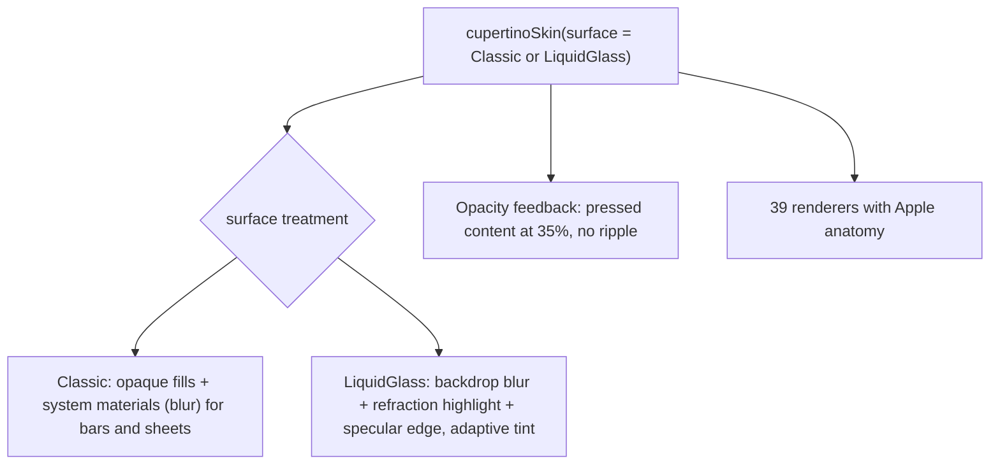

{/* Generated by docs/internal/scripts/sync_vault.py from the Camouflage design notes. Edit the notes and re-run the script; changes made here are overwritten. */}

# Cupertino Skin

:::info[Milestone: Later]

Documented now, so the contract is proven against Apple's language. Whether and when it ships is a separate decision (ADR-22).

:::

## 1. Why

`CupertinoSkin` renders Camouflage in **Apple's Human Interface Guidelines** dialect (iOS, iPadOS, macOS look). It's the dialect that differs most in **structure** from Material and Minimal:
- alerts stack their buttons;
- selects become wheel pickers;
- tabs become segmented controls;
- lists become inset grouped sections;
- the FAB has no Apple equivalent.

That makes it the real stress test of the Skin contract: same components, same parameters, different anatomy. It has two surface options:
- **Classic**: flat fills and system blur materials (pre-iOS 26);
- **Liquid Glass**: Apple's iOS 26+ translucent, refracting glass for bars, sheets and controls.

## 2. Shape



**Surface treatments**

| Treatment | How it's drawn | Platform notes |
|---|---|---|
| `Classic` | opaque fills. Bars, sheets and menus use a blurred translucent material (`surface` at ~80% + a 20–30 backdrop blur). | Flutter: `BackdropFilter(ImageFilter.blur)`. Compose: a backdrop blur needs a graphics-layer approach (Android 12+ `RenderEffect`, or a library such as Haze on all targets), falling back to an opaque fill. |
| `LiquidGlass` | backdrop blur + a refraction/lensing shader at the edges + a specular highlight + a tint adapted to the content behind | Flutter: `BackdropFilter` + a fragment shader (`FragmentProgram`). Compose: runtime shaders (`RuntimeShader` on Android 13+, Skia `RuntimeEffect` on other targets) over a captured backdrop. The most expensive dialect to render; it degrades to `Classic` on low-end devices and under **Reduce Transparency**. |

**Interaction feedback: `Opacity`.** Pressed content fades to about 35% (no ripple, no overlay). Focus (keyboard, macOS/iPadOS) is a 3 px accent ring.

## 3. API

```kotlin
fun cupertinoSkin(surface: CupertinoSurface = Classic): CamoSkin   // Classic | LiquidGlass
fun cupertinoTheme(accent: Color = SystemBlue, dark: Boolean = false, fontFamily: FontFamily? = null): CamoTheme
```

**Starter theme:**
- Apple's system colors mapped to roles: `primary` = systemBlue (accent), `error` = systemRed, `success` = systemGreen, `warning` = systemOrange, `info` = systemTeal.
- Surfaces map to systemBackground / secondarySystemBackground / tertiarySystemBackground and the grouped variants.
- `onSurface` = label, and `onSurfaceVariant` = secondaryLabel.
- Typography uses the **system font** (SF Pro on Apple platforms; it may not be shipped elsewhere, so a Cupertino skin on Android or the web falls back to the platform font or an app-provided one), with Apple's text styles mapped to the 15 roles (largeTitle 34 → displaySmall, title1 28, title2 22, title3 20, headline 17 semibold → titleMedium, body 17 → bodyLarge, callout 16, subheadline 15, footnote 13, caption1 12, caption2 11).

Exact hex values are taken from Apple's current HIG color tables at implementation time, for light, dark and increased-contrast variants.

### 3.1 Dialect alignment

| Appearance | Cupertino rendering |
|---|---|
| `Solid` | filled prominent button: accent fill, white label (`.borderedProminent`; Liquid Glass: `.glassProminent`) |
| `Soft` | tinted: accent at ~15% fill, accent label (`.bordered`; Liquid Glass: `.glass`) |
| `Raised` | → Soft |
| `Outline` | → Soft (Apple has no outlined buttons) |
| `Ghost` | plain accent text (`.borderless`) |
| `Link` | plain accent text (`.plain`) |

| Tone | Cupertino |
|---|---|
| Error | destructive role: systemRed text or fill |
| Success / Warning / Info | systemGreen / systemOrange / systemTeal |

### 3.2 Component mapping (structure changes in bold)

| Component | Apple equivalent | Rendering |
|---|---|---|
| CamoButton | Button | capsule (Liquid Glass) or 12-radius rounded rect, 44 tall (regular), opacity press |
| CamoIconButton | Button (icon-only) | SF Symbol-sized icon, no container for Ghost, 44 target |
| CamoFab | – | **a circular prominent button**. Guidance: prefer a toolbar action. |
| CamoTextField | Text field | **rounded-rect filled field** (`tertiarySystemFill`), no border, label above or as a placeholder |
| CamoCheckbox | Toggle (checkbox, macOS) | iOS: **a checkmark** (circle-check style); macOS: checkbox |
| CamoSwitch | Toggle (switch) | 51 × 31, **`primary` (the accent) when on**. Apple's green is one line away: `SwitchTheme(colors = SwitchColors(trackOn = success))`. |
| CamoRadio | – | **a checkmark on the selected row** (iOS list style). A `Horizontal` group falls back to circle options in a row (a checkmark list only works vertically). |
| CamoSegmentedControl | Segmented control | gray track + **a sliding white thumb** |
| CamoSlider | Slider | thin track, a large round white thumb with shadow |
| CamoDatePicker | Date picker | **`style` Wheel** for single dates (the compact/inline calendar for ranges) |
| CamoTimePicker | Date picker (time) | **`style` Wheel** |
| CamoStepper | Stepper | the − / + pill; the value is shown beside it |
| CamoSearchField | Search field | rounded gray field with a magnifier, and a "Cancel" button when active |
| CamoSelect | Picker / pop-up button | **a menu on iPad/macOS, a wheel picker in a sheet on iPhone** |
| CamoCard | (group box / inset section) | a rounded rect on the grouped background, no shadow |
| CamoAccordion | Disclosure control | `indicatorPosition` Start, a rotating chevron |
| CamoListItem / Section | Lists and tables | **inset grouped sections** (rounded, `secondarySystemGroupedBackground`), chevron accessories |
| CamoChip | Token field (macOS) | rounded capsule tokens |
| CamoBadge | Badge | red count badge |
| CamoAvatar | – | circle, gray initials |
| CamoProgress | Progress indicators | thin bar; **the circle becomes an activity indicator** (spoke spinner) when indeterminate |
| CamoSnackbar | – | **a top or bottom rounded banner** with a material background (there's no Apple snackbar) |
| CamoBanner | – | an inset rounded message cell with an SF Symbol |
| CamoDialog | Alert | **centered alert, 270 wide, `titleAlign` Center, `actionsLayout` side by side (`Stacked` when a label doesn't fit); destructive in red** |
| CamoBottomSheet | Sheet | large-radius sheet with a grabber (`showHandle` true), medium/large detents on iPhone, **form sheet on iPad** (matches `widePresentation = Centered`) |
| CamoMenu | Menu / context menu | material-backed menu with separators, destructive items in red, `checkPosition` Leading |
| CamoTooltip | Help tag (macOS) | macOS only; iOS shows the tooltip on long-press |
| CamoTopBar | Navigation bar | `titleAlign` Center; **large title that collapses as `scrollOffset` grows** (over the large-title height), material background |
| CamoTabs | Segmented control | **rendered as a segmented control**; Solid and Ghost look the same. `scrollable = true` falls back to a scrolling underline row (a segmented control can't scroll). |
| CamoNavigationBar | Tab bar | material/glass tab bar, `indicator` None, accent tint on the selected item; `showLabels` default Always (HIG) |
| CamoNavigationRail | (sidebar, iPad) | → **a compact sidebar** |
| CamoNavigationDrawer | Sidebar | iPad/macOS sidebar list; the modal drawer becomes a sidebar overlay |
| CamoPagedList | List + refresh control | **UIRefreshControl-style spinner above the list**, inset-grouped rows when sectioned |
| CamoSkeleton | (redacted placeholders) | pulse, `systemFill` blocks |
| CamoDivider | Separator | hairline, inset 16 in lists |

## 4. Build steps

1. `Opacity` feedback, and the `Classic` surface (including the blur material with an opaque fallback).
2. `cupertinoTheme` from the HIG color and type tables, snapshot-pinned.
3. The renderers with Apple anatomy (the structure changes above are the priority tests of the contract).
4. `LiquidGlass`: the backdrop capture + shader per platform, a device-capability check, and fallback to `Classic` under Reduce Transparency or on low-end devices.
5. The screenshot matrix, plus a manual comparison with native iOS screens.

**Done when**
- [ ] All 39 renderers work with the Classic surface.
- [ ] Alerts, wheel-picker selects, inset grouped lists and the large-title top bar match native iOS structure.
- [ ] Liquid Glass runs at 60 fps on a current iPhone and a mid-range Android device, and falls back correctly.

## 5. Edge cases

| Case | Decided behavior |
|---|---|
| **Reduce Transparency** (iOS setting) | Glass and materials become opaque fills. |
| **Increase Contrast** | Uses the increased-contrast color variants and stronger separators. |
| Cupertino skin on Android | Allowed (it's just a skin). The system back gesture still works. Guidance: pick the skin per platform at the root. |
| A FAB requested under Cupertino | Rendered as a circular button (above). The docs recommend a toolbar action instead. |
| Contract gaps found | Record them as ADRs and add them to core (e.g. a `detents` option for sheets). |

| Switch color | Follows the brand accent (`primary`), like every other selected control in the skin (decided 2026-09-27). Apps that want the iOS green set `SwitchTheme.colors.trackOn` to `success`. |
