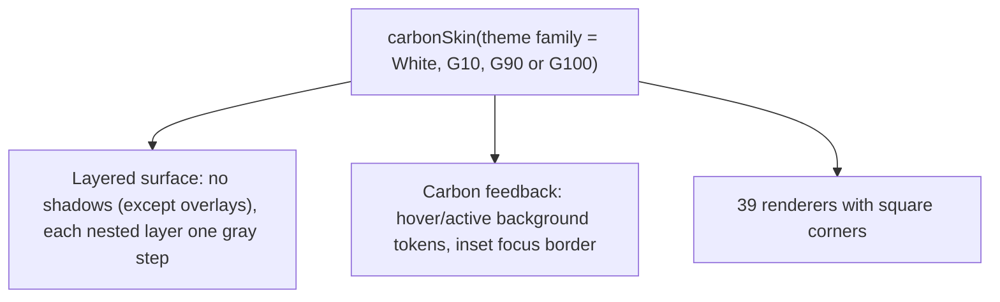

{/* Generated by docs/internal/scripts/sync_vault.py from the Camouflage design notes. Edit the notes and re-run the script; changes made here are overwritten. */}

# Carbon Skin

:::info[Milestone: Later]

Documented now. Whether and when it ships is a separate decision (ADR-22).

:::

## 1. Why

`CarbonSkin` renders Camouflage in **IBM Carbon**'s dialect: **square corners**, flat layered surfaces, a strong grid, productive density, and a bold blue interactive color. It suits enterprise, data-heavy and desktop tools. It stresses the contract in two ways:
- **text fields with a bottom border only** (a different anatomy);
- **layers instead of elevation**, where depth is a different gray per nesting level.

## 2. Shape



**Surface treatment: `Layered`.** Surfaces use **layer tokens** (`layer-01` … `layer-03`), which map to Camouflage's surface levels. There are no shadows, except for overlays (dialogs and menus get Carbon's single overlay shadow).

**Interaction feedback: `CarbonStates`.** Background swaps to `…-hover` / `…-active` tokens. Focus is a **2 px inset focus border** (`focus` color), so it never changes the layout.

## 3. API

```kotlin
fun carbonSkin(): CamoSkin
fun carbonTheme(family: CarbonThemeFamily = White, fontFamily: FontFamily? = null): CamoTheme   // White | G10 (light) · G90 | G100 (dark)
```

**Starter theme:**
- Carbon's four themes map to roles: `background` → `surface`, `layer-01..03` → `surfaceContainerLow..High`, `text-primary/secondary` → `onSurface`/`onSurfaceVariant`, `border-strong/subtle` → `outline`/`outlineVariant`, `interactive`/`button-primary` → `primary` (blue 60), `support-error/success/warning/info` → the status families.
- Typography: **IBM Plex Sans** for the authentic look, **added by the app** (skins never bundle fonts): `carbonTheme(fontFamily = IbmPlexSans)`, falling back to the platform font, with Carbon's type sets mapped to the 15 roles (heading-07 54 → displayLarge … body-compact-01 14 → bodyMedium, label-01 12 → labelMedium, helper-text-01 12 → bodySmall).
- **Shapes: all 0**, except `full` for toggles and tags.
- Values come from Carbon's published tokens at implementation time.

### 3.1 Dialect alignment

| Appearance | Carbon rendering |
|---|---|
| `Solid` | Primary button (blue 60 fill) |
| `Soft` | Secondary button (gray 80 fill, white text) |
| `Raised` | → Soft |
| `Outline` | Tertiary button (blue border and text) |
| `Ghost` | Ghost button |
| `Link` | → Link component style (blue, underline on hover) |

| Tone | Carbon |
|---|---|
| Error | Danger button, `support-error` |
| Success / Warning / Info | `support-success` / `support-warning` / `support-info` |

### 3.2 Component mapping

| Component | Carbon equivalent | Rendering |
|---|---|---|
| CamoButton / IconButton | Button (+ icon-only) | 48 tall (productive 40), **square**, text start-aligned with the icon at the end |
| CamoFab | – | a square primary icon button (guidance: use a toolbar) |
| CamoTextField | Text input | **`field-01` fill + bottom border only**, label above, helper text below, 40 tall |
| CamoCheckbox / Radio | Checkbox / Radio button | 16 square box / circle |
| CamoSwitch | Toggle | 48 × 24, green (`support-success`) when on, with an "On/Off" label option |
| CamoSegmentedControl | Content switcher | square segments, selected = inverse fill |
| CamoSlider | Slider | 2 px track, 14 thumb, a number input beside it (optional) |
| CamoDatePicker | Date picker | `style` Calendar, square cells |
| CamoTimePicker | Time picker | `style` Fields with an AM/PM select |
| CamoStepper | Number input | **`layout` Split** |
| CamoSearchField | Search | `field` fill, magnifier, square |
| CamoSelect | Dropdown / Select | field look + a square menu |
| CamoCard | Tile | `layer` fill, square, optional clickable/selectable |
| CamoAccordion | Accordion | chevron at the end, bottom borders |
| CamoListItem | Structured list / Contained list | rows with bottom borders |
| CamoChip | Tag | pill tags (the one rounded element), in type colors |
| CamoBadge | – (tag) | a small pill with a count |
| CamoAvatar | – | `AvatarTheme.shape` default `Square` (circle allowed), gray initials |
| CamoProgress | Progress bar / Loading | 2 px bar; the circle becomes the Carbon loading spinner |
| CamoSnackbar | Toast notification | a square toast with a colored left border; `showToneIcon` true, `showDismiss` true |
| CamoBanner | Inline notification | a colored left border (the `accentBorder` option) + icon + actions |
| CamoDialog | Modal | square, `layer` fill, title 20, **`actionsLayout` FullWidthRow**, `showCloseButton` true (shown when `dismissible`) |
| CamoBottomSheet | – | → a side panel or modal from the bottom, square, `showHandle` default false |
| CamoMenu | Menu / Overflow menu | square, 40 items, overlay shadow |
| CamoTooltip | Tooltip / Toggletip | inverse, square with a caret |
| CamoTopBar | UI shell header | 48 tall, **gray 100 (dark) header** in every theme |
| CamoTabs | Tabs | Solid → contained tabs, Ghost → line tabs |
| CamoNavigationBar | – | a bottom bar in Carbon style (mobile) |
| CamoNavigationRail / Drawer | UI shell left panel (rail / expanded) | 48 rail, 256 panel, `indicator` Line (a blue start-edge line) |
| CamoPagedList | Structured list + Loading | inline loading row at the end |
| CamoSkeleton | Skeleton states | pulse, `skeleton-background` / `skeleton-element` |
| CamoDivider | (borders) | 1 px `border-subtle` |

## 4. Build steps

1. The `Layered` surface, `CarbonStates` feedback, and the inset focus border.
2. `carbonTheme` for the four families, with a `fontFamily` parameter (the sample app adds IBM Plex Sans).
3. The renderers. Bottom-border text fields and full-width modal button rows are the structural tests.

**Done when**
- [ ] All 39 renderers in the White and G100 themes. The layer nesting (a card inside a card) steps gray correctly.

## 5. Edge cases

| Case | Decided behavior |
|---|---|
| **Layer nesting** | Carbon's rule: a component on `layer-01` uses `layer-02` for its own fill. Camouflage's `SurfaceLevel` handles this, and nested surfaces step up one level. |
| Square corners vs `shapes` tokens | The Carbon theme sets all shape roles to 0. A brand can still round them, and it's no longer strict Carbon. |
| The dark header in light themes | A Carbon convention: `TopBarTheme.colors` defaults to gray 100 in every family. |
| Touch devices | Carbon is desktop-first. The 48 touch targets still apply (the component guarantees them). |
