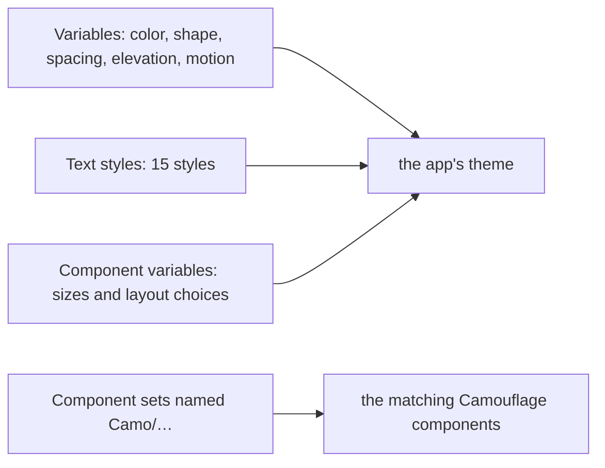

{/* Generated by docs/internal/scripts/sync_vault.py from the Camouflage design notes. Edit the notes and re-run the script; changes made here are overwritten. */}

# Figma Conventions

:::info[For designers]

This page is for the design team. It has no code. Following it means your Figma file turns into the app's theme mechanically, with no guessing and no rebuilding of components. The developer side is [Figma and AI](/guide/integrations/figma-and-ai).

:::

## 1. Why

Camouflage apps don't rebuild components for each design. They reuse the same components and change the **theme**: colors, type, corner sizes, spacing, and a set of per-component choices (button height, where a dialog puts its buttons, whether the bottom bar floats). If the Figma file names these the way Camouflage does, a developer (or an AI agent) can read them straight into code.

## 2. Shape

What you design maps to four things in the app:

| You make in Figma | It becomes |
|---|---|
| color, shape, spacing, elevation and motion **variables** | the theme's design tokens |
| 15 **text styles** | the type scale |
| **component variables** (sizes, layout choices) | how each kind of component looks everywhere in the app |
| **component sets** named `Camo/…` | the components developers use, linked one to one |

## 3. API: the conventions

### 3.1 Variables

| Collection | Modes | Names (examples) |
|---|---|---|
| `camouflage/color` | `Light`, `Dark` (add brand or high-contrast modes as needed) | `primary`, `on-primary`, `primary-container`, `surface`, `surface-container-high`, `on-surface`, `outline`, `error`, `success`, `warning`, `info` … (the full list of 42 roles is in the theme note) |
| `camouflage/shape` | – | `none`, `extra-small`, `small`, `medium`, `large`, `extra-large` |
| `camouflage/spacing` | – | `none`, `xxs`, `xs`, `s`, `m`, `l`, `xl`, `xxl` |
| `camouflage/elevation` | – | `level0` … `level5` |
| `camouflage/motion` | – | `duration-short`, `duration-medium`, `duration-long` |
| `camouflage/component` | – | see §3.3 |

- Name **roles, not colors**: `primary`, not `blue-600`. Your primitives (the palette) can stay in their own collection; alias the roles to them.
- Every `on-…` color is the text or icon color on top of its partner (`on-primary` on `primary`). Check contrast (4.5:1 for text).
- Your own palette and names are welcome: put them in a `custom/<set>` collection in your naming (`custom/brand/600`, `custom/radius/card`) and alias the roles to them. Developers get them as a typed set (`brand[600]`), and changing `brand/600` updates every role that uses it.

### 3.2 Text styles

Fifteen styles named `type/<role>/<size>`: roles `display`, `headline`, `title`, `body`, `label`; sizes `large`, `medium`, `small` (e.g. `type/body/medium`). Each style includes its **weight**. Fonts: say which font the app should add; the app ships it, Camouflage doesn't.

### 3.3 Component variables

Only what your design changes from the defaults. Two kinds:

**Sizes** (number variables): `button/height`, `button/radius`, `button/icon-size`, `text-field/height`, `text-field/border-width`, `card/radius`, `list-item/height-one-line`, …

**Layout choices** (string or Boolean variables), for example:

| Variable | Values |
|---|---|
| `button/default-appearance` | `solid`, `soft`, `raised`, `outline`, `ghost`, `link` |
| `text-field/label-placement` | `above`, `floating` |
| `checkbox/label-position` | `start`, `end` |
| `top-bar/title-align` | `start`, `center` |
| `top-bar/divider` | `never`, `when-scrolled`, `always` |
| `dialog/actions-layout` | `end`, `center`, `full-width-row`, `stacked` |
| `dialog/title-align` | `start`, `center` |
| `bottom-sheet/show-handle`, `bottom-sheet/show-close-button` | `true`, `false` |
| `navigation-bar/placement` | `pinned`, `floating` |
| `navigation-bar/indicator` | `pill`, `line`, `dot`, `fill`, `none` |
| `list-item/dividers` | `none`, `full`, `inset` |
| `snackbar/position` | `bottom`, `top` |
| `skeleton/animation` | `shimmer`, `pulse`, `none` |

The complete list is each component's "component theme" table; the names are the same, in kebab-case.

### 3.4 Component sets

- Name them `Camo/<Component>`: `Camo/Button`, `Camo/TextField`, `Camo/Card`.
- Use Camouflage's property names and values:
  - `appearance`: `solid`, `soft`, `raised`, `outline`, `ghost`, `link` (the visual weight: most emphasis → least);
  - `tone`: `default`, `error`, `success`, `warning`, `info` (the color meaning);
  - `state`: `enabled`, `hovered`, `pressed`, `focused`, `disabled`, `loading`;
  - text as a text layer named `label`; icons as instance swaps named `prefix icon` / `suffix icon` with a Boolean `has prefix icon`.
- Design **one** button with these properties, not a separate "Primary Button", "Danger Button", "Secondary Button": those are `appearance` × `tone`.

## 4. Build steps (for a design team adopting Camouflage)

1. Set up the collections in §3.1 with Light and Dark modes, aliased to your palette.
2. Create the 15 text styles.
3. Add component variables only where your design differs.
4. Build component sets with the §3.4 properties.
5. Hand the file to development: it maps to a theme without a meeting.

**Done when**
- [ ] Every color role and text style exists, the Light and Dark modes are complete, and the component sets use `appearance`, `tone` and `state`.

## 5. Edge cases

| Case | What to do |
|---|---|
| A design that doesn't fit a component at all (a bottom bar that expands into a menu) | Design it freely. Developers build it from Camouflage's building blocks, so it still matches the rest. Tell them it's a one-off. |
| "Make this look like Apple's / that app's" for one component | Note it on the component. Developers can borrow that component's structure from another skin while keeping your colors and type. |
| A value you want in only one place (a taller button in one footer) | Don't change the variable. Note it on the frame; it's a local override. |
| No Figma paid plan (no Dev Mode) | These conventions still work: variables and styles can also be read from a file export or a free plugin. |
