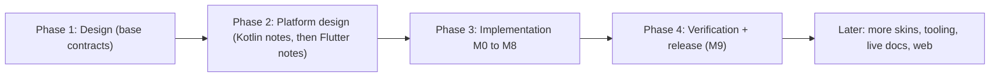
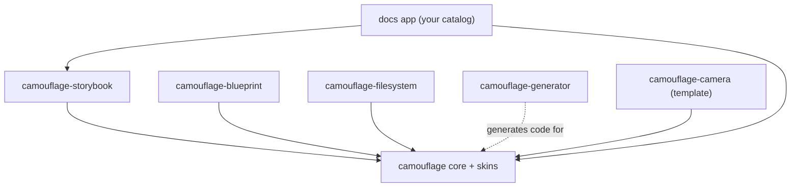

{/* Generated by docs/internal/scripts/sync_vault.py from the Camouflage design notes. Edit the notes and re-run the script; changes made here are overwritten. */}

# Roadmap

## 1. Why

The roadmap turns the docs into a **build order** and an **episode list**. The project follows a **waterfall lifecycle** (ADR-21): the complete design documentation is finished and reviewed **before** implementation starts. Within implementation, the milestones are the build order: each ends with something visible that works, so every recording has a payoff. Every milestone is built in **Kotlin first, then ported to Flutter**, which gives a natural "same design, two frameworks" series.

## 2. Shape

| Phase | Output | Exit gate |
|---|---|---|
| **1. Design** | all `base/` notes: architecture, theme, skin contract, provider, the design language, 40 component contracts, the skins (Minimal for v1; Material, Cupertino, Fluent, Carbon documented for Later), inventory, decisions | user review of `base/` |
| **2. Platform design** | all `kotlin/` notes, then all `flutter/` notes, mirroring `base/` | user review of each folder |
| **3. Implementation** | code in `camouflage-kotlin` then `camouflage-dart`, in milestone order M0–M8 | each milestone's *Done when* checked on both platforms |
| **4. Verification + release** | the full test matrix, accessibility passes, publishing v0.1 | M9's *Done when* |

Inside phase 3, each milestone is a loop: re-read the notes → build in Kotlin → port to Flutter → record.

## 3. API

The implementation milestones, with the notes they cover and suggested episodes:

| Milestone | Notes | Result you can show | Episodes (Kotlin → Flutter) |
|---|---|---|---|
| **M0 Setup** | [Architecture](/guide/architecture/architecture), [Project Setup](/guide/architecture/project-setup), [Project Setup](/guide/architecture/project-setup) | modules build in CI for **every platform** (Kotlin: Android, iOS, desktop, web; Flutter: all six), and the sample app launches on each | 1. "Starting a UI library from zero: why Skin + Theme" · 2. "One library, every platform: KMP setup and CI" |
| **M1 Theme** | [Theme](/guide/foundations/theme), [Design Language](/guide/foundations/design-language) + the platform Theme notes | a theme with light/dark, and a contrast check that catches a bad color | 3. "Design tokens in code" · 4. "Writing a WCAG contrast checker" |
| **M2 Skin + Provider** | [Skin Contract](/guide/architecture/skin-contract), [Provider and Scoping](/guide/architecture/provider-and-scoping) + the platform Skin Contract and Provider notes | `DebugSkin` renders placeholder boxes, and nested providers work | 5. "The Skin contract" · 6. "CompositionLocal vs InheritedWidget: providing a skin" |
| **M3 Hello skin** | CamoText, CamoIcon, CamoSurface, CamoButton, CamoIconButton, CamoDivider, [Minimal Skin](/guide/skins/minimal-skin) | the first real skin, Camouflage's own minimal dialect (all six button appearances) | 7. "A design system of our own: the Minimal skin" · 8. "Six button appearances, one component" |
| **M4 Theme swap demo** | [Provider and Scoping](/guide/architecture/provider-and-scoping) §3.3 | one screen, two brands and dark mode, switched live | 9. "Same components, new brand, zero code changes" (the core pitch, short-form friendly) |
| **M5 Inputs + forms** | CamoTextField, CamoCheckbox, CamoSwitch, CamoRadio, CamoSegmentedControl, CamoSlider, CamoSearchField, CamoDatePicker, CamoTimePicker, CamoStepper, [CamoForm](/components/inputs/camo-form) | a validated sign-up form, a settings list, a search screen | 10. "Text fields that survive a skin switch" · 11. "Radio, switch, checkbox: same code, different meaning" · 11b. "Flutter's Form, rebuilt for Compose" · 11c. "A date picker without Material" |
| **M6 Structure + overlays** | CamoCard, CamoTopBar, CamoListItem, CamoAccordion, CamoSkeleton, CamoPagedList, [Overlays](/components/overlays/overlays), CamoDialog, CamoBottomSheet, CamoMenu, CamoSelect, CamoTooltip | a full sample app screen: lists, menus, selects, dialogs and sheets | 12. "Top bars, lists and scroll" · 12b. "A paged list: refresh, next page, skeletons" · 13. "Dialogs and sheets as Navigation 3 routes" · 13b. "The same sheet with Flutter's show" · 13c. "A select that is a sheet on phones and a menu on desktop" |
| **M7 Feedback + compact** | CamoChip, CamoBadge, CamoAvatar, CamoProgress, CamoSnackbar, CamoBanner | status everywhere: tags, badges, progress, snackbars with Undo, banners by tone | 14. "Tone: one word, every status color" · 15. "A snackbar messenger without Material" |
| **M8 Navigation chrome** | CamoTabs, CamoNavigationBar, CamoNavigationRail, CamoNavigationDrawer, CamoFab | one app that shows a bar on phones, a rail on tablets and a drawer on desktop | 16. "Adaptive navigation in one component" · 17. "A FAB that collapses on scroll" |
| **M9 Test + publish** | [Testing](/guide/delivery/testing), [Publishing](/guide/delivery/publishing), [Testing](/guide/delivery/testing), [Publishing](/guide/delivery/publishing) | v0.1 on Maven Central and pub.dev | 18. "Screenshot tests for a design system" · 19. "Publishing v0.1" |
| **Later** | [Figma and AI](/guide/integrations/figma-and-ai), new skins, the "Later" rows of [Component Inventory](/guide/foundations/component-inventory) | the Later skins ([Skins](/guide/skins): Material, Cupertino with Liquid Glass, Fluent, Carbon); Figma → theme through the MCP; date pickers, data tables… | "Adding Material in one episode" · "Adding a second skin in one episode" · "Figma to Camouflage with one prompt" · "Liquid Glass in Compose and Flutter" |
| **Later: Tooling** | [Tooling](/guide/integrations/tooling) | tokens JSON (theme, component themes, brand token sets, skin choice) → the `camo` generator → Kotlin and Dart brand modules; `camouflage-mcp`; a free-plan Figma plugin; Camouflage Studio | "A brand theme from one JSON file" · "Camouflage's own MCP server" · "Studio: design once, export to Kotlin and Dart" |
| **Later: Live docs** | [Decisions](/guide/project/decisions) ADR-18 | live component previews in the Docusaurus docs site (`srctool/camouflage`), via the web builds (which already exist from M0) in iframes. **The gallery and embed are deferred until Compose Multiplatform web is stable.** | "Live Kotlin components in a docs site" |
| **Later: Camouflage for web** | [Tooling](/guide/integrations/tooling) | a third platform next to Kotlin and Flutter, built as **Web Components** (custom elements usable from any framework or plain HTML; decided 2026-09-27), with its own `web/` docs mirroring `base/` like the other two. It enables a web canvas and web export in Studio. |

Component notes: [Components — Overview](/components).

### The Camouflage family (separate packages, after v0.1)

**One repo, many packages (ADR-26).** Everything that depends on Camouflage, or generates code for it, lives in the **camouflage repo** as its own package: a Gradle module in `camouflage-kotlin`, a pub package in `camouflage-dart`'s workspace. Each is published separately, so an app pulls only what it uses. Packages that work without Camouflage live in their own repo. Each package keeps its own docs folder in the vault (`projects/camouflage-*`), with its own spec and plan when it starts.

| Package | Repo |
|---|---|
| core, skins, `camouflage-navigation3` | camouflage (the core set, versioned together, in the Kotlin BOM) |
| `camouflage-blueprint`, `camouflage-storybook`, `camouflage-filesystem`, `camouflage-generator`, templates (`camouflage-camera`, …) | camouflage (each versioned on its own) |
| `camouflage-figma-kit` | Figma (design side) |
| srctool gradle-conventions | its own repo after extraction |

| Package | What it is | Depends on | Starts after |
|---|---|---|---|
| **camouflage-storybook** | a Storybook(JS)-style catalog for Flutter and Kotlin: stories, controls (args), addons (skin/theme switcher, backgrounds, viewport, font scale, RTL, a11y checks). Its own UI is built with Camouflage. It can display Camouflage components **or** plain Compose/Flutter components. | `camouflage` core + a skin | M9. It becomes Camouflage's own docs app. |
| **camouflage-blueprint** | server-driven UI: builds Camouflage components, `CamoForm`s and `CamoRule`s from JSON through a type registry (prior art: the author's `flutter-json-ui`) | `camouflage` core | M9, and a stable component API (v1.0 is better) |
| **camouflage-filesystem** | a custom file system for import/export on devices where the OS disables Android's file system UI (e.g. custom smart-screen builds with no DocumentsUI / Storage Access Framework picker): the file layer **plus an in-app file browser/picker built with Camouflage**, like Storybook's UI. | `camouflage` core + a skin | after M6 (it needs dialogs, top bars, text fields, lists) |
| **camouflage-navigation3** (Kotlin, official add-on, M6) | Navigation 3 integration: `CamoDialogSceneStrategy`, `CamoBottomSheetSceneStrategy`, metadata helpers, `CamoNavResults`. Published with core (in the BOM). Later: page transitions that follow the skin's motion tokens. | `camouflage` core + Navigation 3 | M6 |
| **camouflage-figma-kit** (design) | the Camouflage Figma library: Variables in the naming contract ([Theme](/guide/foundations/theme) §3.12), component sets with Camouflage properties (`appearance`, `tone`, states), one page per dialect preview, and Code Connect mappings. Designers work in Camouflage's vocabulary from day one ([Design Language](/guide/foundations/design-language)). | nothing (it's the design side) | alongside M1–M3 (tokens first, then components as they're built) |
| **srctool gradle-conventions** (build tooling) | the convention plugins (`com.srctool.kmp.library`, `.compose`, `.publish`), grown inside `camouflage-kotlin/build-logic` and extracted into their own published project | nothing | after M9 (extract and publish) |
| **camouflage-generator** (build tooling) | code generation for Camouflage apps: first the `AppIcon` set from an assets folder (one icon widget per asset, `IconSource` with `autoMirror`/`original` from file-name conventions). Kotlin: a Gradle plugin; Dart: a `build_runner` builder. Later candidates: a `CamoTheme` from a design-tokens JSON export. | `camouflage` core (generated code uses its API) | after M3 (icons exist) |
| **templates**, e.g. **camouflage-camera** | ready-made pages built from Camouflage components, one package per template so an app only pulls the platform dependencies it needs (the camera page brings CameraX / AVFoundation / the `camera` plugin). Each is skin- and theme-aware, and opens like any page (a route, or `show` for sheets). | `camouflage` core + the template's platform libraries | after M8 (templates use the whole component set) |

**Dependency rules (no cycles):**

1. **Core never depends on a family package.** Camouflage's own showcase lives in a docs app built on storybook, never inside core.
2. **Storybook UI vs canvas.** Storybook's UI has one `CamouflageProvider`. Each story canvas gets its own nested provider, controlled by the toolbar's skin/theme switcher, so changing the canvas never restyles storybook.
3. **Develop together, publish separately.** Family packages in the camouflage repo depend on core as a project dependency (Kotlin: `project(":camouflage-core")`; Flutter: the pub workspace), so they always build against the current core. This avoids version skew (storybook compiled against 0.3 while the docs app pulls 0.4). Core's public-API check catches breaking changes, and each package is released on its own version.
4. **Filesystem uses Camouflage for its UI**, the same way Storybook does, and its browser/picker follows the app's skin and theme. Inside the package, the file layer stays separate from the UI code, so it could be split into its own UI-free package later if an app without Camouflage ever needs it.
5. **Templates are packages, not core.** Core stays free of heavy platform dependencies (camera, media, file access).

**Tooling (ADR-31, Later).** Tools that don't need a paid Figma seat, all around one **tokens JSON** (theme + component themes): the `camo` CLI in `camouflage-generator` (tokens → Kotlin/Dart theme code, validate, lint), **`camouflage-mcp`** (Camouflage's own MCP server), a free-plan **Figma plugin** in `camouflage-figma-kit`, and **Camouflage Studio** (a theme builder built with Camouflage). Order: format + CLI → MCP → plugin → Studio. See [Tooling](/guide/integrations/tooling).

**Sibling project: Sinew (ADR-29, ADR-37).** Sinew is the author's app architecture: self-mapping envelopes (abstract bases each app subclasses), a `Pager<T>` that owns the paging rules, `Result`, a `ViewState` of `Loading | Done | Failed`, a coded and localized error model, network, storage, security and devtools. It's a separate project in its own repo (`srctool/sinew`, Maven `com.srctool.sinew`). **Camouflage never depends on Sinew, and Sinew never depends on Camouflage**; the optional `sinew_camouflage` glue (layer 3) maps Sinew's paging state to `CamoPagedListState`.

**Dependency layers (ADR-27).** A package depends only on lower layers, never on its own layer:

| Layer | Packages | May depend on |
|---|---|---|
| 0 | core | nothing from Camouflage |
| 1 | skins, `camouflage-navigation3` | layer 0 |
| 2 | blueprint, storybook, filesystem, templates (camera, …) | layers 0–1 (skin-minimal only for the fallback provider), **never each other** |
| – | `camouflage-generator`, build-logic | nothing from Camouflage (build tools; generated code is plain text using core's API) |
| 3 | glue modules (e.g. `camouflage-storybook-blueprint`), sample, docs app, your apps | anything below |

- Two layer-2 packages that should work together (camera saves into filesystem, the file picker offers "take a photo") expose **callbacks or slots** (`onCapture`, `onSaved`), and the **app** connects them.
- Skins never ship Storybook stories: stories live in the docs app or a layer-3 stories module.
- CI checks the table on both platforms: a Gradle task over project dependencies (Gradle also refuses cycles itself), and a script over `melos list --graph` that includes `dev_dependencies` (pub allows cycles through them).

**Using several packages in one app (ADR-27).** An app is always the top layer, so it can't create a cycle. The real risks are versions and styling:

| Risk | What happens | Rule |
|---|---|---|
| **Version skew (Kotlin)** | filesystem 1.2 was built against core 0.4, camera 0.3 against core 0.5. Gradle quietly picks core 0.5, and filesystem may crash at runtime (`NoSuchMethodError`) if an API it uses changed. | The **BOM is the compatibility set**: it pins core, skins, navigation3 **and every family package** at versions tested together. Apps import the BOM and omit versions. Core's ABI check (`checkKotlinAbi`) blocks accidental breaks. |
| **Version skew (Dart)** | pub resolves one version per package, so a conflict fails loudly at `pub get` instead of at runtime. Before 1.0, `^0.4.0` excludes 0.5, so every core minor release needs the family packages re-released. | Each family package declares a caret range on core. CI re-tests and re-releases family packages when core's minor version bumps (Melos). Each README has a "works with core" table. |
| **Styling** | Each package's UI must match the app. | Family UI follows the app's `CamouflageProvider`. The fallback provider (Minimal) is used only when the app has none, so apps never see two looks by accident. |
| **Extra weight** | An app on another skin still pulls skin-minimal through a family package's fallback. | Accepted: skin-minimal is small and has no Material dependency. Unused code is removed by R8 (Android) and tree shaking (Flutter). |

Episode ideas: "Porting Storybook to Compose and Flutter", "A file browser for Android devices without a file system UI", "UI from JSON with Camouflage Blueprint".

## 4. Build steps

For each milestone:
1. Re-read the base notes listed. Resolve their "Open for review" questions first.
2. Build the Kotlin side from the `kotlin/` notes. Follow each note's build steps, and check each *Done when*.
3. Port to Flutter from the `flutter/` notes. Note any differences in the platform note's §5.
4. Record: the Kotlin episode, then the Flutter episode (or one side-by-side episode).
5. Update each covered note's `status` to `done`.

**Done when**
- [ ] (per milestone) every covered note's *Done when* is checked on both platforms, and its status is `done`.

## 5. Edge cases

| Case | Decided behavior |
|---|---|
| A milestone is too big for one recording | Split it by component. Each component note is sized to about one session. |
| The Flutter port reveals a contract problem | Fix the base note first (with an ADR in [Decisions](/guide/project/decisions)), then the Kotlin note, then continue. |
| Wanting to show Cupertino early for content | The M4 demo can use a second `DebugSkin` with a different look. The real Cupertino skin stays Later. |
