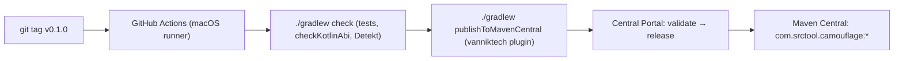
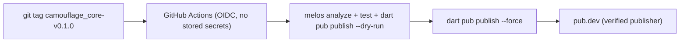

{/* Generated by docs/internal/scripts/sync_vault.py from the Camouflage design notes. Edit the notes and re-run the script; changes made here are overwritten. */}

# Publishing

<KotlinOnly>

## 1. Why {#kotlin-1-why}

v0.1 goes to **Maven Central** so any Android or KMP project can add Camouflage with one dependency. Once a version is published it can't be deleted, only superseded, so this note fixes the coordinates, versioning, signing and CI flow **before** the first release.

## 2. Shape {#kotlin-2-shape}



**Artifacts**

| Coordinates | Contents |
|---|---|
| `com.srctool.camouflage:camouflage-core:<v>` | core, with KMP variants for android, iosArm64, iosSimulatorArm64, jvm, wasmJs |
| `com.srctool.camouflage:camouflage-skin-minimal:<v>` | the Minimal skin (v1) + `minimalTheme` |
| `com.srctool.camouflage:camouflage-navigation3:<v>` | optional Navigation 3 integration (scene strategies, results) |
| (cross-platform rule) | the core set's **minor** version matches Flutter's (0.3 = the same milestone); patches are independent |
| `com.srctool.camouflage:camouflage-bom:<v>` | a BOM pinning core, skins and navigation3 to the same version, and family packages (later) to versions tested with it (ADR-27) |

The consumer side:

```kotlin
commonMain.dependencies {
    implementation(project.dependencies.platform("com.srctool.camouflage:camouflage-bom:0.1.0"))
    implementation("com.srctool.camouflage:camouflage-core")
    implementation("com.srctool.camouflage:camouflage-skin-minimal")
}
```

## 3. API {#kotlin-3-api}

### 3.1 The `com.srctool.publish` convention plugin {#kotlin-31-the-comsrctoolpublish-convention-plugin}

```kotlin
plugins { id("com.vanniktech.maven.publish"); id("org.jetbrains.dokka") }

mavenPublishing {
    publishToMavenCentral()                 // Central Portal (OSSRH was shut down in 2025)
    signAllPublications()
    coordinates("com.srctool.camouflage", project.name, version.toString())
    pom {
        name.set(project.name); description.set("Camouflage adaptive UI library")
        url.set("https://github.com/srctool/camouflage")
        licenses { license { name.set("Apache-2.0"); url.set("https://www.apache.org/licenses/LICENSE-2.0") } }
        scm { url.set("https://github.com/srctool/camouflage-kotlin") }
        developers { developer { id.set("srctool"); email.set("contact@srctool.com") } }
    }
}
```

### 3.2 Secrets (GitHub Actions) {#kotlin-32-secrets-github-actions}

`ORG_GRADLE_PROJECT_mavenCentralUsername` / `…Password` (a Central Portal user token), `ORG_GRADLE_PROJECT_signingInMemoryKey` (an ASCII-armored PGP private key), and `…KeyPassword`. The `com.srctool` namespace must be verified on the Central Portal first (a DNS TXT record on `srctool.com`).

### 3.3 Versioning {#kotlin-33-versioning}

- SemVer. `0.x` while the API settles: a minor bump **may** break, and the changelog says so.
- From `1.0`, breaking changes need a major bump, and `checkKotlinAbi` enforces awareness: an ABI change fails CI until `updateKotlinAbi` is committed and reviewed.
- Deprecate before removing: `@Deprecated(level = WARNING)` for one minor version, then `ERROR`, then removal in the next major (the policy in [Decisions](/guide/project/decisions)).

## 4. Build steps {#kotlin-4-build-steps}

1. Claim the `com.srctool` namespace on the Central Portal (DNS verification).
2. Generate a PGP key, publish the public key to a keyserver, and store the secrets.
3. Write the `com.srctool.publish` convention plugin and apply it to core, skin-minimal and bom.
4. `./gradlew publishToMavenLocal`, then consume it from a throwaway Android-only project and a KMP project.
5. The release workflow: on `v*` tags, a **single macOS job** runs `check` then `publishToMavenCentral` (a macOS host is needed for the iOS artifacts, and one host avoids duplicate uploads).
6. Dokka HTML published to GitHub Pages, or linked from the Docusaurus site.
7. Release 0.1.0.

**Done when**
- [ ] `com.srctool.camouflage:camouflage-core:0.1.0` resolves from Maven Central in a fresh Android app and a fresh KMP app (all four targets).

## 5. Edge cases {#kotlin-5-edge-cases}

| Case | Decided behavior |
|---|---|
| A publish from Linux CI | Refused by the workflow design: iOS artifacts need Xcode. Always publish from macOS. |
| A partial upload failure | The Central Portal deployment stays unreleased. Drop it in the portal, then re-run. Never bump the version to "fix" a failed upload. |
| A mistake in a released version | It can't be deleted. Release a patch (`0.1.1`), and mark it in the changelog. |
| A snapshot channel | Optional: publish `-SNAPSHOT` from `main` to the Central Portal snapshots repo, so the storybook project can track unreleased changes. |

:::tip[Decided (2026-10-02, ADR-36)]

- **Group id:** `com.srctool.camouflage`. The author owns `srctool.com`, and its DNS verification on the Central Portal is in progress. If verification fails, the fallback is `io.github.srctool.camouflage` (verified by a temporary public repo in the `srctool` GitHub org). Only `srctool { publishing { groupId } }` changes.

:::

</KotlinOnly>

<DartOnly>

## 1. Why {#dart-1-why}

v0.1 goes to **pub.dev** as two packages, `camouflage_core` and `camouflage_skin_minimal`, published by a **verified publisher**, with automated publishing from GitHub Actions. Published versions can be retracted but never deleted, so the versioning rules are fixed here first.

## 2. Shape {#dart-2-shape}



| Package | Depends on | Notes |
|---|---|---|
| `camouflage_core` | `flutter`, `material_color_utilities`, `intl` | `widgets.dart` only |
| `camouflage_skin_minimal` | `camouflage_core: ^0.1.0` | the Minimal skin (v1) + `minimalTheme` |

Dart has no BOM. Apps add both packages, and the skin's constraint on core keeps them compatible.

## 3. API {#dart-3-api}

**`pubspec.yaml` (package) essentials:**

```yaml
name: camouflage_core
description: Adaptive UI components whose look comes from a swappable skin and theme.
version: 0.1.0
repository: https://github.com/srctool/camouflage-dart
issue_tracker: https://github.com/srctool/camouflage-dart/issues
topics: [design-system, ui, theming, widget]
environment: { sdk: ^3.13.0, flutter: ">=3.47.0" }
resolution: workspace
```

**Automated publishing:**
1. On pub.dev, open the package's *Admin* page and enable "publishing from GitHub Actions" for `srctool/camouflage-dart`, with the tag pattern `camouflage_core-v{{version}}` (and the same for the skin).
2. The workflow uses the official `dart-lang/setup-dart` publish flow (OIDC token). There's no long-lived credential in the repo.

**Verified publisher:** it requires verifying a domain in Google Search Console. It uses the same `srctool.com` domain as Maven Central (ADR-36) (Publishing). Without the domain, packages can be published under your Google account and moved to a publisher later.

**Versioning:**
- SemVer, `0.x` while settling (pub treats `0.x` minor bumps as breaking, so `^0.1.0` won't pick up `0.2.0`, which is the right safety).
- `melos version` bumps both packages together and writes the changelogs from conventional commits.
- **Across platforms**: the core set (core, skins, navigation) shares the **minor** version with Kotlin (0.3 = the same milestone and features on both); **patch** versions are independent, so each platform ships its own fixes.
- `dart_apitool` checks the public-API diff against the published version before the release (the Dart counterpart to `checkKotlinAbi`).
- Deprecation: `@Deprecated('Use X; removed in 1.0')` for one minor version, then removal.

## 4. Build steps {#dart-4-build-steps}

1. Complete each package's `pubspec`, `README.md` (with a screenshot and a usage snippet), `CHANGELOG.md`, `LICENSE` (Apache-2.0), and `example/` (pub.dev shows it).
2. `dart pub publish --dry-run` for both. Fix every warning. Aim for the full pub points (docs, platforms, analysis, up-to-date dependencies).
3. First publish manually (it creates the packages), then enable automated publishing.
4. The release workflow on tags.
5. Release 0.1.0: core first, then the skin.

**Done when**
- [ ] `flutter pub add camouflage_core camouflage_skin_minimal` works in a fresh app on all six platforms.
- [ ] pub.dev shows all six platforms supported for both packages.

## 5. Edge cases {#dart-5-edge-cases}

| Case | Decided behavior |
|---|---|
| Publishing the skin before core | It fails version solving on pub.dev. Always publish core first. |
| A mistake in a release | `dart pub retract` within 7 days, or publish a patch. |
| Workspace `resolution: workspace` in published packages | It's ignored by consumers. Local development still resolves packages from the workspace. |
| Different versions between Kotlin and Flutter | Allowed. Each platform versions independently. The changelog notes which base milestone each version implements. |

</DartOnly>
