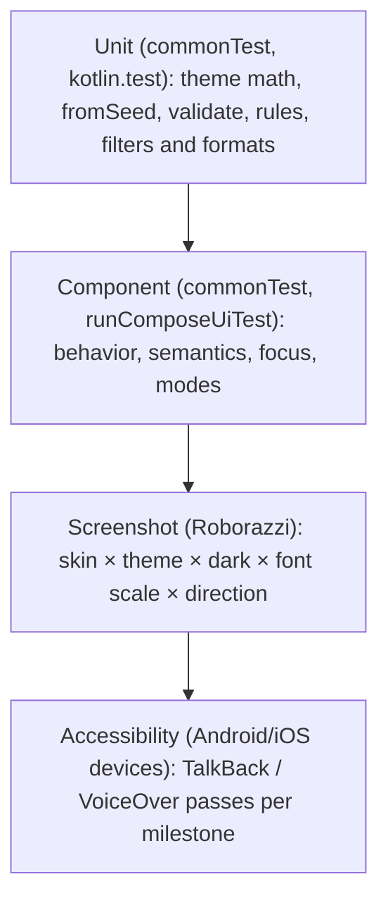
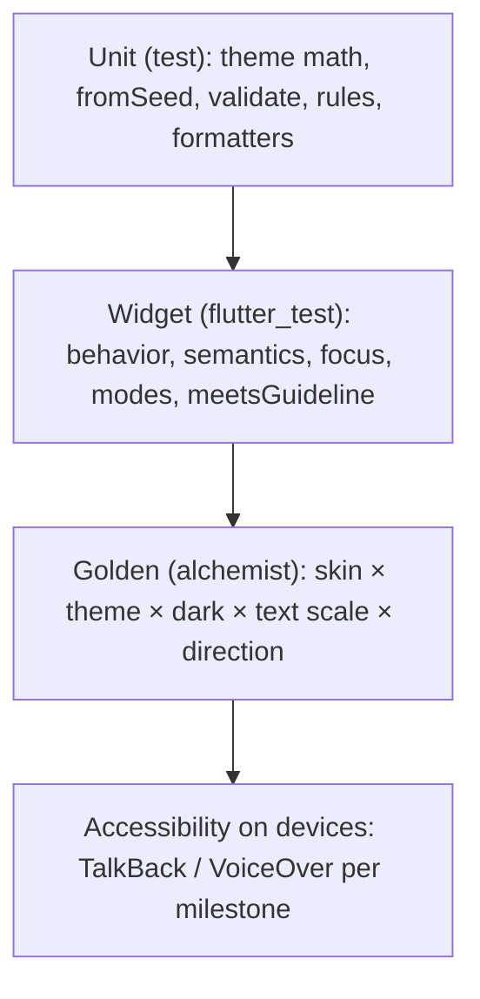

{/* Generated by docs/internal/scripts/sync_vault.py from the Camouflage design notes. Edit the notes and re-run the script; changes made here are overwritten. */}

# Testing

<KotlinOnly>

## 1. Why {#kotlin-1-why}

A design-system library breaks in visual and behavioral ways that ordinary unit tests don't see:
- a renderer that stops applying the behavior modifier;
- a token no longer honored;
- a dark-mode contrast regression;
- a layout that clips at 200% font scale.

This note defines the test layers and the **matrix** every component goes through. The per-component tests are listed in each component note's build steps (starting at [Components — Overview](/components#implementation)). The contract being tested is [Skin Contract](/guide/architecture/skin-contract).

## 2. Shape {#kotlin-2-shape}



| Layer | Where it runs | Tool |
|---|---|---|
| Unit | every target (jvm, iOS simulator, wasmJs, android host) | `kotlin.test` |
| Component | jvm (fast, CI default), iOS simulator; android host via Robolectric | Compose Multiplatform `runComposeUiTest` (common UI-test API) |
| Screenshot | android host (Robolectric), jvm desktop; iOS (experimental) | Roborazzi |
| Accessibility | Android and iOS, manually + with automated checks where available | TalkBack/VoiceOver checklist; automated Accessibility Test Framework checks on Android through Compose ui-test's `enableAccessibilityChecks()` |

**No screenshot or a11y testing on web**: Roborazzi doesn't support it, and the canvas limits screen readers (ADR-18). Web gets unit + component tests where `runComposeUiTest` runs.

## 3. API {#kotlin-3-api}

### 3.1 Shared test utilities (in `commonTest`, possibly a `camouflage-skin-testing` artifact later) {#kotlin-31-shared-test-utilities-in-commontest-possibly-a-camouflage-skin-testing-artifact-later}

```kotlin
fun ComposeUiTest.setCamoContent(skin: CamoSkin = MinimalSkin, theme: CamoTheme = minimalLight,
                                 fontScale: Float = 1f, rtl: Boolean = false, content: @Composable () -> Unit)

fun ComposeUiTest.assertRendererAppliesBehavior(renderClickable: @Composable (onClick: () -> Unit) -> Unit)
    // clicks at the node's corner and its center, and expects both to fire; expects a semantics role

fun <S> assertNoLiterals(render: @Composable (style: S) -> Unit, oddStyle: S, measure: (SemanticsNode) -> Boolean)
```

### 3.2 The screenshot matrix {#kotlin-32-the-screenshot-matrix}

| Axis | Values |
|---|---|
| skin | `MinimalSkin` (+ `DebugSkin` for contract tests) |
| theme | `minimalLight`, `minimalDark` on every axis; **one brand theme** (from `fromSeed`, with a custom token set) from M3, but only in one combination per component: light, font 1.0, LTR |
| font scale | 1.0, 2.0 |
| direction | LTR, RTL |
| component states | per component: variants × tones × enabled/disabled/focused/pressed(where capturable) |

The file naming is `button_primary-error_material_dark_fs2_rtl.png`. Goldens live in `src/<target>Test/snapshots`, and CI runs `verifyRoborazzi*`. Record with `recordRoborazzi*` locally, and review the diffs in the PR.

### 3.3 Coverage {#kotlin-33-coverage}

Kover on core logic (theme, rules, filters and formats, form state, provider): **≥ 75% lines**, enforced in `check` from M2. Renderers are covered by screenshots, not line coverage.

## 4. Build steps {#kotlin-4-build-steps}

1. `setCamoContent` and the assertion utilities.
2. Unit tests per the base notes' build steps (already listed in each Kotlin note).
3. Roborazzi setup: the plugin in `com.srctool.kmp.library`, Robolectric `@GraphicsMode(NATIVE)` for the android host, the desktop capture for jvm.
4. The matrix generator: a parameterized test per component that iterates the axes.
5. The CI jobs: `verifyRoborazziDebug` (android host) + `verifyRoborazziJvm` in `jvm-and-android`, and iOS verification in the `ios` job (allowed to fail while experimental).
6. The accessibility checklist per milestone (TalkBack + VoiceOver): every interactive element reachable, correctly named, role and state announced; errors announced.

**Done when**
- [ ] `./gradlew check` runs unit + component + screenshot verification on jvm and android.
- [ ] A deliberately broken renderer (behavior modifier removed) fails `assertRendererAppliesBehavior`.
- [ ] A deliberately hard-coded height fails the no-literals test.

## 5. Edge cases {#kotlin-5-edge-cases}

| Case | Decided behavior |
|---|---|
| Font rendering differs by platform | Goldens are **per target**. Never compare android goldens to desktop goldens. |
| Animations in screenshots | Capture with `mainClock.autoAdvance = false` and advance to the end state. Reduced motion in tests also removes flakiness. |
| Flaky iOS screenshot support | Allowed to fail in CI until Roborazzi's iOS support leaves experimental. |
| Web | Unit and component tests only. |

</KotlinOnly>

<DartOnly>

## 1. Why {#dart-1-why}

These are the same layers and the same matrix as Kotlin (Testing), with Flutter's tools. Flutter has one advantage: **`flutter_test` has built-in accessibility guidelines** (tap-target size, labelled targets, text contrast), so part of the a11y checking is automated in ordinary widget tests.

## 2. Shape {#dart-2-shape}



| Layer | Tool | Runs on |
|---|---|---|
| Unit | `package:test` / `flutter_test` | any host |
| Widget | `flutter_test` (`WidgetTester`, `SemanticsHandle`) | any host |
| Golden | `alchemist` | CI goldens on Linux (deterministic, Ahem font); platform goldens locally for readable review |
| Accessibility | `meetsGuideline(androidTapTargetGuideline / iOSTapTargetGuideline / labeledTapTargetGuideline / textContrastGuideline)` + a manual screen-reader checklist | host (guidelines), devices (manual) |

## 3. API {#dart-3-api}

### 3.1 Shared test helpers (`test/helpers/`) {#dart-31-shared-test-helpers-testhelpers}

```dart
Widget camoTestApp({CamoSkin skin = minimalSkin, CamoTheme theme = minimalLight,
    double textScale = 1, TextDirection direction = TextDirection.ltr, required Widget child});

Future<void> expectAccessible(WidgetTester tester) async {
  final handle = tester.ensureSemantics();
  await expectLater(tester, meetsGuideline(androidTapTargetGuideline));
  await expectLater(tester, meetsGuideline(iOSTapTargetGuideline));
  await expectLater(tester, meetsGuideline(labeledTapTargetGuideline));
  await expectLater(tester, meetsGuideline(textContrastGuideline));
  handle.dispose();
}
```

### 3.2 Golden matrix (alchemist) {#dart-32-golden-matrix-alchemist}

```dart
goldenTest('CamoButton matrix', fileName: 'button_matrix',
  builder: () => GoldenTestGroup(children: [
    for (final theme in [minimalLight, minimalDark])          // the brand theme: one combination per component (below)
      for (final scale in [1.0, 2.0])
        for (final dir in TextDirection.values)
          for (final a in Appearance.values)
            for (final tone in Tone.values)
              GoldenTestScenario(name: '${a.name}-${tone.name}-${theme.hashCode}-x$scale-${dir.name}',
                child: camoTestApp(theme: theme, textScale: scale, direction: dir,
                  child: CamoButton(text: 'Save', onPressed: () {}, appearance: a, tone: tone))),
  ]),
);
```

It's the same axes as Kotlin: skin, theme, text scale, direction, and component states. Alchemist's **CI goldens** replace text with blocks, so they're identical on every host, and **platform goldens** keep real text for local review.

### 3.3 Coverage {#dart-33-coverage}

`flutter test --coverage` + `lcov`: **≥ 75%** lines on the logic folders (`theme/`, `form/`, `text_field/` formatters, `provider/`), enforced in CI from M2. Renderers are covered by goldens.

## 4. Build steps {#dart-4-build-steps}

1. `camoTestApp`, `expectAccessible`, and a DebugSkin-based behavior helper (a tap at the corner of the touch target fires).
2. Unit and widget tests from each component note's build steps.
3. alchemist setup (`flutter_test_config.dart` with `AlchemistConfig`), and the matrix per component.
4. The CI job: `melos run test` + CI goldens. A failure uploads the diff images as artifacts.
5. The accessibility checklist per milestone (TalkBack + VoiceOver), shared with Kotlin.

**Done when**
- [ ] `melos run test` covers unit, widget, goldens and guidelines.
- [ ] A deliberately 32 px icon button fails `androidTapTargetGuideline`.
- [ ] A deliberately low-contrast theme fails `textContrastGuideline` in a golden scenario.

## 5. Edge cases {#dart-5-edge-cases}

| Case | Decided behavior |
|---|---|
| **Built-in a11y guidelines (Flutter only)** | Used in every widget test. Kotlin gets similar checks only on Android (`enableAccessibilityChecks`). |
| Fonts in goldens | CI goldens use Ahem (text as blocks), so they're deterministic across OSes. |
| Animations in goldens | `pumpAndSettle` before capture, and reduced motion in `camoTestApp` removes the timing flakiness. |
| Web-specific behavior | `flutter test --platform chrome` for the few web-sensitive tests (text input, links). |
| **Brand theme in the matrix** | From M3, one extra golden per component: `brandTheme`, light, text scale 1.0, LTR. It catches renderers that ignore the theme without doubling the goldens. |

</DartOnly>
